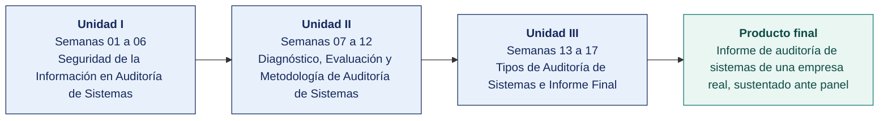

  
  &nbsp;&nbsp;&nbsp;&nbsp;&nbsp;&nbsp;
  

  <strong>Universidad Privada de Tacna</strong> 
  Facultad de Ingeniería · Escuela Profesional de Ingeniería de Sistemas 
  Tacna, Perú

<h1 align="center">SI-084 · Auditoría de Sistemas</h1>

---

## Docente del curso

| | |
|---|---|
| **Nombre** | Dr. Oscar Juan Jimenez Flores |
| **Correo institucional** | [oscarjimenezflores@upt.pe](mailto:oscarjimenezflores@upt.pe) |
| **Escuela** | Escuela Profesional de Ingeniería de Sistemas · Facultad de Ingeniería |
| **Perfil profesional** | [LinkedIn](https://www.linkedin.com/in/oscar-jimenez-flores/) |
| **Perfil de investigación** | [CTI Vitae — CONCYTEC](https://ctivitae.concytec.gob.pe/appDirectorioCTI/VerDatosInvestigador.do?id_investigador=33398) |

Escribe al correo institucional para consultas del curso. Indica en el asunto la sigla de la asignatura y el número de semana, para que la respuesta llegue antes.

## Datos generales de la asignatura

| | |
|---|---|
| **Asignatura** | SI-084 · Auditoría de Sistemas |
| **Ciclo** | X |
| **Horas semanales** | 04 horas académicas de 50 min · 2 en aula: teoría 60 + dinámica 35 + cierre 5 · 2 en laboratorio: taller 60 + avance asistido 40 |
| **Créditos** | 03 |
| **Tipo** | Obligatorio |
| **Prerrequisito** | SI-985 Gestión de la Configuración de Software |
| **Área curricular** | Ingeniería de Software |
| **Duración** | 17 semanas, organizadas en 3 unidades |
| **Unidades** | **I** Seguridad de la Información en Auditoría de Sistemas · **II** Diagnóstico, Evaluación y Metodología de Auditoría de Sistemas · **III** Tipos de Auditoría de Sistemas e Informe Final |
| **Producto final** | Informe de auditoría de sistemas de una empresa real, sustentado ante panel |

## En este documento

1. [Docente del curso](#docente-del-curso)
2. [Datos generales de la asignatura](#datos-generales-de-la-asignatura)
3. [Competencia de la asignatura](#competencia-de-la-asignatura)
4. [Idea rectora del curso](#idea-rectora-del-curso)
5. [Cómo avanza el curso](#cómo-avanza-el-curso)
6. [Índice de semanas](#índice-de-semanas)
7. [Qué contiene cada semana](#qué-contiene-cada-semana)
8. [Cómo se entregan los trabajos](#cómo-se-entregan-los-trabajos)
9. [Plan de evaluación](#plan-de-evaluación)
10. [Herramientas del curso](#herramientas-del-curso)
11. [Glosario técnico](#glosario-técnico)
12. [Atributos del Graduado y assessment](#atributos-del-graduado-y-assessment)
13. [Bibliografía y fuentes del curso](#bibliografía-y-fuentes-del-curso)

## Competencia de la asignatura

> Aplica fundamentos de auditoría de sistemas para elaborar el informe técnico según los estándares y normas vigentes.
>
> **Evidencia.** Informe preliminar de auditoría de sistemas.

## Idea rectora del curso

El curso está construido como un encargo de auditoría real, de principio a fin. No se estudia auditoría, se audita.

En la **Unidad I** montas un entorno auditable en Docker y ejecutas auditoría técnica con herramientas libres. En la **Unidad II** dejas las herramientas y produces los planes que sostienen un encargo profesional. En la **Unidad III** ejecutas el trabajo de campo sobre una empresa real, redactas el informe y lo sustentas ante un panel.

Cada equipo propone en la Semana 01 una **empresa real**, preferentemente de Tacna o del sur del Perú, y el docente aprueba la factibilidad del acceso. Si el acceso no se concreta, el equipo pasa al caso simulado de respaldo del [`ANEXO-CASO-SIMULADO.md`](ANEXO-CASO-SIMULADO.md) sin perder continuidad ni evidencia.

## Cómo avanza el curso

## Índice de semanas

Cada semana es una carpeta con cuatro documentos — la portada, la teoría de la sesión de aula, la dinámica de aula evaluada como nota cognitiva y la guía del taller de laboratorio.

### Unidad I — Seguridad de la Información en Auditoría de Sistemas

| Semana | Tema | Teoría | Dinámica | Taller |
|---|---|---|---|---|
| **[01](SEMANA-01/)** | Introducción a la Auditoría de Sistemas y a la Seguridad de la Información | [Teoría](SEMANA-01/1-TEORIA.md) | [Dinámica](SEMANA-01/2-DINAMICA.md) | [Taller](SEMANA-01/3-TALLER.md) |
| **[02](SEMANA-02/)** | Principios de Seguridad de la Información · Roles y Responsabilidades | [Teoría](SEMANA-02/1-TEORIA.md) | [Dinámica](SEMANA-02/2-DINAMICA.md) | [Taller](SEMANA-02/3-TALLER.md) |
| **[03](SEMANA-03/)** | Evaluación de la Seguridad Informática · NTP-ISO/IEC 27001:2022 y Gestión del Riesgo | [Teoría](SEMANA-03/1-TEORIA.md) | [Dinámica](SEMANA-03/2-DINAMICA.md) | [Taller](SEMANA-03/3-TALLER.md) |
| **[04](SEMANA-04/)** | Controles de Auditoría de Aplicación, Físicos, Lógicos y de Calidad · La Ley SOX en el Perú | [Teoría](SEMANA-04/1-TEORIA.md) | [Dinámica](SEMANA-04/2-DINAMICA.md) | [Taller](SEMANA-04/3-TALLER.md) |
| **[05](SEMANA-05/)** | Áreas Específicas de Auditoría · Programa de Trabajo y Pruebas de Auditoría | [Teoría](SEMANA-05/1-TEORIA.md) | [Dinámica](SEMANA-05/2-DINAMICA.md) | [Taller](SEMANA-05/3-TALLER.md) |
| **[06](SEMANA-06/)** | Auditoría Continua y CAATs · Exposición de Trabajos · Examen de Unidad I | [Teoría](SEMANA-06/1-TEORIA.md) | [Dinámica](SEMANA-06/2-DINAMICA.md) | [Taller](SEMANA-06/3-TALLER.md) |

### Unidad II — Diagnóstico, Evaluación y Metodología de Auditoría de Sistemas

| Semana | Tema | Teoría | Dinámica | Taller |
|---|---|---|---|---|
| **[07](SEMANA-07/)** | Auditoría de los Componentes de TI · Los Pasos de la Auditoría de Sistemas | [Teoría](SEMANA-07/1-TEORIA.md) | [Dinámica](SEMANA-07/2-DINAMICA.md) | [Taller](SEMANA-07/3-TALLER.md) |
| **[08](SEMANA-08/)** | Planeación y Ejecución de la Auditoría · Controles, Normas Legales y Estándares | [Teoría](SEMANA-08/1-TEORIA.md) | [Dinámica](SEMANA-08/2-DINAMICA.md) | [Taller](SEMANA-08/3-TALLER.md) |
| **[09](SEMANA-09/)** | Principios del Auditor de Sistemas · NTP-ISO/IEC 12207 en Auditoría | [Teoría](SEMANA-09/1-TEORIA.md) | [Dinámica](SEMANA-09/2-DINAMICA.md) | [Taller](SEMANA-09/3-TALLER.md) |
| **[10](SEMANA-10/)** | El Proceso de Auditoría · Diagnóstico de la Situación Actual · Metodologías de Evaluación | [Teoría](SEMANA-10/1-TEORIA.md) | [Dinámica](SEMANA-10/2-DINAMICA.md) | [Taller](SEMANA-10/3-TALLER.md) |
| **[11](SEMANA-11/)** | Auditoría Jurídica de Entornos Informáticos · Auditoría de la Función Informática | [Teoría](SEMANA-11/1-TEORIA.md) | [Dinámica](SEMANA-11/2-DINAMICA.md) | [Taller](SEMANA-11/3-TALLER.md) |
| **[12](SEMANA-12/)** | Integración Metodológica · Exposición de Trabajos · Examen de Unidad II | [Teoría](SEMANA-12/1-TEORIA.md) | [Dinámica](SEMANA-12/2-DINAMICA.md) | [Taller](SEMANA-12/3-TALLER.md) |

### Unidad III — Tipos de Auditoría de Sistemas e Informe Final

| Semana | Tema | Teoría | Dinámica | Taller |
|---|---|---|---|---|
| **[13](SEMANA-13/)** | El Informe de Auditoría · Características y Procedimientos de Elaboración | [Teoría](SEMANA-13/1-TEORIA.md) | [Dinámica](SEMANA-13/2-DINAMICA.md) | [Taller](SEMANA-13/3-TALLER.md) |
| **[14](SEMANA-14/)** | Estándares y Buenas Prácticas · Gobierno Corporativo de TI · Alineamiento Estratégico y BSC | [Teoría](SEMANA-14/1-TEORIA.md) | [Dinámica](SEMANA-14/2-DINAMICA.md) | [Taller](SEMANA-14/3-TALLER.md) |
| **[15](SEMANA-15/)** | Plan de Continuidad del Negocio y Contingencias · ISO 22301:2019 | [Teoría](SEMANA-15/1-TEORIA.md) | [Dinámica](SEMANA-15/2-DINAMICA.md) | [Taller](SEMANA-15/3-TALLER.md) |
| **[16](SEMANA-16/)** | Auditoría Interna y Externa · Sistema de Control Interno · Elaboración del Informe Final | [Teoría](SEMANA-16/1-TEORIA.md) | [Dinámica](SEMANA-16/2-DINAMICA.md) | [Taller](SEMANA-16/3-TALLER.md) |
| **[17](SEMANA-17/)** | Sustentación de Trabajos Finales · Examen de Unidad III · Cierre del Curso | [Teoría](SEMANA-17/1-TEORIA.md) | [Dinámica](SEMANA-17/2-DINAMICA.md) | [Taller](SEMANA-17/3-TALLER.md) |

## Qué contiene cada semana

| Documento | Para qué sirve | Cuándo se usa |
|---|---|---|
| `README.md` | Portada de la semana con los datos de la asignatura, la ruta de trabajo, los entregables y la forma de evaluación | Antes de la clase |
| `1-TEORIA.md` | Desarrollo conceptual de la sesión de aula, con el mapa de la sesión y las fuentes citadas | Sesión 1, en aula |
| `2-DINAMICA.md` | Actividad en equipo con su consigna, su producto y su rúbrica, evaluada como nota cognitiva | Sesión 1, dentro de los 100 min |
| `3-TALLER.md` | Guía de laboratorio en formato EPIS, evaluada como nota procedimental | Sesión 2, en laboratorio |

## Cómo se entregan los trabajos

Todo trabajo del curso se entrega en **PDF**, con la carátula de la UPT y los códigos de todos los integrantes. Las dos plantillas son obligatorias. Se llenan en Word y se exportan a PDF.

| Plantilla | Para qué | Nombre del archivo que entregas |
|---|---|---|
| [Dinámica de aula](PLANTILLAS/SI084-PLANTILLA-DINAMICA.docx) | Lo que el grupo resolvió en la sesión de aula | `SI084-S<NN>-DINAMICA-Grupo<N>.pdf` |
| [Taller de laboratorio](PLANTILLAS/SI084-PLANTILLA-TALLER.docx) | El informe del taller, en formato EPIS | `SI084-S<NN>-TALLER-Grupo<N>.pdf` |

Las reglas completas de entrega están en [`PLANTILLAS/`](PLANTILLAS/).

## Plan de evaluación

| Criterio | Peso en la unidad | De dónde sale |
|---|---|---|
| Cognitivo | 25 % | Dinámica de aula, su producto y la exposición del equipo |
| Procedimental | 35 % | Guía de laboratorio y sus entregables verificables |
| Actitudinal | 15 % | Participación, puntualidad y trabajo en equipo |
| Examen de unidad | 25 % | **Teórico** (40 min en aula, alternativas) y **práctico** (100 min en laboratorio, sobre los productos de los talleres, con IA permitida) |

Peso de cada unidad en la nota del curso. **Unidad I 25 %**, **Unidad II 35 %** y **Unidad III 40 %**.

## Herramientas del curso

Todas son libres, gratuitas o de uso académico sin costo. El requisito base del laboratorio es Docker con permisos de administrador, Git y un navegador actualizado.

| Recurso | Detalle y enlace | Semanas |
|---|---|---|
| **Keycloak** | Imagen `quay.io/keycloak/keycloak:latest` — https://www.keycloak.org/ | 02 |
| **jq** | Procesador JSON en línea de comandos — https://jqlang.github.io/jq/ | 02 |
| **Python 3.11+** con `pandas` | Conversión de reporte técnico a registro de riesgos | 02, 03, 04, 05, 06, 07, 09, 10, 12, 14, 15, 16 |
| `curl` | Consumo de la Admin REST API | 02 |
| **Greenbone Community Containers** | https://greenbone.github.io/docs/latest/22.4/container/ | 03 |
| **SimpleRisk** | Imagen `simplerisk/simplerisk` — https://www.simplerisk.com/ | 03 |
| **MONARC** (alternativa) | https://www.monarc.lu/download/ — instalación por VM/Vagrant | 03 |
| **Lynis** | https://cisofy.com/lynis/ — `docker run --rm -it --pid host --net host -v /:/rootfs:ro ...` | 04 |
| **OpenSCAP + SCAP Security Guide** | https://www.open-scap.org/ y https://github.com/ComplianceAsCode/content | 04 |
| **Docker Bench for Security** | https://github.com/docker/docker-bench-security | 04 |
| **Trivy** | https://trivy.dev/ — imagen `aquasec/trivy` | 04 |
| **CIS Benchmarks** | https://www.cisecurity.org/cis-benchmarks (descarga gratuita previo registro) | 04 |
| **OWASP ZAP** | Imagen `zaproxy/zap-stable` — https://www.zaproxy.org/ | 05 |
| **Nmap** | Imagen `instrumentisto/nmap` — https://nmap.org/ | 05 |
| **Wazuh** | https://documentation.wazuh.com/current/deployment-options/docker/ | 05 |
| **restic** | https://restic.net/ — respaldo con verificación e inmutabilidad | 05, 15 |
| **OWASP WSTG** | https://owasp.org/www-project-web-security-testing-guide/ | 05 |
| **DuckDB** | `pip install duckdb` — https://duckdb.org/ | 06 |
| **Jupyter Lab** | `pip install jupyterlab` | 06 |
| **Ollama** | https://ollama.com/ — modelo abierto pequeño (p. ej. `llama3.2:3b` o `qwen2.5:7b`) | 06 |
| Dataset | `poblacion_pagos.csv` (180 000 pagos sintéticos), `empleados.csv`, `proveedores.csv` — provistos por el docente | 06 |
| LibreOffice Calc | Presentación de resultados | 06, 09, 10 |
| **COBIT 2019 Framework: Introduction & Methodology** y **Governance and Management Objectives** | https://www.isaca.org/resources/cobit — resúmenes de acceso libre y *COBIT Focus Areas* | 07 |
| **LibreOffice Calc** o Google Sheets | Modelo de priorización | 07 |
| **draw.io** (https://app.diagrams.net/) | Cronograma y flujo del proceso auditado | 07, 08, 14, 16 |
| Información de la empresa real | Organigrama, inventario de sistemas, notas de la entrevista inicial | 07, 10 |
| `ANEXO-CASO-SIMULADO.md` | Dataset completo para equipos sin acceso a empresa real | 07, 13 |
| **ISO 19011:2018** | Cláusula 5.5 (competencia y evaluación) y 7 (competencia de los auditores) | 08, 12 |
| **ITAF (ISACA)** | https://www.isaca.org/resources/frameworks-standards-and-models | 08, 12 |
| **COBIT 2019** — objetivo del encargo seleccionado | https://www.isaca.org/resources/cobit | 08 |
| **LibreOffice Writer / Calc** o Google Workspace | Redacción y matrices | 08 |
| **Pandoc** | Consolidación de Markdown a un PDF único: https://pandoc.org/ | 08, 12 |
| Plan Anual de la Semana 07 | `PLAN_ANUAL_AUDITORIA_TI.md` | 08 |
| **Git** | https://git-scm.com/docs | 09, 13 |
| **git-quick-stats** o `git log` | Métricas del repositorio | 09 |
| **NTP-ISO/IEC 12207** | Estructura de procesos — biblioteca UPT / INACAL | 09 |
| **COBIT 2019** — *Governance and Management Objectives* y *Design Guide* | https://www.isaca.org/resources/cobit | 10 |
| **ISO/IEC 33020** — escala de capacidad de procesos | https://www.iso.org/standard/54195.html | 10 |
| **NIST Cybersecurity Framework 2.0** | https://www.nist.gov/cyberframework | 10 |
| **LimeSurvey** (libre, autoalojado) o **Google Forms** | Aplicación del cuestionario | 10 |
| **Ley 29733** y **D. S. 016-2024-JUS** | https://www.gob.pe/institucion/anpd | 11 |
| **Decreto Legislativo 822** | https://www.gob.pe/institucion/indecopi | 11 |
| **D. Leg. 1412** y **D. S. 029-2021-PCM** | https://www.gob.pe/13326-reglamento-de-la-ley-de-gobierno-digital | 11 |
| **Resolución SBS 504-2021** | https://www.sbs.gob.pe/ | 11 |
| **Plataforma del Estado Peruano** | https://www.gob.pe — normas legales vigentes | 11 |
| **Diario Oficial El Peruano** | https://busquedas.elperuano.pe | 11 |
| **OSQuery** (libre) | https://osquery.io/ — inventario de software instalado | 11 |
| **Trivy / Syft** | SBOM y licencias de componentes de software | 11 |
| **LibreOffice Calc**, **draw.io** | Matriz y diagramas de flujo de datos | 11 |
| Los cinco planes de las semanas 07–11 | Repositorio del equipo | 12 |
| **GanttProject** (libre) o **draw.io** | Cronograma de ejecución | 12 |
| Plan Integral v2.0 | `10_planificacion/PLAN_INTEGRAL_AUDITORIA.md` | 13 |
| Información recibida de la empresa | Según la matriz PBC de la Semana 08 | 13 |
| **LibreOffice Calc / Python + pandas** | Análisis de las extracciones recibidas | 13 |
| **Markdown + Pandoc** | Papeles de trabajo y hallazgos | 13 |
| **COBIT 2019** — dominio EDM y cascada de metas | https://www.isaca.org/resources/cobit | 14 |
| **ISO/IEC 38500:2024** | https://www.iso.org/standard/81684.html · vista previa en https://www.iso.org/obp/ui#iso:std:iso-iec:38500:ed-3:v1:en | 14 |
| **ISO 37000:2021** — principios de gobierno de organizaciones | https://www.iso.org/standard/65036.html | 14 |
| Documentos de la empresa | Actas de directorio o de comité, plan estratégico, presupuesto de TI, casos de negocio, reportes a la dirección | 14, 15 |
| **Metabase** (libre, Docker) o **LibreOffice Calc** | Tablero del BSC | 14 |
| **ISO 22301:2019** | https://www.iso.org/standard/75106.html | 15 |
| **ISO/IEC 27031** — preparación TIC para la continuidad | https://www.iso.org/standard/83507.html | 15 |
| **Duplicati** | https://duplicati.com/ — alternativa con interfaz gráfica | 15 |
| **MinIO** | https://min.io/ — almacenamiento compatible S3 con *object lock* para probar inmutabilidad | 15 |
| Todos los papeles de trabajo y hallazgos | Semanas 13 a 15 | 16 |
| **ISO 19011:2018**, cláusulas 6.5 y 6.6 | https://www.iso.org/standard/70017.html | 16 |
| **ITAF (ISACA)** — lineamientos de reporte | https://www.isaca.org/resources/frameworks-standards-and-models | 16 |
| **COSO 2013** | https://www.coso.org/guidance-on-ic | 16 |
| **Pandoc** + plantilla LaTeX o Word | Generación del informe: https://pandoc.org/ | 16 |
| Expediente completo | Repositorio del equipo, semanas 01 a 16 | 17 |
| **ISO 19011:2018**, cláusulas 6.6 y 6.7 | https://www.iso.org/standard/70017.html | 17 |
| **ITAF (ISACA)** — aseguramiento de la calidad y seguimiento | https://www.isaca.org/resources/frameworks-standards-and-models | 17 |
| **Python 3.11+**, **Pandoc**, **Git** | Verificación, ensamblaje y versionado | 17 |
| **GanttProject** o **LibreOffice Calc** | Programa de seguimiento | 17 |

## Atributos del Graduado y assessment

El curso contribuye al **Plan de Assessment de la Escuela**, que mide los once Atributos del Graduado del perfil de egreso bajo el modelo ICACIT.

| | |
|---|---|
| **Atributo que mide este curso** | **AG-I02 · Ética** |
| **Producto acreditable** | Informe Final de Auditoría de Sistemas de una empresa real, sustentado ante panel |
| **Instrumento** | Rúbrica analítica institucional, escala 1–4 |
| **Nivel de logro esperado** | ≥ 65 % de los estudiantes en nivel ≥ 3 (Logrado) |
| **Semanas de captura de evidencia** | **08**, **09**, **11**, **16** y **17** |
| **Momentos de reporte** | Semana 08 (corte 1) y Semana 16 (corte 2) |
| **Docente responsable** | Dr. Oscar Juan Jimenez Flores |

> **No afecta la calificación.** La rúbrica del atributo se aplica sobre los mismos entregables que el curso ya exige, con un registro paralelo al de notas. El estudiante no entrega nada adicional.

Por estar en el ciclo X y sobre una empresa real, este curso es el **punto de medición terminal** del AG-I02 para el programa. La captura individual es la sustentación de la Semana 17.

Todo el instrumental está en [`ASSESSMENT/`](ASSESSMENT/): el [mapa del atributo semana a semana](ASSESSMENT/MAPA-AG.md), la [rúbrica](ASSESSMENT/RUBRICAS-AG.md), la [ficha de evidencia](ASSESSMENT/PLANTILLA-EVIDENCIA-AG.md) que se llena en cada captura, el registro por estudiante y la [plantilla del informe de assessment](ASSESSMENT/PLANTILLA-INFORME-ASSESSMENT.md) del ciclo.

## Glosario técnico

Todo término, sigla y norma que aparece en el curso está definido en el [**glosario técnico**](GLOSARIO.md). Los términos en inglés se conservan cuando así se usan en el trabajo profesional: es como se encuentran en la documentación y en el código.

## Bibliografía y fuentes del curso

Reunidas de las guías de laboratorio de las 17 semanas. Son normas técnicas, marcos profesionales y bibliografía indexada.

- ACFE. *Report to the Nations — Occupational Fraud and Abuse*. https://www.acfe.com/fraud-resources/report-to-the-nations
- Alexander, A. G. *Diseño de un sistema de gestión de seguridad de información: óptica ISO 27001*.
- Aqua Security. *Trivy Documentation*. https://trivy.dev/
- Autoridad Nacional de Protección de Datos Personales. https://www.gob.pe/institucion/anpd
- Benford, F. (1938). The law of anomalous numbers. *Proceedings of the American Philosophical Society*, 78(4), 551–572.
- Business Continuity Institute. *Good Practice Guidelines*. https://www.thebci.org/
- Center for Internet Security. *CIS Benchmarks*. https://www.cisecurity.org/cis-benchmarks
- CISOfy. *Lynis — Security auditing tool*. https://cisofy.com/lynis/
- CMMI Institute. *CMMI Model V3.0*. https://cmmiinstitute.com/
- Contraloría General de la República del Perú. *Normas Generales de Control Gubernamental* y Ley 28716. https://www.gob.pe/contraloria
- COSO. (2013). *Internal Control — Integrated Framework*. https://www.coso.org/guidance-on-ic
- Decreto Legislativo 1412, Ley de Gobierno Digital, y D. S. 029-2021-PCM. https://www.gob.pe/13326-reglamento-de-la-ley-de-gobierno-digital
- Decreto Legislativo 822, Ley sobre el Derecho de Autor. https://www.gob.pe/institucion/indecopi/
- Decreto Supremo 016-2024-JUS, Reglamento de la Ley 29733 (vigente desde el 31 de marzo de 2025). https://www.gob.pe/institucion/anpd
- Decreto Supremo 029-2021-PCM, Reglamento de la Ley de Gobierno Digital. https://www.gob.pe/13326-reglamento-de-la-ley-de-gobierno-digital
- Diario Oficial El Peruano — Normas Legales. https://busquedas.elperuano.pe
- Docker Inc. *Docker Compose specification*. https://docs.docker.com/reference/compose-file/
- DuckDB Foundation. *DuckDB Documentation*. https://duckdb.org/docs/
- FIRST. *Common Vulnerability Scoring System v3.1: Specification Document*. https://www.first.org/cvss/v3-1/specification-document
- Franklin F., E. B. (2007). *Auditoría administrativa: gestión estratégica del cambio*. Pearson.
- Greenbone AG. *Greenbone Community Documentation*. https://greenbone.github.io/docs/
- IFAC. *Normas Internacionales de Auditoría (NIA)* — NIA 265 sobre comunicación de deficiencias de control interno. https://www.iaasb.org/
- ISACA. (2018). *COBIT 2019 Design Guide: Designing an Information and Technology Governance Solution*. https://www.isaca.org/resources/cobit
- ISACA. (2019). *Developing the IT Audit Plan Using COBIT 2019*. ISACA Journal, vol. 3. https://www.isaca.org/resources/isaca-journal/issues/2019/volume-3/developing-the-it-audit-plan-using-cobit-2019
- ISACA. *Code of Professional Ethics*. https://www.isaca.org/credentialing/code-of-professional-ethics
- ISACA. *ITAF: A Professional Practices Framework for IS Audit/Assurance* (5.ª ed.) — aseguramiento de la calidad, documentación y seguimiento. https://www.isaca.org/resources/frameworks-standards-and-models
- ISACA. *Val IT Framework — Enterprise Value: Governance of IT Investments*. https://www.isaca.org/resources/frameworks-standards-and-models
- ISO 19011:2018. *Guidelines for auditing management systems*. International Organization for Standardization. https://www.iso.org/standard/70017.html
- ISO 22301:2019. *Security and resilience — Business continuity management systems — Requirements*. https://www.iso.org/standard/75106.html
- ISO 22313:2020. *Business continuity management systems — Guidance on the usa of ISO 22301*. https://www.iso.org/standard/75107.html
- ISO 31000:2018. *Risk management — Guidelines*. https://www.iso.org/standard/65694.html
- ISO 37000:2021. *Governance of organizations — Guidance*. https://www.iso.org/standard/65036.html
- ISO/IEC 25010. *Systems and software Quality Requirements and Evaluation (SQuaRE) — Product quality model*. https://www.iso.org/standard/78176.html
- ISO/IEC 27001:2022. *Information security, cybersecurity and privacy protection — Information security management systems — Requirements*. https://www.iso.org/standard/27001
- ISO/IEC 27002:2022. *Information security, cybersecurity and privacy protection — Information security controls*. https://www.iso.org/standard/75652.html
- ISO/IEC 27005:2022. *Guidance on managing information security risks*. https://www.iso.org/standard/80585.html
- ISO/IEC 27031. *Guidelines for ICT readiness for business continuity*. https://www.iso.org/standard/83507.html
- ISO/IEC 33001:2015. *Process assessment — Concepts and terminology*. https://www.iso.org/standard/54175.html
- ISO/IEC 33020:2019. *Process measurement framework for assessment of process capability*. https://www.iso.org/standard/54195.html
- ISO/IEC 38500:2024. *Information technology — Governance of IT for the organization* (3.ª edición; cancela y reemplaza la ISO/IEC 38500:2015). https://www.iso.org/standard/81684.html
- ISO/IEC/IEEE 12207:2017. *Systems and software engineering — Software life cycle processes*. https://www.iso.org/standard/63712.html
- ISO/IEC/IEEE 15288:2023. *Systems and software engineering — System life cycle processes*. https://www.iso.org/standard/81702.html
- Kaplan, R. S. y Norton, D. P. (1996). *The Balanced Scorecard: Translating Strategy into Action*. Harvard Business School Press.
- Kaplan, R. S. y Norton, D. P. (2004). *Strategy Maps: Converting Intangible Assets into Tangible Outcomes*. Harvard Business School Press.
- Keycloak Project. *Server Administration Guide* y *Admin REST API*. https://www.keycloak.org/documentation
- Ley 27269, Ley de Firmas y Certificados Digitales.
- Ley 28716, Ley de Control Interno de las Entidades del Estado. https://www.gob.pe/contraloria
- Ley 29733, Ley de Protección de Datos Personales, y su Reglamento aprobado por D. S. 016-2024-JUS (vigente desde el 31 de marzo de 2025). https://www.gob.pe/institucion/anpd
- Ley 30096, Ley de Delitos Informáticos (Perú). https://www.gob.pe/institucion/congreso-de-la-republica/normas-legales
- MinIO. *Object Locking and Retention*. https://min.io/docs/minio/linux/administration/object-management/object-retention.html
- NC3 Luxembourg. *MONARC — Optimised Risk Analysis Method*. https://www.monarc.lu/
- Nigrini, M. J. (2012). *Benford's Law: Applications for Forensic Accounting, Auditing, and Fraud Detection*. Wiley.
- NIST. (2020). *SP 800-53 Rev. 5, Security and Privacy Controls*, familia AC (Access Control). https://csrc.nist.gov/pubs/sp/800/53/r5/upd1/final
- NIST. (2024). *The NIST Cybersecurity Framework (CSF) 2.0*. https://www.nist.gov/cyberframework
- Nmap Project. *Nmap Reference Guide*. https://nmap.org/book/man.html
- NTP-ISO/IEC 12207. *Tecnología de la información. Procesos del ciclo de vida del software*. **INACAL. Referencia sectorial.** https://www.gob.pe/institucion/pcm/tema/transformacion-digital
- Ollama. *Ollama Documentation*. https://github.com/ollama/ollama/tree/main/docs
- OpenSCAP Project. https://www.open-scap.org/ · ComplianceAsCode. https://github.com/ComplianceAsCode/content
- OWASP Foundation. *OWASP Juice Shop Project*. https://owasp.org/www-project-juice-shop/
- OWASP Foundation. *OWASP Top 10:2021*. https://owasp.org/Top10/
- OWASP Foundation. *Web Security Testing Guide (WSTG)*. https://owasp.org/www-project-web-security-testing-guide/
- OWASP Foundation. *ZAP Documentation*. https://www.zaproxy.org/docs/
- Piattini Velthuis, M., Del Peso Navarro, E. y Del Peso Ruiz, M. (2009). *Auditoría de tecnologías y sistemas de información* (6.ª ed.). Alfaomega / Ra-Ma. Capítulos de auditoría de la explotación y de las comunicaciones.
- Resolución de Secretaría de Gobierno y Transformación Digital n.° 003-2023-PCM/SGTD (uso obligatorio de la NTP-ISO/IEC 27001 vigente en entidades públicas). https://www.gob.pe/institucion/pcm/tema/transformacion-digital/normas-legales
- Resolución Ministerial 004-2016-PCM (uso obligatorio de la NTP ISO/IEC 27001 en el Sistema Nacional de Informática). https://www.gob.pe/institucion/pcm/normas-legales/292578-004-2016-pcm
- Resolución SBS N.º 504-2021 y modificatorias — gestión de la continuidad en entidades supervisadas. https://www.sbs.gob.pe/
- Resolución SBS N.º 504-2021 y modificatorias (SBS 1515-2021, SBS 3797-2023). https://www.sbs.gob.pe/
- Resolución SBS N.º 504-2021 y sus modificatorias. https://www.sbs.gob.pe/
- restic. *restic Documentation*. https://restic.readthedocs.io/
- SimpleRisk. *SimpleRisk Documentation*. https://www.simplerisk.com/documentation
- Superintendencia de Banca, Seguros y AFP. *Reglamento de Auditoría Interna* y *Reglamento de Auditoría Externa*, modificados por la Res. SBS 504-2021. https://www.sbs.gob.pe/
- Superintendencia de Banca, Seguros y AFP. *Resolución SBS N.º 504-2021, Reglamento para la Gestión de la Seguridad de la Información y la Ciberseguridad*. https://www.sbs.gob.pe/
- The Institute of Internal Auditors. *Global Internal Audit Standards* — dominio de gestión de la calidad y seguimiento del progreso. https://www.theiia.org/en/standards/
- U.S. Congress. (2002). *Sarbanes-Oxley Act of 2002*, Public Law 107-204, secciones 302 y 404. https://www.govinfo.gov/app/details/PLAW-107publ204
- Van Grembergen, W. y De Haes, S. (2009). *Enterprise Governance of Information Technology*. Springer.
- Wazuh Inc. *Wazuh Documentation*. https://documentation.wazuh.com/

---

**SI-084 · Auditoría de Sistemas** · Escuela Profesional de Ingeniería de Sistemas
Universidad Privada de Tacna · Tacna, Perú

Docente · Dr. Oscar Juan Jimenez Flores · [oscarjimenezflores@upt.pe](mailto:oscarjimenezflores@upt.pe)

Material docente de uso académico. Cita la fuente si lo reutilizas.
