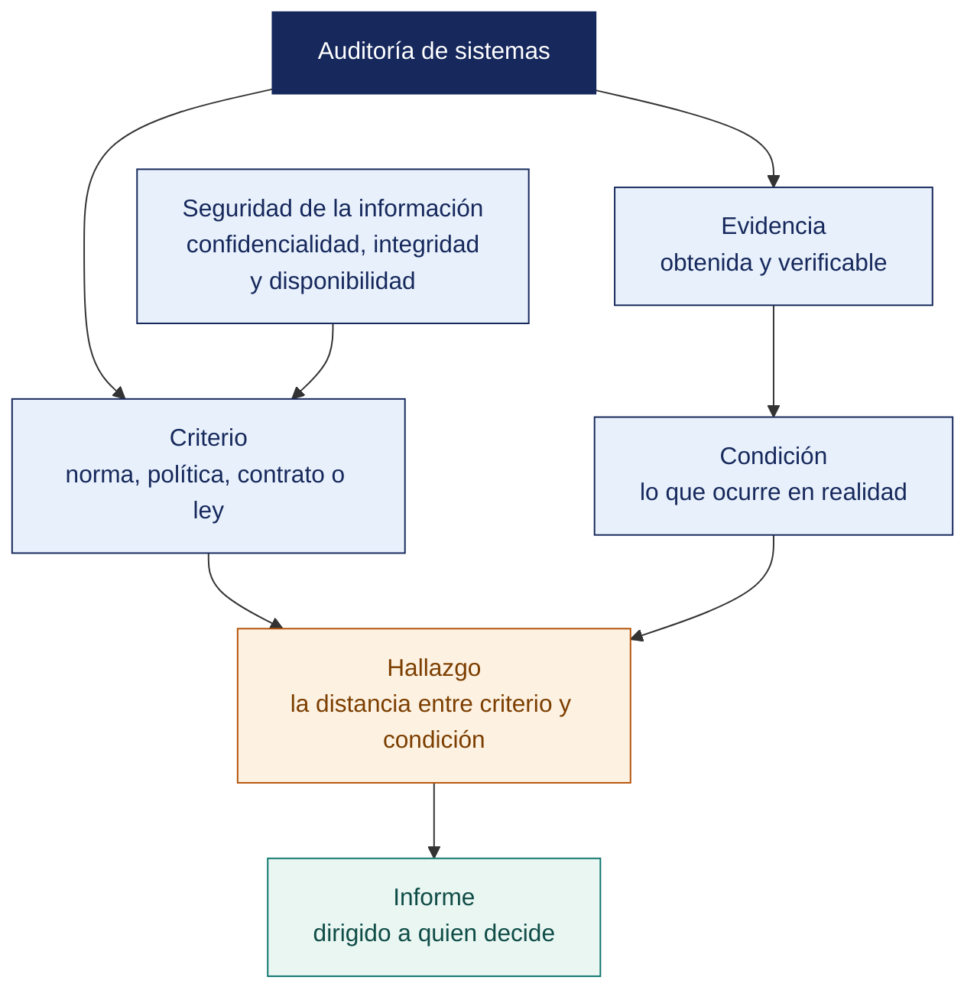

[Semana 01](README.md) · **Teoría** · [Dinámica de aula](2-DINAMICA.md) · [Taller de laboratorio](3-TALLER.md)

# Teoría · Introducción a la Auditoría de Sistemas y a la Seguridad de la Información

**SI-084 · Auditoría de Sistemas** · Semana 01 · Sesión 1 en aula · 2 horas académicas, 100 min, con la dinámica incluida

> ¿Un término no le resulta claro? Está definido en el [glosario técnico del curso](../GLOSARIO.md).

---

## Qué se trabaja en esta sesión

- Qué es auditar.
- Qué es proteger la información.
- Cómo se organiza el curso como un encargo de auditoría.

## Distribución del tiempo

| Bloque | Minutos |
|---|---|
| Prueba de entrada | 10 |
| Qué es auditar | 15 |
| Qué es proteger la información | 20 |
| Cómo se organiza el curso como un encargo de auditoría | 15 |
| Cierre y encuadre metodológico | 5 |
| **Total de la sesión de aula** | **65** |

## Mapa de la sesión



---

## Prueba de entrada

Instrumento diagnóstico de 15 preguntas de opción múltiple, sin nota, para calibrar el punto de partida del grupo. Ejes evaluados:

1. Diferencia entre control, auditoría y consultoría.
2. Tríada CIA (confidencialidad, integridad, disponibilidad).
3. Reconocimiento de la familia ISO/IEC 27000.
4. Noción de riesgo = amenaza × vulnerabilidad × impacto.
5. Comandos básicos de Linux y de Docker.
6. Lectura de un log de servidor web.

El resultado se comparte de forma agregada (histograma anónimo) y define qué refuerzos se insertan en las semanas 2 a 4.

## Qué es auditar

**Definición normativa.** La ISO 19011:2018 define *auditoría* como el «proceso sistemático, independiente y documentado para obtener evidencia objetiva y evaluarla de manera objetiva con el fin de determinar el grado en que se cumplen los criterios de auditoría». Cada palabra de esa definición es operativa:

| Término | Consecuencia práctica |
|---|---|
| **Proceso sistemático** | Existe un plan, un programa y un procedimiento escrito antes de tocar el primer sistema. No se improvisa. |
| **Independiente** | El auditor no puede auditar lo que él mismo diseñó, configuró u operó. La independencia se documenta y se declara. |
| **Documentado** | Todo hallazgo se sostiene en un papel de trabajo trazable. Sin papel de trabajo, el hallazgo no existe. |
| **Evidencia objetiva** | Registros, declaraciones de hecho u otra información verificable. La opinión del auditor no es evidencia. |
| **Criterios de auditoría** | El conjunto de políticas, procedimientos o requisitos usados como referencia contra la cual se compara la evidencia. Sin criterio no hay hallazgo, hay opinión. |

**El triángulo irreductible.** Un hallazgo de auditoría siempre nace de la tensión entre tres vértices:

```
                      CRITERIO
                 (lo que debería ser:
              norma, política, contrato, ley)
                        /\
                       /  \
                      /    \
                     /      \
          EVIDENCIA /________\ CONDICIÓN
     (lo que se pudo         (lo que realmente
      verificar y probar)      está ocurriendo)
```

Si falta el criterio, el auditor está opinando. Si falta la evidencia, está especulando. Si falta la condición, no hay nada que reportar.

**Auditoría de sistemas y auditoría integrada.** Piattini y Del Peso sitúan la auditoría informática como una especialización de la auditoría que evalúa los sistemas de información en su totalidad — los datos, el software, el hardware, las redes, las personas y los procedimientos. Su *valor agregado a la auditoría integrada* es que ninguna auditoría financiera moderna puede emitir opinión sin evaluar los controles generales de TI (ITGC), porque los estados financieros se producen dentro de un ERP — si el control de accesos del ERP está roto, la cifra que imprime el ERP no es confiable, por muy bien cuadrada que esté.

Esta es la razón por la que la Sarbanes-Oxley Act de 2002 —promulgada tras los colapsos de Enron y WorldCom— convirtió la evaluación de los controles internos sobre el reporte financiero, incluidos los de TI, en una obligación legal para las empresas listadas en bolsa de los Estados Unidos, con efecto de arrastre sobre sus subsidiarias en el Perú.


**Ejemplo trabajado — la diferencia entre revisar y auditar.** Dos personas miran el mismo hecho. El sistema de ventas permite anular una factura ya emitida.

| | El técnico revisa | El auditor audita |
|---|---|---|
| **Qué observa** | «Se puede anular una factura» | «Se puede anular una factura ya emitida, sin registro de quién ni por qué» |
| **Contra qué lo compara** | Con lo que le parece razonable | Contra un **criterio**: el manual de procedimientos de la empresa, numeral 8.4, que exige autorización del jefe de ventas |
| **Qué concluye** | «Habría que arreglarlo» | «Condición: 31 anulaciones en el periodo sin registro de autorización. Criterio: numeral 8.4. Efecto: S/ 214 000 en ventas anuladas sin trazabilidad» |
| **Con qué lo sustenta** | Su experiencia | La extracción del sistema, con fecha y responsable de la entrega |
| **A quién responde** | A quien le preguntó | Al destinatario del encargo, con independencia de quien pidió la revisión |

**Lo que separa a los dos no es el conocimiento técnico. Es el criterio y la evidencia.** Un técnico excelente sin criterio citado produce una opinión; un auditor con criterio produce un hallazgo exigible.

**Preguntas para la sesión**

| Pregunta | Qué debe contener una buena respuesta |
|---|---|
| ¿Puede haber hallazgo sin criterio? | No. Sin criterio solo hay una observación personal. El criterio puede ser una norma, un contrato o **la propia política de la empresa** |
| El gerente dice: «pero eso siempre se ha hecho así». ¿Cambia algo? | No cambia la condición. Puede explicar la **causa** —práctica consolidada sin revisión— y eso mejora la recomendación |
| ¿Auditar es buscar culpables? | No. El informe se dirige a controles y procesos, no a personas. Nombrar personas invade la función de gestión y compromete la independencia |
## Qué es proteger la información

**Información ≠ dato ≠ sistema.** El objeto protegido es la *información*, con independencia del soporte — base de datos, papel, conversación, respaldo en cinta o mensajería. Por eso la norma se llama sistema de gestión de la *seguridad de la información* y no «seguridad informática».

**Propiedades a preservar.** La ISO/IEC 27001:2022 conserva las tres propiedades clásicas y la práctica profesional añade dos más:

| Propiedad | Pregunta que responde | Ejemplo de control |
|---|---|---|
| **Confidencialidad** | ¿Solo quien debe, accede? | Cifrado en reposo, control de acceso basado en roles |
| **Integridad** | ¿El dato es exacto y completo? | Hash, firma digital, restricciones referenciales, bitácora de cambios |
| **Disponibilidad** | ¿Está cuando se necesita? | Alta disponibilidad, respaldos, plan de continuidad |
| **Autenticidad** | ¿Es de quien dice ser? | MFA, certificados |
| **No repudio** | ¿Puede negarlo después? | Registro firmado, sellado de tiempo |

**Riesgo.** Se expresa como el efecto de la incertidumbre sobre los objetivos. Operativamente, el auditor lo descompone en:

```
Riesgo = f(Amenaza, Vulnerabilidad, Valor del activo, Probabilidad, Impacto)
```

y lo trata con cuatro decisiones posibles —**mitigar, transferir, evitar o aceptar**— que deben quedar formalmente autorizadas por el dueño del riesgo, no por el área de TI.

**Riesgo de auditoría.** Distinto del anterior. Es la probabilidad de que el auditor emita una opinión equivocada:

```
Riesgo de auditoría = Riesgo inherente × Riesgo de control × Riesgo de detección
```

El auditor no puede modificar los dos primeros; sí puede reducir el tercero ampliando la muestra, cambiando la técnica o aumentando la profundidad de la prueba.


**Ejemplo trabajado — los tres pilares sobre un caso.** Una distribuidora guarda en un servidor la lista de precios negociados con cada cliente.

| Pilar | Qué significa aquí | Cómo se rompe | Control que lo sostiene |
|---|---|---|---|
| **Confidencialidad** | Solo Comercial y Gerencia ven los precios de cada cliente | Un vendedor descarga la lista completa antes de renunciar y se la lleva a la competencia | Permisos por cliente, no por carpeta; registro de descargas masivas |
| **Integridad** | El precio que ve el vendedor es el que Gerencia autorizó | Alguien edita la hoja y aplica un descuento no aprobado | Datos maestros con aprobación dual y bitácora de cambios |
| **Disponibilidad** | La lista está accesible cuando el vendedor cotiza | El servidor cae en fin de mes y no se puede cotizar | Respaldo probado y tiempo de recuperación acordado |

> **Los tres compiten entre sí.** Cifrar la lista mejora la confidencialidad y empeora la disponibilidad si se pierde la clave. Replicarla a tres servidores mejora la disponibilidad y multiplica los puntos donde se puede filtrar. **Diseñar controles es decidir ese equilibrio, no maximizar los tres.**

**Preguntas para la sesión**

| Pregunta | Qué debe contener una buena respuesta |
|---|---|
| Un hospital cifra las historias clínicas con una clave que solo conoce el jefe de sistemas. ¿Mejoró la seguridad? | Mejoró la confidencialidad y creó un riesgo grave de disponibilidad e integridad: si esa persona no está, la información es irrecuperable. Es un punto único de falla disfrazado de control |
| ¿Cuál de los tres pilares suele ser el más crítico en un hospital? ¿Y en un banco? | En el hospital, disponibilidad e integridad: una historia clínica no disponible o alterada puede costar una vida. En el banco, integridad y confidencialidad del saldo y del dato del cliente |
| ¿Es la trazabilidad un cuarto pilar? | Se discute. Lo defendible es que **sostiene a los tres**: sin registro de quién hizo qué, no se puede demostrar que ninguno se preservó |
## Cómo se organiza el curso como un encargo de auditoría

**El curso es un encargo real de auditoría.** Los equipos (4 a 5 integrantes) reciben esta hoja de ruta:

| Unidad | Semanas | Producto acumulado |
|---|---|---|
| I | 1–6 | **Expediente de pruebas técnicas**: entorno auditable, hallazgos técnicos con evidencia |
| II | 7–12 | **Plan integral de auditoría**: plan anual, programa, procedimientos, matriz legal |
| III | 13–17 | **Informe final de auditoría de una empresa real** + sustentación |

**Selección de la organización auditada.** Cada equipo propone esta misma semana una **empresa real**, con estos requisitos mínimos:

- Contar con al menos un sistema de información en producción y un responsable de TI identificable.
- Disponer de un contacto dispuesto a conceder entrevistas y a firmar el acta de acuerdo.
- No ser el centro laboral de ningún integrante del equipo en función de TI (conflicto de independencia).

El docente aprueba o rechaza en la Semana 2. Si el acceso no se concreta, el equipo migra al **caso simulado de respaldo** (`ANEXO-CASO-SIMULADO.md`) sin perder continuidad.

**Ética y confidencialidad.** Antes de cualquier prueba técnica se firman dos documentos. El **acta de acuerdo y alcance** (qué se puede probar, cuándo y sobre qué activos) y el **acuerdo de confidencialidad**. El Código de Ética Profesional de ISACA obliga al auditor a mantener la confidencialidad de la información obtenida y a no usarla en beneficio propio. **Ninguna prueba técnica se ejecuta sobre un sistema de terceros sin autorización escrita** — en el Perú, el acceso no autorizado a un sistema informático está tipificado en la Ley 30096, Ley de Delitos Informáticos.

## Cierre y encuadre metodológico

- La Unidad I es **puro laboratorio técnico**. Se audita con herramientas, no con diapositivas.
- La Unidad II es **puro plan**. Aprender a planificar es lo que separa a un auditor de un operador de herramientas.
- La Unidad III es **el informe**. El único entregable que la organización auditada realmente lee.

---

---

[Semana 01](README.md) · **Teoría** · [Dinámica de aula](2-DINAMICA.md) · [Taller de laboratorio](3-TALLER.md)

---

**Docente** · Dr. Oscar Juan Jimenez Flores
[oscarjimenezflores@upt.pe](mailto:oscarjimenezflores@upt.pe) · [LinkedIn](https://www.linkedin.com/in/oscar-jimenez-flores/) · [CTI Vitae — CONCYTEC](https://ctivitae.concytec.gob.pe/appDirectorioCTI/VerDatosInvestigador.do?id_investigador=33398)

Escuela Profesional de Ingeniería de Sistemas · Universidad Privada de Tacna · Tacna, Perú
