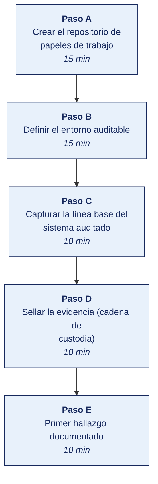

[Semana 01](README.md) · [Teoría](1-TEORIA.md) · [Dinámica de aula](2-DINAMICA.md) · **Taller de laboratorio**

# Taller de laboratorio 01 · Montaje del laboratorio de auditoría en Docker y custodia de la evidencia digital

**SI-084 · Auditoría de Sistemas** · Semana 01 · Sesión 2 en laboratorio · 60 min de taller + 40 de avance · calificación **procedimental**

> ¿Un término no le resulta claro? Está definido en el [glosario técnico del curso](../GLOSARIO.md).

---

## Secuencia del taller



## Qué entregas

| | |
|---|---|
| **Archivo** | `SI084-S01-TALLER-Grupo<N>.pdf` |
| **Plantilla obligatoria** | [SI084-PLANTILLA-TALLER.docx](../PLANTILLAS/SI084-PLANTILLA-TALLER.docx) |
| **Formato** | PDF exportado desde la plantilla en Word, con la carátula de la UPT, el índice actualizado y las capturas numeradas |
| **Qué va dentro** | Las siete secciones del formato EPIS. La sección **3. Resultados** se califica contra la tabla de resultados esperados de esta guía, y cada resultado necesita su evidencia |
| **Dónde se sube** | Aula virtual, tarea «Taller · Semana 01» |
| **Cuándo vence** | 48 horas después de la sesión de laboratorio |

> No se califica un informe entregado en `.docx`, sin carátula, sin los códigos de los integrantes o con resultados declarados sin evidencia.

---

## 1. Información sobre el evento práctico

### 1.1. Título del evento práctico

Montaje de un entorno auditable reproducible con Docker Compose y establecimiento de la cadena de custodia de la evidencia digital.

### 1.2. Objetivos

- Desplegar con **Docker Compose** un entorno multi-servicio que servirá como organización auditada durante toda la Unidad I.
- Aplicar el principio de **reproducibilidad de la evidencia**. Cualquier tercero debe poder reconstruir el entorno y obtener el mismo resultado.
- Construir un **repositorio de papeles de trabajo** versionado en Git, con estructura normalizada.
- Implementar la **cadena de custodia digital** mediante funciones hash y sellado de tiempo, de modo que la evidencia sea defendible.
- Registrar la **línea base (baseline)** del entorno para poder demostrar posteriormente qué cambió y cuándo.

### 1.3. Tiempo de duración

**100 minutos:** 60 de taller guiado y 40 de avance asistido.

### 1.4. Resultados de Aprendizaje (RA)

- **RA1** Analiza e interpreta los conceptos y terminología de Auditoría de Sistemas.
- **RA2** Evalúa la seguridad de la información en Auditoría de Sistemas.

### 1.5. Recursos (equipos, materiales, programas y otros)

**Equipos y sistema operativo**

| Recurso | Requisito mínimo |
|---|---|
| Computadora | 8 GB de RAM, 20 GB libres en disco, virtualización habilitada en BIOS/UEFI |
| Sistema operativo | Windows 11, Linux o macOS, **con permisos de administrador** |
| Terminal | PowerShell 7, `bash` o `zsh` |
| Conexión | Necesaria solo para descargar las imágenes de contenedor |

**Herramientas y enlaces de descarga.** Todas son libres o gratuitas. Se instalan **antes** de la sesión.

| Herramienta | Para qué se usa en este laboratorio | Descarga |
|---|---|---|
| **Docker Desktop** o **Docker Engine** | Desplegar el entorno multiservicio que hará de organización auditada. *Gratuito, Apache 2.0* | https://docs.docker.com/get-started/get-docker/ |
| **Docker Compose** | Orquestar los cinco servicios del entorno con un solo archivo. *Incluido en Docker Desktop* | https://docs.docker.com/compose/install/ |
| **Git** | Versionar el repositorio de papeles de trabajo. *GPL-2.0* | https://git-scm.com/downloads |
| **Visual Studio Code** | Editar el `docker-compose.yml` y los papeles de trabajo. *MIT* | https://code.visualstudio.com/download |
| **OpenSSL** | Calcular los hash SHA-256 de la cadena de custodia. *Apache 2.0; ya incluido en Linux y macOS* | https://openssl-library.org/source/ |
| **7-Zip** *(solo Windows)* | Empaquetar la evidencia sin alterar sus fechas. *LGPL* | https://www.7-zip.org/download.html |

**Imágenes de contenedor que se descargarán** (se obtienen automáticamente con `docker compose pull`):

| Imagen | Papel en el entorno auditado | Ficha oficial |
|---|---|---|
| `bkimminich/juice-shop` | Aplicación web deliberadamente vulnerable | https://hub.docker.com/r/bkimminich/juice-shop |
| `vulnerables/web-dvwa` | Segunda aplicación vulnerable, para pruebas de control de acceso | https://hub.docker.com/r/vulnerables/web-dvwa |
| `postgres:16` | Base de datos con los registros a auditar | https://hub.docker.com/_/postgres |
| `wordpress:latest` | Portal institucional simulado | https://hub.docker.com/_/wordpress |
| `mariadb:11` | Motor de datos del portal | https://hub.docker.com/_/mariadb |

> **Verificación previa.** Ejecuta `docker --version`, `docker compose version` y `git --version`. Si alguno falla, resuélvelo **antes** del laboratorio: la instalación no forma parte de las dos horas de práctica.

### 1.6. Seguridad

> **Advertencia obligatoria.** Este laboratorio despliega aplicaciones **deliberadamente vulnerables**. Su exposición a una red no controlada convierte el equipo en un punto de compromiso.

Reglas no negociables:

1. Los contenedores se publican **exclusivamente en `127.0.0.1`**, nunca en `0.0.0.0`.
2. El laboratorio corre en una **red Docker aislada** (`audit_net`), sin puentes a la red del campus.
3. **Nunca** se ejecuta ninguna prueba de este curso contra un sistema que no sea este laboratorio o un sistema con autorización escrita del titular.
4. Al terminar la sesión se ejecuta `docker compose down` para bajar el entorno.
5. Ninguna credencial real, ningún dato personal real y ningún dato de la empresa auditada se cargan en este entorno.

---

## 2. Procedimiento o Metodología

### Paso A — Crear el repositorio de papeles de trabajo (15 min)

Todo auditor trabaja sobre un expediente estructurado. Se crea con esta jerarquía normalizada:

```bash
mkdir -p auditoria-si084/{00_administracion,10_planificacion,20_evidencia,30_papeles_trabajo,40_hallazgos,50_informe}
cd auditoria-si084
git init
```

| Carpeta | Contenido |
|---|---|
| `00_administracion` | Acta de acuerdo, acuerdo de confidencialidad, declaración de independencia |
| `10_planificacion` | Plan y programa de auditoría (Unidad II) |
| `20_evidencia` | Evidencia cruda: capturas, exportaciones, salidas de herramientas |
| `30_papeles_trabajo` | Análisis del auditor sobre la evidencia |
| `40_hallazgos` | Un archivo por hallazgo, con estructura CCCER |
| `50_informe` | Informe final (Unidad III) |

Se crea el archivo de control de custodia:

```bash
cat > 20_evidencia/CADENA_DE_CUSTODIA.md <<'FIN'
# Cadena de custodia de la evidencia

| ID | Archivo | SHA-256 | Fecha y hora (UTC) | Obtenido por | Método de obtención | Sistema origen |
|----|---------|---------|--------------------|--------------|---------------------|----------------|
FIN
git add . && git commit -m "Estructura inicial del expediente de auditoria"
```

### Paso B — Definir el entorno auditable (15 min)

Se crea `entorno/docker-compose.yml`. Este archivo **es en sí mismo evidencia**. Describe con exactitud el sistema auditado.

```yaml
name: si084-lab

networks:
  audit_net:
    driver: bridge

volumes:
  db_data:
  wp_data:

services:

  # --- Aplicación web vulnerable moderna (SPA + API REST) ---
  juiceshop:
    image: bkimminich/juice-shop:latest
    container_name: si084_juiceshop
    ports:
      - "127.0.0.1:3000:3000"
    networks: [audit_net]
    restart: unless-stopped

  # --- Aplicación web vulnerable clásica (PHP + MySQL) ---
  dvwa:
    image: vulnerables/web-dvwa:latest
    container_name: si084_dvwa
    ports:
      - "127.0.0.1:8081:80"
    networks: [audit_net]
    restart: unless-stopped

  # --- Base de datos corporativa simulada ---
  db:
    image: postgres:16
    container_name: si084_db
    environment:
      POSTGRES_USER: erp_app
      POSTGRES_PASSWORD: erp_app          # <-- hallazgo intencional: credencial débil
      POSTGRES_DB: erp
    ports:
      - "127.0.0.1:5432:5432"
    volumes:
      - db_data:/var/lib/postgresql/data
    networks: [audit_net]

  # --- Portal corporativo ---
  wordpress:
    image: wordpress:latest
    container_name: si084_portal
    depends_on: [wpdb]
    environment:
      WORDPRESS_DB_HOST: wpdb
      WORDPRESS_DB_USER: wp
      WORDPRESS_DB_PASSWORD: wp
      WORDPRESS_DB_NAME: wp
    ports:
      - "127.0.0.1:8082:80"
    volumes:
      - wp_data:/var/www/html
    networks: [audit_net]

  wpdb:
    image: mariadb:11
    container_name: si084_wpdb
    environment:
      MARIADB_DATABASE: wp
      MARIADB_USER: wp
      MARIADB_PASSWORD: wp
      MARIADB_ROOT_PASSWORD: root
    networks: [audit_net]
```

Levantar y verificar:

```bash
cd entorno
docker compose up -d
docker compose ps
```

Comprobación de servicios:

| Servicio | URL local |
|---|---|
| Juice Shop | http://127.0.0.1:3000 |
| DVWA | http://127.0.0.1:8081 (usuario `admin` / `password`) |
| Portal WordPress | http://127.0.0.1:8082 |
| PostgreSQL | `127.0.0.1:5432` |

### Paso C — Capturar la línea base del sistema auditado (10 min)

La línea base responde a la pregunta que toda auditoría termina haciendo. *¿cómo estaba esto el día que empezamos?*

```bash
mkdir -p ../20_evidencia/E01_baseline
cd ../20_evidencia/E01_baseline

# 1. Inventario de contenedores en ejecución
docker compose -f ../../entorno/docker-compose.yml ps --format json > contenedores.json

# 2. Inventario de imágenes con su digest inmutable
docker images --digests --format '{{.Repository}}\t{{.Tag}}\t{{.Digest}}' > imagenes.tsv

# 3. Puertos publicados (superficie de exposición)
docker ps --format '{{.Names}}\t{{.Ports}}' > puertos.tsv

# 4. Configuración efectiva desplegada (no la declarada)
docker compose -f ../../entorno/docker-compose.yml config > compose_efectivo.yml

# 5. Usuarios de la base de datos corporativa
docker exec si084_db psql -U erp_app -d erp -c "\du" > usuarios_postgres.txt

# 6. Variables de entorno de un servicio (fuga de secretos en claro)
docker inspect si084_db --format '{{json .Config.Env}}' > env_db.json
```

> **Observación de auditor.** El paso 6 casi siempre produce el primer hallazgo del curso: las credenciales viajan en variables de entorno en texto claro y son visibles para cualquiera con acceso al *socket* de Docker.

### Paso D — Sellar la evidencia (cadena de custodia) (10 min)

Sin integridad demostrable, la evidencia es refutable. Se calcula el hash SHA-256 de cada artefacto y se registra.

**Linux / macOS:**

```bash
sha256sum * > ../SHA256SUMS_E01.txt
cat ../SHA256SUMS_E01.txt
```

**Windows PowerShell:**

```powershell
Get-ChildItem -File | Get-FileHash -Algorithm SHA256 |
  Select-Object Hash, @{n='File';e={Split-Path $_.Path -Leaf}} |
  Export-Csv ..\SHA256SUMS_E01.csv -NoTypeInformation
```

Se registra cada archivo en `20_evidencia/CADENA_DE_CUSTODIA.md` con identificador, nombre, hash, fecha y hora **en UTC**, auditor responsable, método de obtención y sistema de origen.

**Sellado de tiempo con Git.** El *commit* de Git es en sí un sello criptográfico: su identificador es un hash del contenido más la marca temporal más el *commit* anterior, de modo que alterar un archivo antiguo invalida toda la cadena posterior.

```bash
cd ../..
git add 20_evidencia
git commit -m "E01: linea base del entorno auditado, sellada con SHA-256"
git log --format='%H  %aI  %s' -1
```

**Verificación de que el sellado funciona.** Se altera deliberadamente un archivo y se comprueba que el hash cambia:

```bash
echo "linea agregada" >> 20_evidencia/E01_baseline/puertos.tsv
sha256sum 20_evidencia/E01_baseline/puertos.tsv     # el hash difiere del registrado
git checkout -- 20_evidencia/E01_baseline/puertos.tsv   # se restaura
```

### Paso E — Primer hallazgo documentado (10 min)

Con la línea base en mano, se redacta el primer hallazgo en `40_hallazgos/H-001.md`:

```markdown
# H-001 · Credenciales de base de datos almacenadas en texto claro

- **Riesgo:** Alto
- **Fecha:** aaaa-mm-dd
- **Evidencia:** E01/env_db.json (SHA-256: ...)

## Condición
La instancia PostgreSQL `si084_db` recibe su usuario y contraseña mediante variables de
entorno en texto claro (`POSTGRES_USER=erp_app`, `POSTGRES_PASSWORD=erp_app`), legibles con
`docker inspect` por cualquier cuenta con acceso al socket de Docker. La contraseña es
idéntica al nombre de usuario.

## Criterio
ISO/IEC 27001:2022, Anexo A, control **A.5.17 Authentication information** y control
**A.8.24 Use of cryptography**. Adicionalmente, NTP-ISO/IEC 27001:2022 para entidades del
Sistema Nacional de Informática.

## Causa
El despliegue se realiza con un archivo de composición sin gestión de secretos; no existe
un almacén de secretos ni una política de complejidad de contraseñas de servicio.

## Efecto
Un usuario con acceso local al host o un contenedor comprometido en la misma red obtiene
acceso completo a la base de datos corporativa, con capacidad de lectura, modificación y
borrado de la totalidad de los datos del ERP.

## Recomendación
Migrar las credenciales a `docker secret` o a un gestor de secretos externo; establecer
contraseñas de servicio de al menos 16 caracteres generadas aleatoriamente; restringir el
acceso al socket de Docker al grupo de administradores. Responsable: Jefe de Infraestructura.
Plazo: 30 días.
```

---


### Avance asistido · Avance del encargo asistido (40 min)

Los últimos 40 minutos del laboratorio son del equipo. El docente no dirige: queda disponible para consultas y observa el reparto real del trabajo.

| | |
|---|---|
| **Qué se trabaja** | los papeles de trabajo y entregables del encargo, según el programa de auditoría vigente |
| **Quién decide qué hacer** | El equipo. El docente no asigna tareas en este tramo |
| **Dónde se registra** | el tablero de avance del equipo, con cada elemento asignado a una persona |
| **Para qué sirve la presencia del docente** | Resolver bloqueos en el momento, no revisar entregables |

> **Se registra la contribución individual.** Lo trabajado en este tramo queda en el repositorio con su autoría. Es la evidencia del atributo **AG-I03 Trabajo Individual y en Equipo** que se mide en las semanas de cierre de unidad.

## 3. Resultados

> **Evidencia obligatoria en GitHub.** Todo resultado de este taller se versiona en el repositorio del equipo. El informe **no consigna capturas sueltas**: consigna la **URL** del artefacto en GitHub. Una captura no permite verificar autoría, fecha ni contenido; un enlace sí.
>
> | Qué se entrega | Dónde vive | Qué se escribe en el informe |
> |---|---|---|
> | Código y archivos de configuración | Rama del taller, fusionada a `develop` vía Pull Request | URL del Pull Request |
> | Documentos y matrices | `docs/`, en formato de texto versionable | URL del archivo en la rama |
> | Capturas y videos que el taller exija | `docs/evidencias/S01/` | URL del archivo |
> | Salida de comandos | `docs/evidencias/S01/salidas/*.txt` | URL del archivo |
>
> **Etiqueta del taller.** Al cerrar el taller se crea la etiqueta `taller-01` sobre el commit entregado:
>
> ```bash
> git tag -a taller-01 -m "Taller 01 · SI084"
> git push origin taller-01
> ```
>
> La URL que se consigna en el informe apunta a esa etiqueta:
> `https://github.com/<organizacion>/<repositorio>/tree/taller-01`
>
> **Sin la URL, el resultado no se califica.** El docente evalúa sobre el repositorio, no sobre el PDF.

### 3.1. Tabla de resultados


Al término de la práctica el estudiante debe evidenciar:

| # | Resultado esperado | Verificación |
|---|---|---|
| 1 | Repositorio `auditoria-si084` con las seis carpetas y al menos dos *commits* | `git log --oneline` |
| 2 | Cinco servicios en estado `running`, publicados solo en `127.0.0.1` | `docker compose ps` y `docker ps --format '{{.Ports}}'` |
| 3 | Carpeta `20_evidencia/E01_baseline` con los seis artefactos | Listado de directorio |
| 4 | Archivo `SHA256SUMS_E01.txt` con un hash por artefacto | Contenido del archivo |
| 5 | `CADENA_DE_CUSTODIA.md` con las filas completas y horas en UTC | Contenido del archivo |
| 6 | Hallazgo `H-001.md` con los cinco bloques de la estructura CCCER | Contenido del archivo |
| 7 | Demostración de que modificar un artefacto rompe el hash registrado | Captura del antes y el después |

## 4. Conclusiones

El estudiante redacta un mínimo de tres conclusiones propias. Se esperan líneas argumentales como:

1. La reproducibilidad del entorno auditado —garantizada aquí por un archivo de composición versionado— es lo que permite que un tercero replique la prueba y llegue al mismo resultado; sin ella, el hallazgo depende de la palabra del auditor.
2. La cadena de custodia no es burocracia. Es el mecanismo que convierte un archivo en evidencia defendible ante una gerencia que va a discutir el hallazgo.
3. La línea base capturada al inicio del encargo es el único punto de referencia que permitirá luego demostrar qué cambió durante la auditoría y quién lo cambió.

## 5. Referencias Bibliográficas

- ISO 19011:2018. *Guidelines for auditing management systems*. International Organization for Standardization. https://www.iso.org/standard/70017.html
- ISO/IEC 27001:2022. *Information security, cybersecurity and privacy protection — Information security management systems — Requirements*. https://www.iso.org/standard/27001
- Resolución de Secretaría de Gobierno y Transformación Digital n.° 003-2023-PCM/SGTD (uso obligatorio de la NTP-ISO/IEC 27001 vigente en entidades públicas). https://www.gob.pe/institucion/pcm/tema/transformacion-digital/normas-legales
- Piattini Velthuis, M., Del Peso Navarro, E. y Del Peso Ruiz, M. (2009). *Auditoría de tecnologías y sistemas de información* (6.ª ed.). Alfaomega / Ra-Ma. Capítulos 1 y 2.
- ISACA. *Code of Professional Ethics*. https://www.isaca.org/credentialing/code-of-professional-ethics
- ISACA. *ITAF: A Professional Practices Framework for IS Audit/Assurance* (5.ª ed.). https://www.isaca.org/resources/frameworks-standards-and-models
- Ley 30096, Ley de Delitos Informáticos (Perú). https://www.gob.pe/institucion/congreso-de-la-republica/normas-legales
- Docker Inc. *Docker Compose specification*. https://docs.docker.com/reference/compose-file/
- OWASP Foundation. *OWASP Juice Shop Project*. https://owasp.org/www-project-juice-shop/

## 6. Anexos

- `anexo_A_capturas.pdf` — capturas de `docker compose ps`, del navegador con cada servicio activo y del `git log`.
- `anexo_B_SHA256SUMS_E01.txt` — archivo de hashes generado.
- `anexo_C_propuesta_empresa.pdf` — ficha de la empresa real propuesta por el equipo — razón social, RUC, sector, sistema de información a auditar, contacto y evidencia del acercamiento inicial.

---

---

[Semana 01](README.md) · [Teoría](1-TEORIA.md) · [Dinámica de aula](2-DINAMICA.md) · **Taller de laboratorio**

---

**Docente** · Dr. Oscar Juan Jimenez Flores
[oscarjimenezflores@upt.pe](mailto:oscarjimenezflores@upt.pe) · [LinkedIn](https://www.linkedin.com/in/oscar-jimenez-flores/) · [CTI Vitae — CONCYTEC](https://ctivitae.concytec.gob.pe/appDirectorioCTI/VerDatosInvestigador.do?id_investigador=33398)

Escuela Profesional de Ingeniería de Sistemas · Universidad Privada de Tacna · Tacna, Perú
