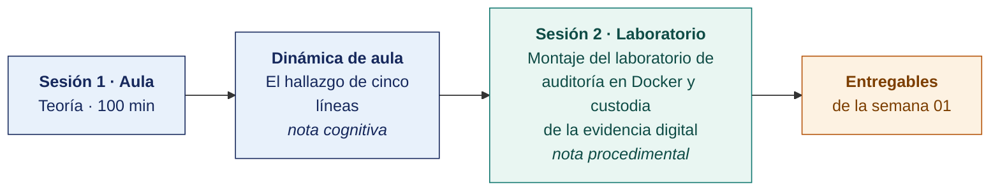

  
  &nbsp;&nbsp;&nbsp;&nbsp;&nbsp;&nbsp;
  

  <strong>Universidad Privada de Tacna</strong> 
  Facultad de Ingeniería · Escuela Profesional de Ingeniería de Sistemas

<h1 align="center">Semana 01 · Introducción a la Auditoría de Sistemas y a la Seguridad de la Información</h1>

  <strong>SI-084 · Auditoría de Sistemas</strong> 
  4 horas académicas de 50 min · 100 min de teoría con la dinámica incluida en aula · 100 min de taller en laboratorio

---

## Datos de la asignatura

| | |
|---|---|
| **Asignatura** | SI-084 · Auditoría de Sistemas |
| **Escuela** | Escuela Profesional de Ingeniería de Sistemas |
| **Ciclo** | X · 04 horas semanales · 03 créditos · Obligatorio |
| **Prerrequisito** | SI-985 Gestión de la Configuración de Software |
| **Unidad** | I — Seguridad de la Información en Auditoría de Sistemas |
| **Semana** | 01 de 17 |
| **Duración** | 4 horas académicas de 50 min · 100 min de teoría con la dinámica incluida en aula · 100 min de taller en laboratorio |
| **Resultados de aprendizaje** | **RA1** Analiza e interpreta los conceptos y terminología de Auditoría de Sistemas · **RA2** Evalúa la seguridad de la información en Auditoría de Sistemas |
| **Atributos del graduado** | AG-I08 Análisis de Problemas (CD2, nivel 4) · AG-I11 Uso de Herramientas (CD1, nivel 4) |

### Lo que indica el sílabo

**Contenido conceptual.** Prueba de entrada, exposición de contenidos conceptuales y criterios metodológicos para el desarrollo del curso. Introducción a la Auditoría de Sistemas, conceptos de auditoría, seguridad de la información.

**Contenido procedimental.** Maneja conceptos básicos de auditoría de sistemas y su valor agregado a la auditoría integrada.

## Materiales de esta semana

| | Documento | Qué encontrarás | Dónde y cuánto dura |
|---|---|---|---|
| 1 | **[Teoría](1-TEORIA.md)** | Qué es auditar · Qué es proteger la información · Cómo se organiza el curso como un encargo de auditoría | Aula · 100 min |
| 2 | **[Dinámica de aula](2-DINAMICA.md)** | El hallazgo de cinco líneas, con su material, su ejemplo resuelto y su rúbrica | Aula · dentro de los 100 min de la sesión de teoría |
| 3 | **[Taller de laboratorio](3-TALLER.md)** | Montaje del laboratorio de auditoría en Docker y custodia de la evidencia digital | Laboratorio · 100 min |

## Ruta de la semana

## Entregables

| Entregable | Formato y nombre del archivo | Vence |
|---|---|---|
| **Dinámica de aula** · El hallazgo de cinco líneas | PDF desde la [plantilla de dinámica](../PLANTILLAS/SI084-PLANTILLA-DINAMICA.docx) · `SI084-S01-DINAMICA-Grupo<N>.pdf` | Antes de cerrar la sesión de teoría |
| **Informe del taller de laboratorio N.º 01** | PDF en formato EPIS desde la [plantilla de taller](../PLANTILLAS/SI084-PLANTILLA-TALLER.docx) · `SI084-S01-TALLER-Grupo<N>.pdf` | 48 h después del taller |
| Repositorio del expediente de auditoría | URL de repositorio Git privado, con el docente como colaborador | Fin de la sesión de laboratorio |

> Ambos se entregan en **PDF**, con la carátula de la UPT y los códigos de todos los integrantes. Las plantillas obligatorias están en [`PLANTILLAS/`](../PLANTILLAS/).

## Cómo se evalúa

| Criterio | Instrumento | Peso en la unidad |
|---|---|---|
| Cognitivo | Rúbrica del hallazgo de cinco líneas + exposición de 10 min | 25 % |
| Procedimental | Lista de cotejo de los 7 resultados del laboratorio | 35 % |
| Actitudinal | Registro de participación, puntualidad y trabajo en equipo | 15 % |

## Atributos del Graduado · presentación del assessment

> En esta primera sesión se presenta el **Atributo del Graduado** que el curso mide para el Plan de Assessment de la Escuela, junto con su rúbrica. Toma diez minutos y evita el malentendido más común. Creer que es una nota más.

| | |
|---|---|
| **Atributo que mide el curso** | **AG-I02 · Ética** |
| **Qué significa** | Aplicar los principios éticos, la ética profesional y las normas de la práctica de la ingeniería, adherirse al marco legal pertinente y respetar la diversidad de los grupos humanos |
| **Semanas en que se recoge evidencia** | 08, 09, 11, 16 y 17 |
| **Sobre qué evidencia** | **La que ya entregas.** Dinámicas, informes de taller y la sustentación final. No hay entregable adicional |
| **Efecto en tu calificación** | **Ninguno.** Mide el programa, no al estudiante. Se registra aparte de las actas |
| **Dónde consultarlo** | [`ASSESSMENT/`](../ASSESSMENT/) · [rúbrica](../ASSESSMENT/RUBRICAS-AG.md) · [mapa](../ASSESSMENT/MAPA-AG.md) |

**Por qué en este curso.** Auditar es la actividad de la ingeniería donde el conflicto ético es cotidiano. Se accede a información que la organización preferiría no mostrar, se depende del auditado y se reporta lo que incomoda. Este curso es además el **punto de medición terminal** del atributo para el programa, por estar en el ciclo X sobre una empresa real.

## Preparación para la Semana 02

- **Leer.** Piattini y Del Peso, capítulo sobre control interno y seguridad.
- **Leer.** ISO/IEC 27001:2022, cláusulas 4 a 6 y los controles A.5.15 a A.5.18 del Anexo A.
- Dejar el entorno Docker operativo. La Semana 02 agrega Keycloak sobre esta misma red `audit_net`.

---

**Docente** · Dr. Oscar Juan Jimenez Flores
[oscarjimenezflores@upt.pe](mailto:oscarjimenezflores@upt.pe) · [LinkedIn](https://www.linkedin.com/in/oscar-jimenez-flores/) · [CTI Vitae — CONCYTEC](https://ctivitae.concytec.gob.pe/appDirectorioCTI/VerDatosInvestigador.do?id_investigador=33398)

Escuela Profesional de Ingeniería de Sistemas · Universidad Privada de Tacna · Tacna, Perú
