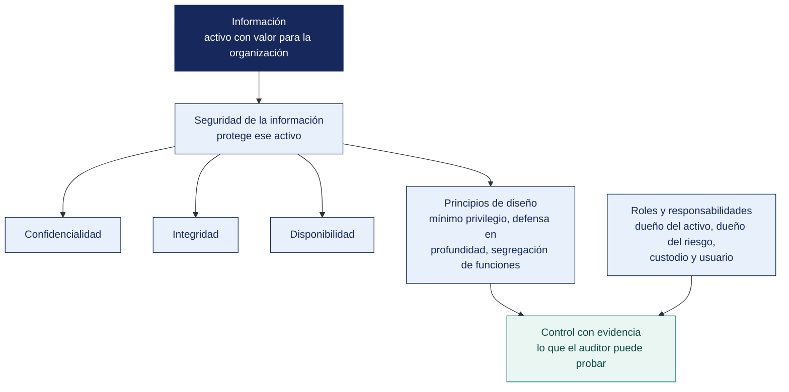

[Semana 02](README.md) · **Teoría** · [Dinámica de aula](2-DINAMICA.md) · [Taller de laboratorio](3-TALLER.md)

# Teoría · Principios de Seguridad de la Información · Roles y Responsabilidades

**SI-084 · Auditoría de Sistemas** · Semana 02 · Sesión 1 en aula · 2 horas académicas, 100 min, con la dinámica incluida

> ¿Un término no le resulta claro? Está definido en el [glosario técnico del curso](../GLOSARIO.md).

---

## Qué se trabaja en esta sesión

- Información y seguridad de la información.
- Los principios que sostienen el diseño de controles.
- Roles y responsabilidades en seguridad de la información.

## Mapa de la sesión

---

## Información y seguridad de la información (15 min)

**La información es el activo; la seguridad es una propiedad de su tratamiento.** Confundirlas produce el error más común en las organizaciones peruanas: comprar un cortafuegos y declarar que «ya se implementó la 27001».

| Dimensión | Información | Seguridad de la información |
|---|---|---|
| **Naturaleza** | Activo con valor de negocio | Conjunto de propiedades preservadas sobre ese activo |
| **Quién responde** | El **dueño del activo** (área usuaria: Finanzas, RR. HH., Ventas) | El **dueño del riesgo**, apoyado por el responsable de seguridad |
| **Cómo se mide** | Por su valor, criticidad y clasificación | Por la efectividad de los controles y el riesgo residual |
| **Error típico** | Creer que la información es de TI | Creer que la seguridad es un producto que se compra |

**Ciclo de vida de la información.** El auditor lo recorre entero porque cada etapa tiene controles distintos: **creación → clasificación → almacenamiento → uso → compartición → archivo → destrucción**. Una organización que cifra su base de datos pero envía los reportes por correo personal, o que no destruye los respaldos vencidos, tiene el control roto exactamente en las etapas que no miró.

**Clasificación de la información.** La ISO/IEC 27001:2022 exige, en el control **A.5.12 Classification of information**, que la información se clasifique según los requisitos de confidencialidad, integridad, disponibilidad y los requisitos legales. Un esquema operativo de cuatro niveles:

| Nivel | Criterio | Ejemplo | Control mínimo |
|---|---|---|---|
| Pública | Divulgación no causa daño | Catálogo de productos | Integridad de publicación |
| Interna | Divulgación causa molestia | Directorio telefónico interno | Autenticación |
| Confidencial | Divulgación causa daño material | Planilla, márgenes por cliente | Cifrado y control de acceso por rol |
| Restringida | Divulgación causa daño grave o legal | Datos sensibles de salud, claves | Cifrado, doble autorización, registro de accesos |

En el Perú, la Ley 29733 de Protección de Datos Personales y su reglamento fuerzan a incorporar una dimensión adicional. Los **datos sensibles** (origen étnico, salud, biometría, ingresos económicos, convicciones) exigen consentimiento expreso y medidas de seguridad reforzadas, con independencia de la clasificación comercial que la empresa les asigne.

## Los principios que sostienen el diseño de controles (20 min)

Estos principios no son eslóganes. Cada uno es una **prueba de auditoría concreta**.

| Principio | Enunciado | Prueba que aplica el auditor |
|---|---|---|
| **Mínimo privilegio** | Cada sujeto recibe solo los permisos indispensables para su función | Comparar la matriz de permisos efectivos contra el perfil del puesto |
| **Necesidad de conocer** | El acceso se otorga por necesidad funcional, no por jerarquía | Verificar si los gerentes tienen acceso a datos que no operan |
| **Segregación de funciones (SoD)** | Ninguna persona controla una transacción de extremo a extremo | Buscar usuarios que puedan crear un proveedor **y** aprobar su pago |
| **Defensa en profundidad** | Múltiples capas independientes; la falla de una no compromete el sistema | Verificar que existan controles en red, host, aplicación y dato |
| **Denegación por defecto** | Lo no autorizado explícitamente está prohibido | Revisar reglas de cortafuegos y ACL con regla final `deny any` |
| **Falla segura** | Ante error, el sistema queda en el estado más seguro | Provocar la caída del servicio de autenticación y observar si abre o cierra |
| **Rendición de cuentas** | Toda acción es atribuible a una persona identificada | Buscar cuentas genéricas y compartidas |
| **Mediación completa** | Cada acceso se verifica, no solo el primero | Comprobar si la autorización se revalida o se cachea indefinidamente |
| **Economía del mecanismo** | Un control simple es un control auditable | Evaluar si alguien en la organización entiende el control completo |

**Segregación de funciones: el control que más hallazgos produce.** En una organización pequeña —y casi todas las MYPE peruanas lo son— la SoD perfecta es imposible: no hay personal suficiente. Ese no es el hallazgo. El hallazgo es la **ausencia de controles compensatorios**: cuando una persona necesariamente concentra funciones incompatibles, la organización debe implementar revisión independiente posterior, bitácora inalterable y aprobación de segundo nivel por excepción. Reportar «no hay segregación de funciones» en una empresa de cuatro personas sin proponer el control compensatorio es un informe inútil.

Combinaciones tóxicas clásicas que el auditor busca siempre:

| Función A | Función B | Riesgo si coinciden |
|---|---|---|
| Crear proveedor | Aprobar pago | Proveedor fantasma |
| Registrar empleado | Aprobar planilla | Empleado fantasma |
| Desarrollar código | Desplegar a producción | Código no revisado en producción |
| Administrar usuarios | Operar la transacción | Autoconcesión de privilegios |
| Custodiar el activo | Registrar el activo | Faltante encubierto contablemente |

## Roles y responsabilidades en seguridad de la información (25 min)

**El error estructural.** Cuando la responsabilidad de la seguridad se concentra en TI, ocurre un conflicto irresoluble: quien opera el sistema decide también qué riesgo se acepta sobre él. La ISO/IEC 27001:2022 lo resuelve en su cláusula 5.3 exigiendo que la dirección asigne responsabilidades y autoridades de forma explícita.

| Rol | Responsabilidad primaria | Lo que **no** le corresponde |
|---|---|---|
| **Alta dirección** | Aprobar la política, asignar recursos, aceptar el riesgo residual | Definir configuraciones técnicas |
| **Dueño del activo de información** (área usuaria) | Clasificar la información, autorizar accesos, validar la vigencia de permisos | Administrar servidores |
| **Dueño del riesgo** | Decidir el tratamiento del riesgo y firmarlo | Delegar la decisión en TI |
| **Responsable de Seguridad de la Información (CISO / OSI)** | Diseñar el SGSI, coordinar, medir, reportar a la dirección | Operar los controles que él mismo audita |
| **Administrador de TI** | Implementar y operar los controles técnicos | Autorizar sus propios accesos |
| **Custodio de datos (DBA)** | Preservar la integridad y disponibilidad del dato | Decidir quién accede |
| **Auditor interno** | Evaluar independientemente el diseño y la eficacia operativa | Diseñar los controles que va a evaluar |
| **Usuario final** | Cumplir la política, reportar incidentes | Compartir sus credenciales «por urgencia» |
| **Oficial de Protección de Datos** | Velar por el cumplimiento de la Ley 29733 | Autorizar tratamientos sin base legal |

**La matriz RACI aplicada al SGSI.** El auditor no pregunta «¿quién es el responsable de la seguridad?». Pregunta, para cada control concreto: *¿quién lo ejecuta (R), quién responde por su resultado (A), a quién se consulta (C) y a quién se informa (I)?* Cuando dos personas figuran como **A** para el mismo control, nadie responde.

**El caso peruano en el sector público.** El Decreto Supremo 029-2021-PCM, reglamento de la Ley de Gobierno Digital (Decreto Legislativo 1412), y las resoluciones de la Secretaría de Gobierno y Transformación Digital establecen la figura del **Líder de Gobierno Digital** y la del **Oficial de Seguridad de la Información**, con responsabilidades formalmente separadas de la jefatura de la Oficina de Tecnologías de la Información. Cuando en una entidad pública el jefe de TI es simultáneamente el Oficial de Seguridad, existe un hallazgo de cumplimiento normativo, no solo de buena práctica.

## Cierre (5 min)

La pregunta que sintetiza la sesión — **si mañana ocurre una fuga de datos en esta organización, ¿quién firma la respuesta al regulador?** Si la respuesta es «el jefe de sistemas», la organización tiene un problema de gobierno, no de tecnología.

---

---

[Semana 02](README.md) · **Teoría** · [Dinámica de aula](2-DINAMICA.md) · [Taller de laboratorio](3-TALLER.md)

---

**Docente** · Dr. Oscar Juan Jimenez Flores
[oscarjimenezflores@upt.pe](mailto:oscarjimenezflores@upt.pe) · [LinkedIn](https://www.linkedin.com/in/oscar-jimenez-flores/) · [CTI Vitae — CONCYTEC](https://ctivitae.concytec.gob.pe/appDirectorioCTI/VerDatosInvestigador.do?id_investigador=33398)

Escuela Profesional de Ingeniería de Sistemas · Universidad Privada de Tacna · Tacna, Perú
