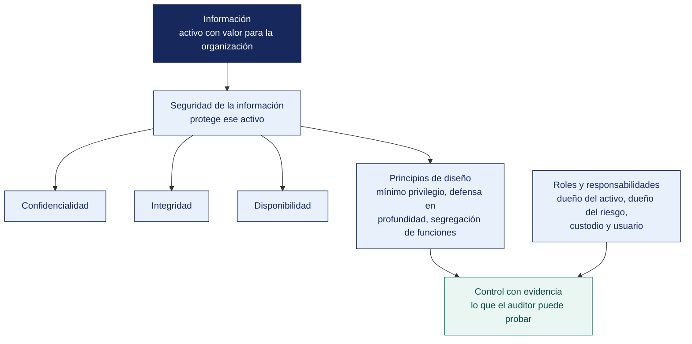

[Semana 02](README.md) · **Teoría** · [Dinámica de aula](2-DINAMICA.md) · [Taller de laboratorio](3-TALLER.md)

# Teoría · Principios de Seguridad de la Información · Roles y Responsabilidades

**SI-084 · Auditoría de Sistemas** · Semana 02 · Sesión 1 en aula · 2 horas académicas, 100 min, con la dinámica incluida

> ¿Un término no le resulta claro? Está definido en el [glosario técnico del curso](../GLOSARIO.md).

---

## La pregunta de esta sesión

Una empresa de seis personas descubre que su contador registró proveedores ficticios y les pagó durante catorce meses. El informe del auditor externo dice, en una línea, «no existe segregación de funciones» y recomienda implementarla.

El gerente responde que son seis personas y que no puede contratar a nadie más. El informe se archiva y nada cambia. Dos años después ocurre otra vez.

> **La pregunta que ordena esta sesión.** *¿Qué se recomienda cuando el control correcto es imposible de aplicar?*

## Antes de empezar

| Lo que necesita traer | De dónde sale |
|---|---|
| Qué es auditar y la estructura de un hallazgo | Semana 01 |
| La tríada de confidencialidad, integridad y disponibilidad | Semana 01 |
| Qué es un control y para qué sirve | Noción intuitiva; se formaliza en la Semana 04 |
| La idea de que la información tiene un dueño | Se construye hoy |

> **Exploración (5 min), antes de cualquier definición.** El aula responde sin consultar apuntes y las respuestas quedan a la vista. *¿Qué debió recomendar el auditor? ¿Quién debía responder por ese registro de proveedores, el contador o alguien más? ¿Qué habría detectado el fraude sin contratar a nadie?* Ninguna respuesta se corrige todavía.

## Distribución del tiempo

| Momento | Minutos |
|---|---|
| El caso de los proveedores ficticios y la exploración inicial | 10 |
| **Bloque 1.** Información y seguridad de la información · con su microaplicación | 15 |
| **Bloque 2.** Los principios que sostienen el diseño de controles · con su microaplicación | 20 |
| **Bloque 3.** Roles y responsabilidades | 12 |
| Cierre, respuesta a la pregunta de la sesión y puente a la dinámica | 8 |
| **Total de la sesión de aula** | **65** |

## Mapa de la sesión

---

## Bloque 1 · Información y seguridad de la información

> **La pregunta del bloque.** *¿De quién es la información de clientes, del área comercial o del área de sistemas?*

**La información es el activo; la seguridad es una propiedad de su tratamiento.** Confundirlas produce el error más común en las organizaciones peruanas. Comprar un cortafuegos y declarar que «ya se implementó la 27001».

| Dimensión | Información | Seguridad de la información |
|---|---|---|
| **Naturaleza** | Activo con valor de negocio | Conjunto de propiedades preservadas sobre ese activo |
| **Quién responde** | El **dueño del activo** (área usuaria: Finanzas, RR. HH., Ventas) | El **dueño del riesgo**, apoyado por el responsable de seguridad |
| **Cómo se mide** | Por su valor, criticidad y clasificación | Por la efectividad de los controles y el riesgo residual |
| **Error típico** | Creer que la información es de TI | Creer que la seguridad es un producto que se compra |

**Ciclo de vida de la información.** El auditor lo recorre entero porque cada etapa tiene controles distintos — **creación → clasificación → almacenamiento → uso → compartición → archivo → destrucción**. Una organización que cifra su base de datos pero envía los reportes por correo personal, o que no destruye los respaldos vencidos, tiene el control roto exactamente en las etapas que no miró.

**Clasificación de la información.** La ISO/IEC 27001:2022 exige, en el control **A.5.12 Classification of information**, que la información se clasifique según los requisitos de confidencialidad, integridad, disponibilidad y los requisitos legales. Un esquema operativo de cuatro niveles:

| Nivel | Criterio | Ejemplo | Control mínimo |
|---|---|---|---|
| Pública | Divulgación no causa daño | Catálogo de productos | Integridad de publicación |
| Interna | Divulgación causa molestia | Directorio telefónico interno | Autenticación |
| Confidencial | Divulgación causa daño material | Planilla, márgenes por cliente | Cifrado y control de acceso por rol |
| Restringida | Divulgación causa daño grave o legal | Datos sensibles de salud, claves | Cifrado, doble autorización, registro de accesos |

En el Perú, la Ley 29733 de Protección de Datos Personales y su reglamento fuerzan a incorporar una dimensión adicional. Los **datos sensibles** (origen étnico, salud, biometría, ingresos económicos, convicciones) exigen consentimiento expreso y medidas de seguridad reforzadas, con independencia de la clasificación comercial que la empresa les asigne.

> **El error frecuente del bloque.** Creer que la seguridad es un producto que se compra. Es el error que produce organizaciones con un cortafuegos caro, una política sin aprobar y ningún inventario de qué información tienen. La seguridad es una **propiedad del tratamiento** de un activo que pertenece al negocio, no al área de TI.

## Bloque 2 · Los principios que sostienen el diseño de controles

> **La pregunta del bloque.** *¿Cuál de estos nueve principios se rompe en el caso del contador?*

Estos principios no son eslóganes. Cada uno es una **prueba de auditoría concreta**.

| Principio | Enunciado | Prueba que aplica el auditor |
|---|---|---|
| **Mínimo privilegio** | Cada sujeto recibe solo los permisos indispensables para su función | Comparar la matriz de permisos efectivos contra el perfil del puesto |
| **Necesidad de conocer** | El acceso se otorga por necesidad funcional, no por jerarquía | Verificar si los gerentes tienen acceso a datos que no operan |
| **Segregación de funciones (SoD)** | Ninguna persona controla una transacción de extremo a extremo | Buscar usuarios que puedan crear un proveedor **y** aprobar su pago |
| **Defensa en profundidad** | Múltiples capas independientes; la falla de una no compromete el sistema | Verificar que existan controles en red, host, aplicación y dato |
| **Denegación por defecto** | Lo no autorizado explícitamente está prohibido | Revisar reglas de cortafuegos y ACL con regla final `deny any` |
| **Falla segura** | Ante error, el sistema queda en el estado más seguro | Provocar la caída del servicio de autenticación y observar si abre o cierra |
| **Rendición de cuentas** | Toda acción es atribuible a una persona identificada | Buscar cuentas genéricas y compartidas |
| **Mediación completa** | Cada acceso se verifica, no solo el primero | Comprobar si la autorización se revalida o se cachea indefinidamente |
| **Economía del mecanismo** | Un control simple es un control auditable | Evaluar si alguien en la organización entiende el control completo |

**Segregación de funciones. El control que más hallazgos produce.** En una organización pequeña —y casi todas las MYPE peruanas lo son— la SoD perfecta es imposible. No hay personal suficiente. Ese no es el hallazgo. El hallazgo es la **ausencia de controles compensatorios** — cuando una persona necesariamente concentra funciones incompatibles, la organización debe implementar revisión independiente posterior, bitácora inalterable y aprobación de segundo nivel por excepción. Reportar «no hay segregación de funciones» en una empresa de cuatro personas sin proponer el control compensatorio es un informe inútil.

Combinaciones tóxicas clásicas que el auditor busca siempre:

| Función A | Función B | Riesgo si coinciden |
|---|---|---|
| Crear proveedor | Aprobar pago | Proveedor fantasma |
| Registrar empleado | Aprobar planilla | Empleado fantasma |
| Desarrollar código | Desplegar a producción | Código no revisado en producción |
| Administrar usuarios | Operar la transacción | Autoconcesión de privilegios |
| Custodiar el activo | Registrar el activo | Faltante encubierto contablemente |

**Ejemplo trabajado — los principios aplicados a un solo caso.** Una cooperativa contrata a un analista de créditos.

| Principio | Cómo se aplica aquí | Qué pasa si se ignora |
|---|---|---|
| **Mínimo privilegio** | Ve los expedientes de los socios de su cartera, no los 21 400 | Un analista descargó 1 900 expedientes que no le correspondían durante cuatro meses |
| **Necesidad de conocer** | Ve el historial crediticio, no los datos de salud del legajo laboral | Datos sensibles accesibles sin relación con la función |
| **Segregación de funciones** | Evalúa el crédito, pero no lo aprueba ni desembolsa | Un solo empleado origina, aprueba y transfiere |
| **Defensa en profundidad** | Permisos, más registro de accesos, más revisión mensual | Un solo control fallando deja el activo descubierto |
| **Falla segura** | Si el sistema de permisos no responde, **niega** el acceso | Ante un fallo, el sistema abre todo «para no detener la operación» |
| **Responsabilidad individual** | Cada acceso queda registrado con usuario nominal | **Cuentas compartidas.** Nadie responde por nada |

> **Fíjese en el caso real.** El acceso indebido a 1 900 expedientes no se detectó por un control. Se detectó por una denuncia interna. Fallaron el mínimo privilegio *y* la defensa en profundidad, porque el servidor de archivos **no registraba accesos de lectura**.

> **Microaplicación (5 min) · la prueba de cada principio.** Cada principio de la tabla trae una prueba concreta. En parejas, el aula elige **tres principios y escribe qué pediría exactamente** para comprobarlos en la empresa del caso. Se recogen dos propuestas antes de continuar.

| Caso | Qué debe contener una buena respuesta |
|---|---|
| ¿Por qué «falla segura» es tan poco popular en las organizaciones? | Porque cuando el control falla, la operación se detiene. La alternativa —abrir todo— es cómoda y es exactamente lo que un atacante provoca a propósito |
| Una empresa de 6 personas no puede segregar funciones. ¿Se abandona el principio? | No. Se sustituye por un control **compensatorio** documentado: revisión posterior por un tercero, con registro. Y se declara por qué se compensó |
| ¿Registrar accesos de lectura es exagerado? | Depende del dato. Para datos sensibles no lo es sin ese registro, una fuga por lectura es indetectable e indemostrable |
> **El error frecuente del bloque.** Reportar «no hay segregación de funciones» en una empresa pequeña sin proponer el control compensatorio. Es el error del informe del caso con el que abrimos — técnicamente correcto y profesionalmente inútil, porque señala una imposibilidad en lugar de una acción. En una organización sin personal suficiente, **el hallazgo no es la ausencia de segregación, es la ausencia de compensación**.

## Bloque 3 · Roles y responsabilidades en seguridad de la información

> **La pregunta del bloque.** *Cuando algo sale mal, ¿quién responde y quién ejecuta?*

**El error estructural.** Cuando la responsabilidad de la seguridad se concentra en TI, ocurre un conflicto irresoluble. Quien opera el sistema decide también qué riesgo se acepta sobre él. La ISO/IEC 27001:2022 lo resuelve en su cláusula 5.3 exigiendo que la dirección asigne responsabilidades y autoridades de forma explícita.

| Rol | Responsabilidad primaria | Lo que **no** le corresponde |
|---|---|---|
| **Alta dirección** | Aprobar la política, asignar recursos, aceptar el riesgo residual | Definir configuraciones técnicas |
| **Dueño del activo de información** (área usuaria) | Clasificar la información, autorizar accesos, validar la vigencia de permisos | Administrar servidores |
| **Dueño del riesgo** | Decidir el tratamiento del riesgo y firmarlo | Delegar la decisión en TI |
| **Responsable de Seguridad de la Información (CISO / OSI)** | Diseñar el SGSI, coordinar, medir, reportar a la dirección | Operar los controles que él mismo audita |
| **Administrador de TI** | Implementar y operar los controles técnicos | Autorizar sus propios accesos |
| **Custodio de datos (DBA)** | Preservar la integridad y disponibilidad del dato | Decidir quién accede |
| **Auditor interno** | Evaluar independientemente el diseño y la eficacia operativa | Diseñar los controles que va a evaluar |
| **Usuario final** | Cumplir la política, reportar incidentes | Compartir sus credenciales «por urgencia» |
| **Oficial de Protección de Datos** | Velar por el cumplimiento de la Ley 29733 | Autorizar tratamientos sin base legal |

**La matriz RACI aplicada al SGSI (Sistema de Gestión de Seguridad de la Información).** El auditor no pregunta «¿quién es el responsable de la seguridad?». Pregunta, para cada control concreto. *¿Quién lo ejecuta (R), quién responde por su resultado (A), a quién se consulta (C) y a quién se informa (I)?* Cuando dos personas figuran como **A** para el mismo control, nadie responde.

**El caso peruano en el sector público.** El Decreto Supremo 029-2021-PCM, reglamento de la Ley de Gobierno Digital (Decreto Legislativo 1412), y las resoluciones de la Secretaría de Gobierno y Transformación Digital establecen la figura del **Líder de Gobierno Digital** y la del **Oficial de Seguridad de la Información**, con responsabilidades formalmente separadas de la jefatura de la Oficina de Tecnologías de la Información. Cuando en una entidad pública el jefe de TI es simultáneamente el Oficial de Seguridad, existe un hallazgo de cumplimiento normativo, no solo de buena práctica.

**Ejemplo trabajado — quién responde cuando algo sale mal.** Se filtran datos de clientes desde una carpeta compartida mal configurada.

| Rol | Qué le correspondía | Qué se le puede exigir |
|---|---|---|
| **Propietario del activo** — el jefe de Comercial | Definir quién debe acceder y con qué nivel | Que declare y revise periódicamente la lista de accesos autorizados. **No se le exige configurar el permiso** |
| **Custodio** — Tecnologías de la Información | Implantar técnicamente lo que el propietario definió | Que la configuración corresponda a lo autorizado, y que exista registro |
| **Usuario** | Usar el acceso para lo que se le otorgó | Que no comparta su credencial ni extraiga información fuera de su función |
| **Oficial de seguridad** | Definir la política y verificar su cumplimiento | Que exista la política, que se haya difundido y que se revise |
| **Alta dirección** | Asignar recursos y aprobar el apetito de riesgo | Que haya aprobado la política y provisto los medios |

> **El error más común en los informes de estudiantes** es atribuirle todo a TI. Si el jefe de Comercial nunca definió quién debía acceder, el custodio configuró en el vacío. **El hallazgo es sobre la ausencia de propietario declarado**, no sobre la configuración.

> **Microaplicación (4 min) · quién responde por el dato.** El aula responde a mano alzada antes de la explicación. La respuesta mayoritaria suele ser la equivocada, y por eso conviene recogerla primero.

| Caso | Qué debe contener una buena respuesta |
|---|---|
| ¿Puede el jefe de sistemas ser propietario de los datos de clientes? | No debería. El propietario es quien conoce el uso del negocio y decide quién accede. Si TI es propietario **y** custodio, no hay quien controle a quien controla |
| ¿Qué se le exige a la alta dirección en un hallazgo de seguridad? | Haber aprobado una política, asignado responsabilidades y provisto recursos. Su responsabilidad es de gobierno, no de configuración |
| ¿Sirve una política de seguridad que nadie leyó? | Como criterio de auditoría, sí: existe y es exigible. Como control, no: sin difusión ni verificación, no opera |
## Cierre · qué se lleva de aquí

**La respuesta a la pregunta con la que abrimos.** Cuando el control correcto es inviable por tamaño o por costo, se recomienda un **control compensatorio** que cubra el mismo objetivo por otra vía, y se documenta por qué se recurre a él. En la empresa del caso, la revisión mensual de todos los pagos por el contador externo detecta al proveedor ficticio sin contratar a nadie. El informe original no era falso, era inaplicable.

**Las tres ideas que deben quedar.**

| Idea | Por qué importa en el ejercicio profesional |
|---|---|
| La información es del negocio; la seguridad es una propiedad de su tratamiento | Determina a quién se le pide la evidencia y quién responde por el hallazgo |
| Cada principio de diseño trae asociada una prueba concreta | Convierte nueve enunciados abstractos en nueve procedimientos que se pueden ejecutar en campo |
| En una organización pequeña, el hallazgo es la ausencia de control compensatorio | Es la diferencia entre un informe que se archiva y uno que produce un cambio |

**Volviendo a la exploración del inicio.** Se releen las respuestas iniciales. La pregunta que más se falla es la tercera — casi todo el mundo propone contratar más gente o comprar un sistema, y casi nadie propone que alguien de fuera del proceso revise después. Esa es la definición de control compensatorio.

**Lo que sigue.** La [dinámica de esta sesión](2-DINAMICA.md) entrega la estructura y la matriz de accesos de su organización, y pide detectar las combinaciones tóxicas de funciones **y proponer controles compensatorios viables para el tamaño de esa empresa**. La restricción es explícita — no vale «contratar más gente».

La pregunta que sintetiza la sesión — **si mañana ocurre una fuga de datos en esta organización, ¿quién firma la respuesta al regulador?** Si la respuesta es «el jefe de sistemas», la organización tiene un problema de gobierno, no de tecnología.
---

---

[Semana 02](README.md) · **Teoría** · [Dinámica de aula](2-DINAMICA.md) · [Taller de laboratorio](3-TALLER.md)

---

**Docente** · Dr. Oscar Juan Jimenez Flores
[oscarjimenezflores@upt.pe](mailto:oscarjimenezflores@upt.pe) · [LinkedIn](https://www.linkedin.com/in/oscar-jimenez-flores/) · [CTI Vitae — CONCYTEC](https://ctivitae.concytec.gob.pe/appDirectorioCTI/VerDatosInvestigador.do?id_investigador=33398)

Escuela Profesional de Ingeniería de Sistemas · Universidad Privada de Tacna · Tacna, Perú
