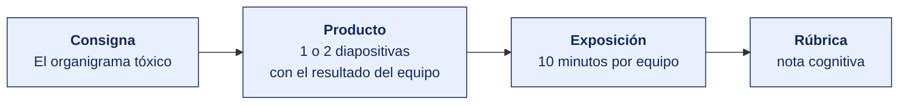

[Semana 02](README.md) · [Teoría](1-TEORIA.md) · **Dinámica de aula** · [Taller de laboratorio](3-TALLER.md)

# Dinámica de aula · El organigrama tóxico

**SI-084 · Auditoría de Sistemas** · Semana 02 · Actividad en aula, **dentro de los 100 min de la sesión de teoría** · calificación **cognitiva**

> ¿Un término no le resulta claro? Está definido en el [glosario técnico del curso](../GLOSARIO.md).

---

## Cómo funciona la actividad



## Qué entregas

| | |
|---|---|
| **Archivo** | `SI084-S02-DINAMICA-Grupo<N>.pdf` |
| **Plantilla obligatoria** | [SI084-PLANTILLA-DINAMICA.docx](../PLANTILLAS/SI084-PLANTILLA-DINAMICA.docx) |
| **Formato** | PDF exportado desde la plantilla en Word, con la carátula de la UPT y los apellidos, nombres y códigos de todos los integrantes |
| **Qué va dentro** | Lo que el grupo resolvió en aula. Las tablas de la sección **Producto** van completas, con los textos redactados, y cada decisión va justificada |
| **Dónde se sube** | Aula virtual, tarea «Dinámica · Semana 02» |
| **Cuándo vence** | Antes de cerrar la sesión de teoría |
| **Exposición** | 10 minutos por grupo en la sesión de teoría de la Semana 03 |

> No se califica un trabajo entregado en `.docx`, sin carátula, sin los códigos de los integrantes o con las tablas del producto vacías.

---

## Consigna

> **«El organigrama tóxico»**
> Cada equipo recibe el **organigrama y la matriz de accesos de una empresa comercializadora de 22 empleados** (está en la sección **Material de trabajo** de esta página), con el detalle de qué roles del ERP tiene asignado cada persona. El equipo debe **detectar las combinaciones tóxicas de segregación de funciones y proponer controles compensatorios viables para el tamaño de la empresa**.

## Material de trabajo

Trabaja sobre esta organización. Es una comercializadora de material de construcción con 22 empleados, un solo local y un ERP de gestión.

**Organigrama**

```
                        Gerencia General (1)
                                │
        ┌───────────────┬───────┴───────┬────────────────┐
        │               │               │                │
   Administración   Comercial       Operaciones      Tecnologías
   y Finanzas (5)      (7)              (7)        de Información (2)
        │               │               │                │
   Contador (1)    Jefe Com. (1)   Jefe Oper. (1)   Jefe TI (1)
   Tesorería (1)   Vendedores (4)  Almacén (4)      Analista (1)
   Compras (1)     Facturación (2) Despacho (2)
   Planillas (1)
   Asistente (1)
```

**Matriz de accesos del ERP**

| # | Puesto | Persona | Roles asignados en el ERP |
|---|---|---|---|
| 1 | Gerente General | G. Rivas | `reportes.consultar`, `todos.consultar` |
| 2 | Contador | M. Salas | `conta.registrar_asiento`, `conta.cerrar_periodo`, `conta.modificar_plan_cuentas` |
| 3 | Tesorería | L. Núñez | `teso.registrar_proveedor`, `teso.programar_pago`, `teso.aprobar_pago`, `teso.conciliar_banco` |
| 4 | Compras | R. Zeña | `comp.crear_requisicion`, `comp.crear_orden`, `comp.aprobar_orden`, `comp.crear_proveedor` |
| 5 | Planillas | A. Torres | `rrhh.registrar_trabajador`, `rrhh.calcular_planilla`, `rrhh.aprobar_planilla` |
| 6 | Asistente Administrativo | C. Paredes | `conta.registrar_asiento`, `teso.programar_pago` |
| 7 | Jefe Comercial | D. Ávila | `vent.crear_pedido`, `vent.aprobar_descuento`, `vent.anular_factura` |
| 8-11 | Vendedores (4) | — | `vent.crear_pedido`, `vent.crear_cliente` |
| 12-13 | Facturación (2) | — | `vent.emitir_factura`, `vent.anular_factura`, `vent.crear_cliente` |
| 14 | Jefe de Operaciones | P. Quispe | `alm.registrar_ingreso`, `alm.registrar_salida`, `alm.ajustar_inventario` |
| 15-18 | Almacén (4) | — | `alm.registrar_ingreso`, `alm.registrar_salida` |
| 19-20 | Despacho (2) | — | `alm.registrar_salida` |
| 21 | Jefe de TI | J. Mendoza | **`admin.todos`** (perfil de superusuario), `desarrollo.desplegar` |
| 22 | Analista de TI | S. Rojas | **`admin.todos`** (perfil de superusuario), `desarrollo.desplegar`, `desarrollo.editar_codigo` |

**Reglas de negocio del ERP que necesitas conocer**

| Regla | Detalle |
|---|---|
| Aprobación de órdenes de compra | Una sola firma si el monto es menor a S/ 20 000. Dos firmas por encima de ese monto |
| Anulación de facturas | No requiere aprobación. Queda registro en la bitácora del sistema, que nadie revisa |
| Ajuste de inventario | No requiere aprobación ni justificación obligatoria |
| Registro de proveedores | El número de cuenta bancaria es un campo editable en cualquier momento, sin flujo de aprobación |
| Bitácora del sistema | Registra usuario, fecha y operación. Se conserva 90 días. No hay revisión periódica establecida |

**Restricción del caso.** La empresa no puede contratar personal adicional en el ejercicio. Cualquier propuesta que dependa de crear un puesto queda fuera del alcance de la dinámica.

## Producto

**Diapositiva 1 — Matriz de conflictos.**

| Persona | Rol A | Rol B en conflicto | Riesgo concreto | Severidad |
|---|---|---|---|---|

**Diapositiva 2 — Controles compensatorios.** Para cada conflicto que **no pueda eliminarse** por falta de personal, un control compensatorio con: descripción, frecuencia, responsable de ejecución y evidencia que dejaría.

## Ejemplo resuelto

*El caso de este ejemplo es distinto del que le toca a tu grupo. Sirve para que veas el nivel de detalle que se espera, no para copiarlo.*

**Una fila bien resuelta de cada tabla.** El ejemplo es de otra empresa y de un conflicto distinto de los que hay en tu material.

*Matriz de conflictos*

| Persona | Rol A | Rol B en conflicto | Riesgo concreto | Severidad |
|---|---|---|---|---|
| Jefe de Almacén (empresa de 30 personas) | `alm.registrar_salida` | `alm.ajustar_inventario` | Puede sacar mercadería del almacén y, acto seguido, ajustar el inventario para que el faltante no aparezca. El ERP no exige justificación ni aprobación para el ajuste, y la diferencia solo se detectaría en el inventario físico anual. | Crítica |

*Control compensatorio*

| Campo | Contenido |
|---|---|
| Conflicto que no se elimina | El almacén tiene un solo jefe y cuatro operarios sin perfil administrativo. Separar el ajuste de inventario exige un puesto de control de existencias que la empresa no puede financiar. |
| Control compensatorio | Revisión quincenal, por el Contador, del reporte de ajustes de inventario del período, con verificación física por muestreo de los cinco ajustes de mayor valor. |
| Frecuencia | Quincenal, dentro de los tres días hábiles siguientes al corte. |
| Responsable de ejecución | Contador, que no tiene acceso al módulo de almacén. |
| Evidencia que deja | Reporte de ajustes firmado, con el detalle del conteo físico de los cinco ajustes verificados y la explicación de cada diferencia. |
| Control ISO que lo sustenta | ISO/IEC 27001:2022, **A.5.3 Segregation of duties**, y objetivo COBIT 2019 **DSS06.03 Manage roles, responsibilities, access privileges and levels of authority**. |

**La diferencia entre aprobar y no aprobar.**

| Así no | Así sí |
|---|---|
| «Riesgo de fraude en almacén.» | «Puede sacar mercadería y ajustar el inventario para que el faltante no aparezca. El ajuste no exige justificación ni aprobación.» |
| «Se recomienda contratar más personal.» | «Revisión quincenal del Contador, con verificación física de los cinco ajustes de mayor valor, porque el puesto de control de existencias no es financiable.» |
| «El jefe supervisa.» | «Contador, que no tiene acceso al módulo de almacén, dentro de los tres días hábiles siguientes al corte.» |

## Reglas

- 35 minutos de elaboración en aula.
- Se exige al menos **un conflicto que el equipo decida NO eliminar**, justificando por qué el control compensatorio es más eficiente que contratar personal.
- Entrega en el aula virtual como `S02_<equipo>_sod.pdf` antes de cerrar la sesión.
- Exposición de 10 minutos en la sesión de teoría de la Semana 03.

## Rúbrica cognitiva (20 puntos)

| Criterio | 5 | 3 | 1 |
|---|---|---|---|
| **Detección de conflictos** | Identifica conflictos no evidentes (p. ej. desarrollo + despliegue) además de los obvios | Identifica solo los conflictos evidentes | Confunde jerarquía con conflicto de funciones |
| **Riesgo concreto** | Describe el fraude o error específico posible y su límite económico | Riesgo genérico pero pertinente | «Riesgo de seguridad» |
| **Control compensatorio** | Viable, con frecuencia, responsable y evidencia verificable | Viable pero incompleto | Propone contratar personal como única salida |
| **Criterio normativo** | Cita el control ISO o el objetivo COBIT aplicable | Menciona la norma sin el control | Sin referencia normativa |

---

---

[Semana 02](README.md) · [Teoría](1-TEORIA.md) · **Dinámica de aula** · [Taller de laboratorio](3-TALLER.md)

---

**Docente** · Dr. Oscar Juan Jimenez Flores
[oscarjimenezflores@upt.pe](mailto:oscarjimenezflores@upt.pe) · [LinkedIn](https://www.linkedin.com/in/oscar-jimenez-flores/) · [CTI Vitae — CONCYTEC](https://ctivitae.concytec.gob.pe/appDirectorioCTI/VerDatosInvestigador.do?id_investigador=33398)

Escuela Profesional de Ingeniería de Sistemas · Universidad Privada de Tacna · Tacna, Perú
