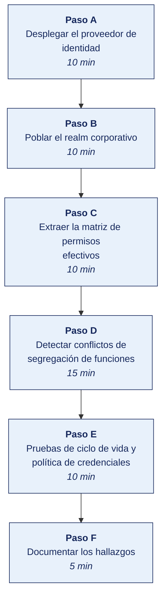

[Semana 02](README.md) · [Teoría](1-TEORIA.md) · [Dinámica de aula](2-DINAMICA.md) · **Taller de laboratorio**

# Taller de laboratorio 02 · Auditoría de identidades, accesos y segregación de funciones con Keycloak

**SI-084 · Auditoría de Sistemas** · Semana 02 · Sesión 2 en laboratorio · 60 min de taller + 40 de avance · calificación **procedimental**

> ¿Un término no le resulta claro? Está definido en el [glosario técnico del curso](../GLOSARIO.md).

---

## Secuencia del taller



## Qué entregas

| | |
|---|---|
| **Archivo** | `SI084-S02-TALLER-Grupo<N>.pdf` |
| **Plantilla obligatoria** | [SI084-PLANTILLA-TALLER.docx](../PLANTILLAS/SI084-PLANTILLA-TALLER.docx) |
| **Formato** | PDF exportado desde la plantilla en Word, con la carátula de la UPT, el índice actualizado y las capturas numeradas |
| **Qué va dentro** | Las siete secciones del formato EPIS. La sección **3. Resultados** se califica contra la tabla de resultados esperados de esta guía, y cada resultado necesita su evidencia |
| **Dónde se sube** | Aula virtual, tarea «Taller · Semana 02» |
| **Cuándo vence** | 48 horas después de la sesión de laboratorio |

> No se califica un informe entregado en `.docx`, sin carátula, sin los códigos de los integrantes o con resultados declarados sin evidencia.

---

## 1. Información sobre el evento práctico

### 1.1. Título del evento práctico

Auditoría de la gestión de identidades y accesos sobre un proveedor de identidad real (Keycloak), con extracción de la matriz de permisos efectivos y detección automatizada de conflictos de segregación de funciones.

### 1.2. Objetivos

- Desplegar **Keycloak** en Docker como proveedor de identidad de la organización auditada.
- Cargar un *realm* corporativo con usuarios, grupos, roles y asignaciones que reproducen una estructura organizacional realista.
- **Extraer por API** la matriz de permisos efectivos, distinguiendo permisos directos de permisos heredados por grupo o por rol compuesto.
- Detectar mediante script las **combinaciones tóxicas de segregación de funciones** definidas en una matriz de conflictos.
- Evaluar la **política de contraseñas, el ciclo de vida de las cuentas y las cuentas huérfanas**.
- Producir dos hallazgos formales con evidencia sellada.

### 1.3. Tiempo de duración

**100 minutos:** 60 de taller guiado y 40 de avance asistido.

### 1.4. Resultados de Aprendizaje (RA)

- **RA1** Analiza e interpreta los conceptos y terminología de Auditoría de Sistemas.
- **RA2** Evalúa la seguridad de la información en Auditoría de Sistemas.

### 1.5. Recursos

| Recurso | Detalle |
|---|---|
| Entorno de la Semana 01 | `si084-lab` operativo, red `audit_net` |
| **Keycloak** | Imagen `quay.io/keycloak/keycloak:latest` — https://www.keycloak.org/ |
| **jq** | Procesador JSON en línea de comandos — https://jqlang.github.io/jq/ |
| **Python 3.11+** con `pandas` | Análisis de la matriz de permisos |
| `curl` | Consumo de la Admin REST API |
| Navegador | Consola de administración de Keycloak |

### 1.6. Seguridad

1. Keycloak se publica únicamente en `127.0.0.1:8080`.
2. El *realm* se puebla con **datos ficticios**; está prohibido cargar nombres, correos o DNI reales de la empresa auditada.
3. Las credenciales de administrador del laboratorio (`admin`/`admin`) son válidas **solo** en este entorno aislado y nunca se replican fuera de él.
4. El *token* de administración obtenido por API se trata como secreto. No se pega en el informe ni se sube al repositorio.

---

## 2. Procedimiento o Metodología

### Paso A — Desplegar el proveedor de identidad (10 min)

Se agrega el servicio al `docker-compose.yml` de la Semana 01:

```yaml
  keycloak:
    image: quay.io/keycloak/keycloak:latest
    container_name: si084_keycloak
    command: start-dev
    environment:
      KC_BOOTSTRAP_ADMIN_USERNAME: admin
      KC_BOOTSTRAP_ADMIN_PASSWORD: admin
      KC_HEALTH_ENABLED: "true"
    ports:
      - "127.0.0.1:8080:8080"
    networks: [audit_net]
```

```bash
docker compose up -d keycloak
docker compose logs -f keycloak | head -30   # esperar "Running the server in development mode"
```

**Consola de administración.** http://127.0.0.1:8080 → *realm* `master`, usuario `admin`.

### Paso B — Poblar el realm corporativo (10 min)

Se crea el *realm* `comercializadora` con la estructura organizacional a auditar. Se ejecuta con el CLI interno de Keycloak:

```bash
docker exec -it si084_keycloak /opt/keycloak/bin/kcadm.sh config credentials \
  --server http://localhost:8080 --realm master --user admin --password admin

KC="docker exec -i si084_keycloak /opt/keycloak/bin/kcadm.sh"

# Realm
$KC create realms -s realm=comercializadora -s enabled=true

# Roles del ERP
for R in compras.crear_proveedor compras.aprobar_pago tesoreria.emitir_cheque \
         rrhh.registrar_empleado rrhh.aprobar_planilla \
         ti.administrar_usuarios ti.desplegar_produccion desarrollo.commit \
         contabilidad.registrar_asiento contabilidad.cerrar_periodo; do
  $KC create roles -r comercializadora -s name=$R
done

# Grupos
for G in Compras Tesoreria RRHH Contabilidad TI Desarrollo Gerencia; do
  $KC create groups -r comercializadora -s name=$G
done
```

A continuación se crean **22 usuarios** con asignaciones deliberadamente mezcladas. Se entrega el archivo `usuarios.json` con la carga completa; se importa con:

```bash
docker cp usuarios.json si084_keycloak:/tmp/usuarios.json
docker exec -i si084_keycloak /opt/keycloak/bin/kcadm.sh create partialImport \
  -r comercializadora -f /tmp/usuarios.json
```

> Si el tiempo apremia, se importa directamente el *realm* completo preparado: `docker exec -i si084_keycloak /opt/keycloak/bin/kc.sh import --file /tmp/realm-comercializadora.json`

### Paso C — Extraer la matriz de permisos efectivos (10 min)

El auditor **no confía en la pantalla**. Extrae por API y analiza fuera del sistema auditado.

```bash
# 1. Obtener token de administración
TOKEN=$(curl -s -X POST http://127.0.0.1:8080/realms/master/protocol/openid-connect/token \
  -d "client_id=admin-cli" -d "username=admin" -d "password=admin" \
  -d "grant_type=password" | jq -r .access_token)

mkdir -p ../20_evidencia/E02_iam && cd ../20_evidencia/E02_iam

# 2. Inventario de usuarios
curl -s -H "Authorization: Bearer $TOKEN" \
  "http://127.0.0.1:8080/admin/realms/comercializadora/users?max=1000" > usuarios.json

# 3. Roles efectivos por usuario (incluye heredados por grupo y roles compuestos)
echo '[]' > roles_efectivos.json
for ID in $(jq -r '.[].id' usuarios.json); do
  U=$(jq -r --arg id "$ID" '.[] | select(.id==$id) | .username' usuarios.json)
  curl -s -H "Authorization: Bearer $TOKEN" \
    "http://127.0.0.1:8080/admin/realms/comercializadora/users/$ID/role-mappings/realm/composite" \
 | jq --arg u "$U" '[.[] | {usuario:$u, rol:.name}]' >> tmp_roles.jsonl
done
jq -s 'add' tmp_roles.jsonl > roles_efectivos.json && rm tmp_roles.jsonl

# 4. Política de contraseñas del realm
curl -s -H "Authorization: Bearer $TOKEN" \
  "http://127.0.0.1:8080/admin/realms/comercializadora" \
 | jq '{passwordPolicy, bruteForceProtected, otpPolicyType, sslRequired,
         accessTokenLifespan, ssoSessionIdleTimeout}' > politica_realm.json

# 5. Eventos de autenticación (¿está activada la auditoría?)
curl -s -H "Authorization: Bearer $TOKEN" \
  "http://127.0.0.1:8080/admin/realms/comercializadora/events/config" > config_eventos.json
```

> **Punto de auditoría.** El paso 3 usa el endpoint `composite`, no `role-mappings/realm`. La diferencia es el hallazgo: la pantalla de administración muestra los roles *directos*, mientras que el permiso real del usuario incluye los heredados. Auditar la pantalla equivocada produce un informe que subestima el privilegio.

### Paso D — Detectar conflictos de segregación de funciones (15 min)

Se define primero la **matriz de conflictos** —el criterio— y luego se contrasta con la evidencia:

```python
# archivo: ../../30_papeles_trabajo/PT02_analisis_sod.py
import json, pandas as pd
from itertools import combinations

# --- CRITERIO: matriz de funciones incompatibles ---
CONFLICTOS = [
    ("compras.crear_proveedor",   "compras.aprobar_pago",      "Proveedor fantasma con pago autoaprobado", "Crítico"),
    ("compras.aprobar_pago",      "tesoreria.emitir_cheque",   "Aprobación y desembolso por la misma persona", "Crítico"),
    ("rrhh.registrar_empleado",   "rrhh.aprobar_planilla",     "Empleado fantasma en planilla", "Crítico"),
    ("desarrollo.commit",         "ti.desplegar_produccion",   "Código sin revisión independiente en producción", "Alto"),
    ("ti.administrar_usuarios",   "compras.aprobar_pago",      "Autoconcesión de privilegios transaccionales", "Crítico"),
    ("contabilidad.registrar_asiento", "contabilidad.cerrar_periodo", "Ajuste y cierre sin revisión", "Alto"),
]

# --- EVIDENCIA ---
roles = pd.DataFrame(json.load(open("../20_evidencia/E02_iam/roles_efectivos.json")))
matriz = roles.assign(v=1).pivot_table(index="usuario", columns="rol",
                                       values="v", fill_value=0)

# --- ANÁLISIS ---
filas = []
for a, b, riesgo, sev in CONFLICTOS:
    if a in matriz.columns and b in matriz.columns:
        for usuario in matriz.index[(matriz[a] == 1) & (matriz[b] == 1)]:
            filas.append({"usuario": usuario, "rol_A": a, "rol_B": b,
                          "riesgo": riesgo, "severidad": sev})

conf = pd.DataFrame(filas)
conf.to_csv("../40_hallazgos/PT02_conflictos_sod.csv", index=False)

print(f"Usuarios analizados : {len(matriz)}")
print(f"Roles distintos     : {len(matriz.columns)}")
print(f"Conflictos SoD      : {len(conf)}")
print(conf.to_string(index=False) if len(conf) else "Sin conflictos")

# --- Prueba adicional: usuarios con privilegio excesivo ---
print("\nUsuarios con más de 4 roles efectivos:")
print(matriz.sum(axis=1).sort_values(ascending=False).head(8).to_string())
```

Ejecución y sellado:

```bash
python3 ../../30_papeles_trabajo/PT02_analisis_sod.py | tee ../../30_papeles_trabajo/PT02_salida.txt
sha256sum ../20_evidencia/E02_iam/* ../../40_hallazgos/PT02_conflictos_sod.csv \
  >> ../SHA256SUMS_E02.txt
```

### Paso E — Pruebas de ciclo de vida y política de credenciales (10 min)

| Prueba | Comando o verificación | Criterio ISO/IEC 27001:2022 |
|---|---|---|
| **P1** Política de contraseñas definida | `jq .passwordPolicy politica_realm.json` — un valor `null` es hallazgo | A.5.17 |
| **P2** Protección contra fuerza bruta | `jq .bruteForceProtected politica_realm.json` | A.8.5 |
| **P3** Segundo factor exigido | `jq .otpPolicyType politica_realm.json` y revisión de *Required Actions* | A.8.5 |
| **P4** Registro de eventos activo | `jq '.eventsEnabled, .adminEventsEnabled' config_eventos.json` | A.8.15 |
| **P5** Cuentas nunca usadas | Usuarios sin `lastLogin` o creados hace más de 90 días sin acceso | A.5.18 |
| **P6** Cuentas sin correo verificado | `jq '[.[] \| select(.emailVerified==false) \| .username]' usuarios.json` | A.5.16 |
| **P7** Transporte cifrado exigido | `jq .sslRequired politica_realm.json` — `none` es hallazgo | A.8.24 |
| **P8** Sesión con expiración razonable | `jq .ssoSessionIdleTimeout politica_realm.json` | A.8.5 |

### Paso F — Documentar los hallazgos (5 min)

Se redactan como mínimo **dos hallazgos** en `40_hallazgos/`, con estructura CCCER completa y referencia al identificador de evidencia y su hash:

- `H-002.md` — conflicto de segregación de funciones de severidad crítica, con el nombre del usuario, los dos roles y el fraude posible.
- `H-003.md` — deficiencia en la política de credenciales o en el registro de eventos.

---


### Avance asistido · Avance del encargo asistido (40 min)

Los últimos 40 minutos del laboratorio son del equipo. El docente no dirige: queda disponible para consultas y observa el reparto real del trabajo.

| | |
|---|---|
| **Qué se trabaja** | los papeles de trabajo y entregables del encargo, según el programa de auditoría vigente |
| **Quién decide qué hacer** | El equipo. El docente no asigna tareas en este tramo |
| **Dónde se registra** | el tablero de avance del equipo, con cada elemento asignado a una persona |
| **Para qué sirve la presencia del docente** | Resolver bloqueos en el momento, no revisar entregables |

> **Se registra la contribución individual.** Lo trabajado en este tramo queda en el repositorio con su autoría. Es la evidencia del atributo **AG-I03 Trabajo Individual y en Equipo** que se mide en las semanas de cierre de unidad.

## 3. Resultados

> **Evidencia obligatoria en GitHub.** Todo resultado de este taller se versiona en el repositorio del equipo. El informe **no consigna capturas sueltas**: consigna la **URL** del artefacto en GitHub. Una captura no permite verificar autoría, fecha ni contenido; un enlace sí.
>
> | Qué se entrega | Dónde vive | Qué se escribe en el informe |
> |---|---|---|
> | Código y archivos de configuración | Rama del taller, fusionada a `develop` vía Pull Request | URL del Pull Request |
> | Documentos y matrices | `docs/`, en formato de texto versionable | URL del archivo en la rama |
> | Capturas y videos que el taller exija | `docs/evidencias/S02/` | URL del archivo |
> | Salida de comandos | `docs/evidencias/S02/salidas/*.txt` | URL del archivo |
>
> **Etiqueta del taller.** Al cerrar el taller se crea la etiqueta `taller-02` sobre el commit entregado:
>
> ```bash
> git tag -a taller-02 -m "Taller 02 · SI084"
> git push origin taller-02
> ```
>
> La URL que se consigna en el informe apunta a esa etiqueta:
> `https://github.com/<organizacion>/<repositorio>/tree/taller-02`
>
> **Sin la URL, el resultado no se califica.** El docente evalúa sobre el repositorio, no sobre el PDF.

### 3.1. Tabla de resultados


| # | Resultado esperado | Verificación |
|---|---|---|
| 1 | Keycloak operativo con el *realm* `comercializadora` y 22 usuarios | Consola de administración |
| 2 | `E02_iam/` con `usuarios.json`, `roles_efectivos.json`, `politica_realm.json`, `config_eventos.json` | Listado de directorio |
| 3 | Matriz de permisos efectivos con **roles compuestos resueltos** | Salida de `PT02_analisis_sod.py` |
| 4 | `PT02_conflictos_sod.csv` con al menos tres conflictos detectados | Contenido del CSV |
| 5 | Tabla de las ocho pruebas P1–P8 con veredicto y evidencia por prueba | Papel de trabajo |
| 6 | Dos hallazgos CCCER con criterio ISO citado por código de control | `40_hallazgos/H-002.md`, `H-003.md` |
| 7 | `SHA256SUMS_E02.txt` y registro en la cadena de custodia | Contenido de los archivos |

## 4. Conclusiones

Mínimo tres, redactadas por el estudiante. Líneas argumentales esperadas:

1. El privilegio efectivo de un usuario rara vez coincide con el privilegio que muestra la pantalla de administración. La herencia por grupos y los roles compuestos crean accesos que nadie autorizó conscientemente.
2. La segregación de funciones es un control de diseño organizacional, no un parámetro del sistema; el software solo puede evidenciar el conflicto, no resolverlo.
3. En organizaciones pequeñas el hallazgo útil no es la ausencia de SoD sino la ausencia de controles compensatorios documentados, ejecutados con una frecuencia definida y que dejan evidencia.

## 5. Referencias Bibliográficas

- ISO/IEC 27001:2022. *Information security, cybersecurity and privacy protection — ISMS — Requirements*, Anexo A, controles A.5.12, A.5.15–A.5.18, A.8.2, A.8.5, A.8.15. https://www.iso.org/standard/27001
- ISO/IEC 27002:2022. *Information security controls*. https://www.iso.org/standard/75652.html
- ISACA. (2018). *COBIT 2019 Framework: Governance and Management Objectives*, objetivo **DSS05 Managed Security Services** y **APO01 Managed I&T Management Framework**. https://www.isaca.org/resources/cobit
- Piattini Velthuis, M., Del Peso Navarro, E. y Del Peso Ruiz, M. (2009). *Auditoría de tecnologías y sistemas de información* (6.ª ed.). Alfaomega / Ra-Ma. Capítulo de control interno y seguridad lógica.
- Alexander, A. G. *Diseño de un sistema de gestión de seguridad de información: óptica ISO 27001*.
- Ley 29733, Ley de Protección de Datos Personales, y su Reglamento aprobado por D. S. 016-2024-JUS (vigente desde el 31 de marzo de 2025). https://www.gob.pe/institucion/anpd
- Decreto Supremo 029-2021-PCM, Reglamento de la Ley de Gobierno Digital. https://www.gob.pe/13326-reglamento-de-la-ley-de-gobierno-digital
- Keycloak Project. *Server Administration Guide* y *Admin REST API*. https://www.keycloak.org/documentation
- NIST. (2020). *SP 800-53 Rev. 5, Security and Privacy Controls*, familia AC (Access Control). https://csrc.nist.gov/pubs/sp/800/53/r5/upd1/final

## 6. Anexos

- `anexo_A_matriz_permisos.xlsx` — matriz completa usuario × rol exportada del análisis.
- `anexo_B_pruebas_P1_P8.pdf` — captura de la salida de cada prueba con su veredicto.
- `anexo_C_matriz_conflictos.pdf` — la matriz de funciones incompatibles usada como criterio, con su fuente.

---

---

[Semana 02](README.md) · [Teoría](1-TEORIA.md) · [Dinámica de aula](2-DINAMICA.md) · **Taller de laboratorio**

---

**Docente** · Dr. Oscar Juan Jimenez Flores
[oscarjimenezflores@upt.pe](mailto:oscarjimenezflores@upt.pe) · [LinkedIn](https://www.linkedin.com/in/oscar-jimenez-flores/) · [CTI Vitae — CONCYTEC](https://ctivitae.concytec.gob.pe/appDirectorioCTI/VerDatosInvestigador.do?id_investigador=33398)

Escuela Profesional de Ingeniería de Sistemas · Universidad Privada de Tacna · Tacna, Perú
