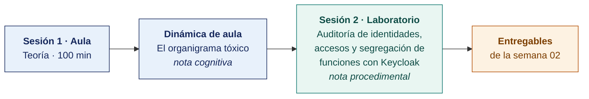

  
  &nbsp;&nbsp;&nbsp;&nbsp;&nbsp;&nbsp;
  

  <strong>Universidad Privada de Tacna</strong> 
  Facultad de Ingeniería · Escuela Profesional de Ingeniería de Sistemas

<h1 align="center">Semana 02 · Principios de Seguridad de la Información · Roles y Responsabilidades</h1>

  <strong>SI-084 · Auditoría de Sistemas</strong> 
  4 horas académicas de 50 min · aula: teoría 60 + dinámica 35 + cierre 5 · laboratorio: taller 60 + avance asistido 40

---

## Datos de la asignatura

| | |
|---|---|
| **Asignatura** | SI-084 · Auditoría de Sistemas |
| **Escuela** | Escuela Profesional de Ingeniería de Sistemas |
| **Ciclo** | X · 04 horas semanales · 03 créditos · Obligatorio |
| **Prerrequisito** | SI-985 Gestión de la Configuración de Software |
| **Unidad** | I — Seguridad de la Información en Auditoría de Sistemas |
| **Semana** | 02 de 17 |
| **Duración** | 4 horas académicas de 50 min · aula: teoría 60 + dinámica 35 + cierre 5 · laboratorio: taller 60 + avance asistido 40 |
| **Resultados de aprendizaje** | **RA1** Analiza e interpreta los conceptos y terminología de Auditoría de Sistemas · **RA2** Evalúa la seguridad de la información en Auditoría de Sistemas |
| **Atributos del graduado** | AG-I02 Ética (CD2, nivel 4) · AG-I08 Análisis de Problemas (CD2, nivel 4) |

### Lo que indica el sílabo

**Contenido conceptual.** Principios de seguridad de la Información, información vs. seguridad. Seguridad de la Información, roles y responsabilidades.

**Contenido procedimental.** Comprensión sobre los principios y la relevancia de la seguridad informática y la evaluación de los riesgos.

## Materiales de esta semana

| | Documento | Qué encontrarás | Dónde y cuánto dura |
|---|---|---|---|
| 1 | **[Teoría](1-TEORIA.md)** | Información y seguridad de la información · Los principios que sostienen el diseño de controles · Roles y responsabilidades en seguridad de la información | Aula · 100 min |
| 2 | **[Dinámica de aula](2-DINAMICA.md)** | El organigrama tóxico, con su material, su ejemplo resuelto y su rúbrica | Aula · dentro de los 100 min de la sesión de teoría |
| 3 | **[Taller de laboratorio](3-TALLER.md)** | Auditoría de identidades, accesos y segregación de funciones con Keycloak | Laboratorio · 100 min |

## Ruta de la semana

## Entregables

| Entregable | Formato y nombre del archivo | Vence |
|---|---|---|
| **Dinámica de aula** · El organigrama tóxico | PDF desde la [plantilla de dinámica](../PLANTILLAS/SI084-PLANTILLA-DINAMICA.docx) · `SI084-S02-DINAMICA-Grupo<N>.pdf` | Antes de cerrar la sesión de teoría |
| **Informe del taller de laboratorio N.º 02** | PDF en formato EPIS desde la [plantilla de taller](../PLANTILLAS/SI084-PLANTILLA-TALLER.docx) · `SI084-S02-TALLER-Grupo<N>.pdf` | 48 h después del taller |
| Hallazgos H-002 y H-003 en el repositorio | Commit firmado en Git | 48 h después del laboratorio |

> Ambos se entregan en **PDF**, con la carátula de la UPT y los códigos de todos los integrantes. Las plantillas obligatorias están en [`PLANTILLAS/`](../PLANTILLAS/).

## Cómo se evalúa

| Criterio | Instrumento | Peso |
|---|---|---|
| Cognitivo | Rúbrica del organigrama tóxico + exposición de 10 min en la Semana 03 | 25 % |
| Procedimental | Lista de cotejo de los 7 resultados del laboratorio | 35 % |
| Actitudinal | Participación y cumplimiento de las reglas de seguridad del laboratorio | 15 % |

## Preparación para la Semana 03

- **Leer.** ISO/IEC 27001:2022, cláusulas 6.1.2 y 6.1.3 (apreciación y tratamiento del riesgo).
- **Leer.** ISO/IEC 27005:2022, capítulos sobre identificación y análisis del riesgo.
- Revisar la documentación de **MONARC**. https://www.monarc.lu/
- **Dejar el entorno operativo.** La Semana 03 agrega MONARC y OpenVAS/GVM sobre `audit_net`.

---

**Docente** · Dr. Oscar Juan Jimenez Flores
[oscarjimenezflores@upt.pe](mailto:oscarjimenezflores@upt.pe) · [LinkedIn](https://www.linkedin.com/in/oscar-jimenez-flores/) · [CTI Vitae — CONCYTEC](https://ctivitae.concytec.gob.pe/appDirectorioCTI/VerDatosInvestigador.do?id_investigador=33398)

Escuela Profesional de Ingeniería de Sistemas · Universidad Privada de Tacna · Tacna, Perú
