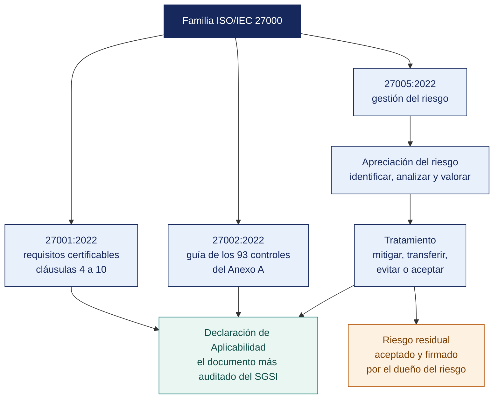

[Semana 03](README.md) · **Teoría** · [Dinámica de aula](2-DINAMICA.md) · [Taller de laboratorio](3-TALLER.md)

# Teoría · Evaluación de la Seguridad Informática · NTP-ISO/IEC 27001:2022 y Gestión del Riesgo

**SI-084 · Auditoría de Sistemas** · Semana 03 · Sesión 1 en aula · 2 horas académicas, 100 min, con la dinámica incluida

> ¿Un término no le resulta claro? Está definido en el [glosario técnico del curso](../GLOSARIO.md).

---

## Qué se trabaja en esta sesión

- La familia de normas ISO/IEC 27000.
- Las cláusulas certificables 4 a 10.
- Gestión del riesgo de seguridad de la información.
- Software libre para el tratamiento del riesgo.

## Mapa de la sesión



---

## La familia de normas ISO/IEC 27000 (15 min)

Un error frecuente es citar «la ISO 27001» para todo. La familia está deliberadamente dividida por función, y el auditor cita la norma correcta:

| Norma | Naturaleza | Para qué la usa el auditor |
|---|---|---|
| **ISO/IEC 27000** | Vocabulario | Definiciones formales de activo, riesgo, control, incidente |
| **ISO/IEC 27001:2022** | **Requisitos certificables** | Es el **criterio** de la auditoría de certificación. Se audita contra sus cláusulas 4 a 10 y contra la Declaración de Aplicabilidad |
| **ISO/IEC 27002:2022** | **Guía de controles** | Explica *cómo* implementar los 93 controles del Anexo A. No es certificable ni auditable por sí sola |
| **ISO/IEC 27003** | Guía de implementación del SGSI | Interpretar la intención de las cláusulas |
| **ISO/IEC 27004** | Medición | Evaluar si los indicadores del SGSI son idóneos |
| **ISO/IEC 27005:2022** | **Gestión del riesgo de seguridad** | Método para el proceso de apreciación y tratamiento del riesgo |
| **ISO/IEC 27007** | Auditoría de un SGSI | Cómo se audita un SGSI (complementa ISO 19011) |
| **ISO/IEC 27017 / 27018** | Nube y datos personales en la nube | Auditoría de proveedores cloud |
| **ISO/IEC 27035** | Gestión de incidentes | Auditar la capacidad de respuesta |
| **ISO 22301:2019** | Continuidad del negocio | Auditar el BCP (Unidad III) |

**Cambio estructural de la edición 2022.** El Anexo A pasó de 114 controles en 14 dominios (edición 2013) a **93 controles en 4 temas**: *Organizacionales* (A.5, 37 controles), *Personas* (A.6, 8), *Físicos* (A.7, 14) y *Tecnológicos* (A.8, 34). Se incorporaron 11 controles nuevos, entre ellos *Threat intelligence* (A.5.7), *Information security for use of cloud services* (A.5.23), *ICT readiness for business continuity* (A.5.30), *Configuration management* (A.8.9), *Data masking* (A.8.11), *Data leakage prevention* (A.8.12), *Monitoring activities* (A.8.16), *Web filtering* (A.8.23) y *Secure coding* (A.8.28).

**En el Perú.** La NTP-ISO/IEC 27001 es la adopción nacional de la norma. La **Resolución de Secretaría de Gobierno y Transformación Digital n.° 003-2023-PCM/SGTD** dispone que las entidades públicas usen obligatoriamente la NTP-ISO/IEC 27001 **vigente**, que a la fecha corresponde a la edición **2022**. Antecedente: la Resolución Ministerial 004-2016-PCM había impuesto la NTP ISO/IEC 27001:2014 a las entidades del Sistema Nacional de Informática. Para el auditor esto significa que, en el sector público peruano, un incumplimiento del SGSI **no es una desviación de buena práctica: es un incumplimiento normativo con responsabilidad administrativa**.

## Las cláusulas certificables 4 a 10 (15 min)

El Anexo A recibe toda la atención, pero la mayoría de las no conformidades mayores se levantan en las cláusulas 4 a 10:

| Cláusula | Requisito | Evidencia que exige el auditor |
|---|---|---|
| **4** Contexto | Cuestiones internas/externas, partes interesadas, alcance del SGSI | Documento de alcance, con lo excluido justificado |
| **5** Liderazgo | Política aprobada, roles asignados por la dirección | Política firmada y vigente; acta de asignación de roles |
| **6.1** Riesgos | Proceso de apreciación y tratamiento definido y aplicado | Metodología documentada, registro de riesgos, **Declaración de Aplicabilidad (SoA)**, plan de tratamiento y **aceptación del riesgo residual firmada por el dueño del riesgo** |
| **6.2** Objetivos | Objetivos medibles con plan para alcanzarlos | Objetivos con indicador, meta, plazo y responsable |
| **7** Soporte | Recursos, competencia, concienciación, comunicación, información documentada | Registro de capacitación, control de versiones de documentos |
| **8** Operación | Ejecución del plan de tratamiento, control de cambios y de proveedores | Evidencia de operación de los controles |
| **9** Evaluación | Seguimiento, medición, **auditoría interna** y **revisión por la dirección** | Programa de auditoría interna, informes, acta de revisión por la dirección |
| **10** Mejora | No conformidades, acciones correctivas, mejora continua | Registro de no conformidades con análisis de causa raíz |

**La Declaración de Aplicabilidad (SoA)** es el documento más auditado del SGSI: lista los 93 controles del Anexo A y, para cada uno, declara si aplica, la justificación de inclusión o exclusión, y el estado de implementación. **Un control excluido sin justificación trazable al análisis de riesgos es una no conformidad mayor inmediata.**

## Gestión del riesgo de seguridad de la información (20 min)

**El proceso (ISO/IEC 27005:2022 + ISO 31000).**

```
Establecimiento del contexto
        │
        ▼
 APRECIACIÓN DEL RIESGO ───────────────────────┐
   ├─ Identificación (activos, amenazas,       │
   │   vulnerabilidades, controles existentes) │
   ├─ Análisis (probabilidad × impacto)        │  Comunicación
   └─ Valoración (comparar con el criterio     │  y consulta
       de aceptación)                          │      ↕
        │                                      │  Seguimiento
        ▼                                      │  y revisión
 TRATAMIENTO DEL RIESGO ───────────────────────┘
   Mitigar · Transferir · Evitar · Aceptar
        │
        ▼
 Riesgo residual → ACEPTACIÓN FORMAL por el dueño del riesgo
```

**Dos enfoques de identificación.** La edición 2022 de la ISO/IEC 27005 formaliza dos caminos:

| Enfoque | Punto de partida | Cuándo conviene |
|---|---|---|
| **Basado en eventos** | Escenarios de riesgo de alto nivel ligados a objetivos de negocio | Dirección, visión estratégica, organizaciones maduras |
| **Basado en activos** | Inventario de activos → amenazas → vulnerabilidades | Auditoría técnica, primer ciclo del SGSI, organizaciones pequeñas |

En este curso se usa el **enfoque basado en activos** por su trazabilidad directa a la evidencia técnica que se levanta en el laboratorio.

**Escalas.** Una matriz de riesgo sin escalas definidas es decorativa. El criterio debe fijarse *antes* de evaluar:

| Probabilidad | Definición operativa |
|---|---|
| 1 Muy baja | Menos de una vez cada 5 años |
| 2 Baja | Una vez cada 2–5 años |
| 3 Media | Una vez al año |
| 4 Alta | Varias veces al año |
| 5 Muy alta | Mensual o más frecuente |

| Impacto | Definición operativa (ajustada a la organización) |
|---|---|
| 1 Insignificante | Sin efecto material; se corrige en horas |
| 2 Menor | Interrupción < 4 h; sin efecto en clientes |
| 3 Moderado | Interrupción 4–24 h; reclamos de clientes |
| 4 Mayor | Interrupción > 24 h; pérdida económica significativa; incumplimiento contractual |
| 5 Catastrófico | Continuidad comprometida; sanción del regulador; daño reputacional irreversible |

**Riesgo inherente vs. riesgo residual.** El riesgo inherente se evalúa *ignorando* los controles existentes; el residual, *después* de considerarlos y **verificar que operan**. El error de auditoría más frecuente es tomar por bueno un control documentado que nunca se probó: eso convierte el riesgo residual en una ficción.

**Las cuatro decisiones de tratamiento.**

| Decisión | Qué significa | Ejemplo | Quién la firma |
|---|---|---|---|
| **Mitigar** | Implementar controles para reducir probabilidad o impacto | MFA, cifrado, respaldo | Dueño del riesgo, con plan y plazo |
| **Transferir** | Trasladar la consecuencia financiera a un tercero | Póliza cibernética, cláusula contractual con el proveedor | Dueño del riesgo + Legal |
| **Evitar** | Eliminar la actividad que origina el riesgo | Dejar de almacenar tarjetas y delegar en la pasarela de pago | Dirección |
| **Aceptar** | Asumirlo conscientemente porque está bajo el criterio | Riesgo residual bajo, documentado y firmado | **Dueño del riesgo, nunca TI** |

> **Regla de auditoría.** Un riesgo «aceptado» sin firma del dueño del riesgo es en realidad un riesgo **ignorado**, y así debe reportarse.

## Software libre para el tratamiento del riesgo (15 min)

| Herramienta | Licencia | Fortaleza | Limitación |
|---|---|---|---|
| **SimpleRisk Community** | Libre (con edición comercial) | Imagen Docker oficial; flujo completo riesgo→mitigación→revisión; mapeo a marcos | Reportería avanzada en la edición de pago |
| **MONARC** | Open source (NC3 Luxemburgo) | Método optimizado y repetible; biblioteca de objetos de riesgo; alineado a ISO/IEC 27005 | No tiene imagen Docker oficial; se instala por VM, Vagrant o Ansible |
| **eramba Community** | Community edition gratuita | GRC completo: riesgos, controles, políticas, cumplimiento | Curva de aprendizaje alta |
| **OpenVAS / Greenbone Community Edition** | GPL | Detección técnica de vulnerabilidades con CVE y CVSS | Alimenta el riesgo técnico, no es un GRC |
| **Hoja de cálculo con método documentado** | LibreOffice Calc | Trazabilidad total, cero dependencias | No escala ni controla concurrencia |

**Criterio de selección para el auditor:** la herramienta importa mucho menos que la **trazabilidad del método**. Un registro de riesgos en LibreOffice con escalas definidas, criterio de aceptación aprobado y firmas del dueño del riesgo es auditable; un GRC caro con escalas por defecto y sin firmas, no lo es.

---

---

[Semana 03](README.md) · **Teoría** · [Dinámica de aula](2-DINAMICA.md) · [Taller de laboratorio](3-TALLER.md)

---

**Docente** · Dr. Oscar Juan Jimenez Flores
[oscarjimenezflores@upt.pe](mailto:oscarjimenezflores@upt.pe) · [LinkedIn](https://www.linkedin.com/in/oscar-jimenez-flores/) · [CTI Vitae — CONCYTEC](https://ctivitae.concytec.gob.pe/appDirectorioCTI/VerDatosInvestigador.do?id_investigador=33398)

Escuela Profesional de Ingeniería de Sistemas · Universidad Privada de Tacna · Tacna, Perú
