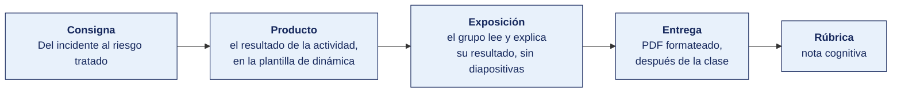

[Semana 03](README.md) · [Teoría](1-TEORIA.md) · **Dinámica de aula** · [Taller de laboratorio](3-TALLER.md)

# Dinámica de aula · Del incidente al riesgo tratado

**SI-084 · Auditoría de Sistemas** · Semana 03 · Actividad en aula, **dentro de los 100 min de la sesión de teoría** · calificación **cognitiva**

> ¿Un término no le resulta claro? Está definido en el [glosario técnico del curso](../GLOSARIO.md).

---

## Cómo funciona la actividad

## Qué entregas

| | |
|---|---|
| **Archivo** | `SI084-S03-DINAMICA-Grupo<N>.pdf` |
| **Plantilla obligatoria** | [SI084-PLANTILLA-DINAMICA.docx](../PLANTILLAS/SI084-PLANTILLA-DINAMICA.docx) |
| **Formato** | PDF exportado desde la plantilla en Word, con la carátula de la UPT y los apellidos, nombres y códigos de todos los integrantes |
| **Qué va dentro** | Lo que el grupo resolvió en aula. Las tablas de la sección **Producto** van completas, con los textos redactados, y cada decisión va justificada |
| **Dónde se sube** | Aula virtual, tarea «Dinámica · Semana 03» |
| **Cuándo vence** | Hasta 24 h después de la sesión de teoría. La tabla se resuelve en aula; el PDF se formatea y se sube después |
| **Exposición** | En la ronda de cierre de **esta misma sesión**. El grupo **lee y explica su resultado** ante el aula, con el documento a la vista. No se usan diapositivas |

> No se califica un trabajo entregado en `.docx`, sin carátula, sin los códigos de los integrantes o con las tablas del producto vacías.

---

## Consigna

> **«Del incidente al riesgo tratado»**
> Cada equipo recibe **uno de los diez incidentes** de esta página, con su línea de tiempo, los sistemas afectados, los controles que existían y la respuesta de la organización. Debe recorrer el camino inverso al que recorrió la empresa. **Del incidente consumado, reconstruir el riesgo que debió estar registrado, evaluarlo y decidir su tratamiento**.

| | |
|---|---|
| **Su papel** | **Analista de riesgos** que llega el día después del incidente |
| **Misión** | Reconstruir el riesgo que debió estar registrado antes, evaluarlo y decidir su tratamiento |
| **Restricción** | **La escala se declara antes de calificar.** No vale ajustar el número al desenlace, que ya se conoce |

Que el equipo recorra el camino inverso al que recorrió la organización. Del incidente ya consumado, reconstruir el riesgo que debió estar registrado antes, evaluarlo con una escala declarada y decidir su tratamiento. Es el ejercicio que enseña por qué un registro de riesgos vacío no significa que no haya riesgos.

## Cómo se desarrolla · 35 minutos

| | Bloque | Quién | Minutos |
|---|---|---|---|
| **1** | **Leer la línea de tiempo.** Se recorre la línea de tiempo del incidente asignado y se separan tres cosas que suelen confundirse. Qué falló, qué se hizo cuando falló y qué se dejó de hacer antes. | Equipo | 7 |
| **2** | **Activo y dueño.** Se nombra el activo afectado, tomado de la fila de sistemas, y el cargo que debía responder por él. Si nadie responde por ese activo, ese es ya el primer hallazgo. | Equipo | 7 |
| **3** | **Amenaza y controles que fallaron.** Se identifica la vulnerabilidad explotada y se contrasta con la fila **controles que existían**. Un control que existía y no operó no es lo mismo que un control ausente, y el tratamiento es distinto en cada caso. | Equipo | 7 |
| **4** | **Probabilidad e impacto inherentes.** Se califican de 1 a 5 con la escala de la teoría, y **se justifica cada valor con un dato de la línea de tiempo**. La ubicación en la matriz se anota junto con el valor. | Equipo | 7 |
| **5** | **Tratamiento y residual.** Se decide mitigar, transferir, evitar o aceptar, se citan los controles del Anexo A con su código, se estima el residual y se nombra el cargo que debe firmar su aceptación. | Equipo | 7 |

## Material de trabajo

**Todo lo que se necesita está en esta página.** Se **asigna un incidente a cada equipo al iniciar la actividad**, de los diez del cuadro siguiente. Son diez organizaciones distintas, con activos, controles y consecuencias distintas, de modo que **ninguna ficha de riesgo coincide con la de otro equipo**.

Cada incidente viene con lo que el equipo necesita para reconstruir el riesgo hacia atrás. La línea de tiempo, los sistemas alcanzados, **los controles que sí existían** y la explicación que dio la propia organización.

### Incidente 1 · Agroexportadora de aceituna · Cifrado de servidor de planta por programa malicioso

| | |
|---|---|
| **Línea de tiempo** | **14/03, 06:40.** El jefe de planta no puede abrir el sistema de trazabilidad de lotes. **07:10.** Se detectan archivos renombrados en el servidor de planta. **09:00.** Se apaga el servidor. **11:30.** Se intenta restaurar del respaldo y se descubre que la última copia legible es del **28/02**. **16:00.** Se decide reconstruir 14 días de trazabilidad desde las guías en papel. |
| **Sistemas afectados** | Servidor de planta, sistema de trazabilidad de lotes, carpeta compartida de certificados |
| **Controles que existían** | Antivirus con licencia vencida desde enero. Respaldo diario configurado, sin prueba de restauración desde 2023. Acceso remoto habilitado para el proveedor del sistema, sin fecha de caducidad |
| **Lo que la organización respondió** | «El respaldo estaba configurado y corría todas las noches. Nadie sabía que el archivo se generaba vacío desde marzo» |

### Incidente 2 · Clínica privada · Acceso indebido a historias clínicas

| | |
|---|---|
| **Línea de tiempo** | **02/06.** Una paciente reclama que un familiar conoció su diagnóstico sin que ella lo comunicara. **05/06.** Se revisa la bitácora del sistema clínico y se halla que **17 usuarios administrativos** consultaron su historia en cuatro días. **07/06.** Se comprueba que el acceso general a historias se concedió al personal administrativo en 2023 «para agilizar la facturación». **12/06.** Se restringe el acceso. No se notificó a la autoridad. |
| **Sistemas afectados** | Sistema clínico, módulo de historia clínica electrónica |
| **Controles que existían** | Bitácora de accesos activa y nunca revisada. Perfiles de acceso definidos en 2019 y no actualizados. No existe procedimiento de notificación de brechas |
| **Lo que la organización respondió** | «El sistema registra todos los accesos, así que el control existe». La bitácora no se había revisado nunca |

### Incidente 3 · Municipalidad distrital · Caída del sistema de trámite documentario

| | |
|---|---|
| **Línea de tiempo** | **08/04, 08:00.** El sistema de trámite no levanta tras un corte eléctrico del fin de semana. **10:00.** Se constata que la base de datos quedó inconsistente. **11:00.** No hay documentación del sistema. El programador que lo construyó ya no trabaja en la entidad. **09/04.** Se atiende en papel. **22/04.** Se restablece parcialmente, con **1 340 expedientes** cuyo estado no pudo recuperarse. |
| **Sistemas afectados** | Servidor de la sede, sistema de trámite documentario en PHP, base de datos |
| **Controles que existían** | Respaldo semanal en disco externo guardado en la misma oficina. Sin UPS en el servidor. Sin documentación técnica ni código fuente entregado |
| **Lo que la organización respondió** | «El sistema funcionó nueve años sin problemas». No existía plan de contingencia ni responsable designado |

### Incidente 4 · Cooperativa de ahorro y crédito · Desembolsos a cuentas alteradas

| | |
|---|---|
| **Línea de tiempo** | **19/09.** Un socio reclama que su desembolso no llegó. **20/09.** Se detectan **6 desembolsos** del trimestre cuya cuenta de destino fue modificada entre la aprobación y el pago. **21/09.** La bitácora muestra que las seis modificaciones se hicieron con la cuenta de un desarrollador que tiene acceso directo a la base de producción. **23/09.** Se bloquea el acceso. Monto afectado, **S/ 84 200**. |
| **Sistemas afectados** | Core financiero, tabla de cuentas de socio, módulo de desembolsos |
| **Controles que existían** | Aprobación de crédito con doble firma, correctamente operativa. Acceso directo a producción concedido a desarrollo «para resolver incidencias». Sin registro de cambios a nivel de base de datos |
| **Lo que la organización respondió** | «El control de aprobación funcionó, las seis operaciones estaban correctamente aprobadas». El fraude ocurrió después de la aprobación |

### Incidente 5 · Empresa de transporte de carga · Suplantación de proveedor y pago desviado

| | |
|---|---|
| **Línea de tiempo** | **11/07.** Llega un correo desde una dirección parecida a la del taller habitual, informando cambio de cuenta bancaria. **12/07.** Tesorería actualiza la cuenta del proveedor en el ERP y programa el pago. **15/07.** Se pagan **S/ 46 800**. **02/08.** El taller real reclama la deuda impaga. **04/08.** Se comprueba que nadie verificó el cambio de cuenta por un canal distinto del correo. |
| **Sistemas afectados** | ERP, maestro de proveedores, módulo de tesorería |
| **Controles que existían** | El maestro de proveedores solo lo modifica tesorería, que es la misma área que aprueba el pago. Sin procedimiento de verificación de cambio de datos bancarios. Filtro de correo sin marcado de remitente externo |
| **Lo que la organización respondió** | «El correo parecía del proveedor de siempre y tenía su firma» |

### Incidente 6 · Distribuidora mayorista · Diferencia de inventario descubierta en el cierre

| | |
|---|---|
| **Línea de tiempo** | **31/12.** El inventario físico arroja una diferencia de **4.7 %** contra el saldo contable. **07/01.** Se revisa y se constata que el módulo de almacén del ERP dejó de usarse en 2019 y la operación se lleva en hojas de cálculo del jefe de almacén. **09/01.** Las hojas no tienen historial de cambios. **14/01.** No es posible determinar si la diferencia es error, merma o sustracción. |
| **Sistemas afectados** | ERP módulo de almacén, hojas de cálculo del área, kardex |
| **Controles que existían** | Conteos cíclicos definidos en el procedimiento, no ejecutados desde 2021. Ajuste de inventario permitido al mismo jefe que registra ingresos y salidas. Sin conciliación mensual |
| **Lo que la organización respondió** | «El ERP no se adaptaba a nuestra forma de trabajar, por eso se dejó de usar» |

### Incidente 7 · Instituto de educación superior · Alteración de notas después del cierre de acta

| | |
|---|---|
| **Línea de tiempo** | **28/02.** Un docente advierte que la nota de un estudiante en el acta cerrada no es la que registró. **01/03.** Se revisan las actas del semestre y se hallan **23 notas** modificadas después del cierre. **03/03.** Todas las modificaciones se hicieron con la cuenta de la ex secretaria académica, que cesó el 31/07 del año anterior y cuya cuenta seguía activa. **05/03.** Se desactiva la cuenta. |
| **Sistemas afectados** | Sistema académico, módulo de actas y notas |
| **Controles que existían** | Cierre de acta con bloqueo de edición, que el perfil de secretaría podía revertir. Bitácora de cambios de nota activa. Sin procedimiento de baja de usuarios al cese |
| **Lo que la organización respondió** | «El sistema bloquea el acta al cerrarla». El bloqueo era reversible por un perfil que nadie revisó |

### Incidente 8 · Empresa de saneamiento · Facturación masiva errónea

| | |
|---|---|
| **Línea de tiempo** | **05/05.** Se emite la facturación mensual de **68 000** conexiones. **06/05.** Empiezan los reclamos por importes desproporcionados. **07/05.** Se detecta que un cambio en la tabla de tarifas se aplicó directamente sobre la base de producción, sin pasar por el módulo. **08/05.** Se anulan **11 400** recibos. **20/05.** Se reemite. Costo de reimpresión y reparto, **S/ 61 000**. |
| **Sistemas afectados** | Sistema comercial, tabla de tarifas, módulo de facturación |
| **Controles que existían** | Cambio de tarifas previsto por el módulo, con aprobación del jefe comercial. Acceso directo a la base concedido a TI. Sin ambiente de pruebas, los cambios se aplican en producción |
| **Lo que la organización respondió** | «Se hizo directo en la base porque el módulo tardaba y había que facturar ese día» |

### Incidente 9 · Servicios de ingeniería para minería · Lecturas de telemetría alteradas

| | |
|---|---|
| **Línea de tiempo** | **17/10.** Un cliente cuestiona el informe técnico de un equipo instalado. **19/10.** Se comparan las lecturas del informe con las del sensor y **no coinciden en 340 registros**. **21/10.** Se comprueba que las lecturas se modificaron con la cuenta genérica `telemetria`, que usan tres personas. **24/10.** No es posible determinar quién las modificó. El contrato queda en revisión. |
| **Sistemas afectados** | Plataforma de telemetría, base de lecturas, generador de informes |
| **Controles que existían** | Firma del informe por el ingeniero responsable. Cuenta genérica compartida con permiso de modificación de lecturas. Sin registro de cambios sobre la tabla de lecturas |
| **Lo que la organización respondió** | «La cuenta genérica se creó para la integración de sensores y quedó con permisos de escritura» |

### Incidente 10 · Cadena regional de farmacias · Anulaciones de venta sin sustento

| | |
|---|---|
| **Línea de tiempo** | **30/11.** El cierre mensual muestra **412 anulaciones** de venta en cuatro locales, contra un promedio de 38. **02/12.** Se revisa y las anulaciones se concentran en el turno noche de tres locales. **04/12.** El perfil de jefe de local permite anular sin autorización de un segundo. **06/12.** El faltante de mercadería en esos locales asciende a **S/ 39 400**. **09/12.** Se restringe el perfil. |
| **Sistemas afectados** | Punto de venta, módulo de anulaciones, kardex de local |
| **Controles que existían** | Arqueo de caja diario, que cuadraba porque la venta anulada no ingresaba al arqueo. Anulación permitida al mismo perfil que vende. Sin alerta por volumen inusual de anulaciones |
| **Lo que la organización respondió** | «El arqueo de caja cuadraba todos los días» |

> **Preste atención a la última fila.** La respuesta de la organización es casi siempre razonable y casi siempre incompleta. En ocho de los diez incidentes existía un control que se consideraba suficiente y que **no cubría lo que ocurrió**. Distinguir el control ausente del control presente que no operó es lo que cambia por completo el tratamiento que se propone.

## Lo que la teoría de hoy te da

Esta dinámica aplica piezas concretas de la sesión de teoría de hoy. Se usan tal cual, sin buscar nada más.

| De la teoría | Para qué se usa aquí |
|---|---|
| [Gestión del riesgo de seguridad de la información](1-TEORIA.md) | De ahí salen las escalas de probabilidad e impacto y la distinción entre riesgo inherente y residual, que el producto exige justificar |
| [Las cláusulas certificables 4 a 10](1-TEORIA.md) | La cláusula 6 fija que el tratamiento se decide contra un criterio de aceptación acordado, no por preferencia del equipo |
| [La familia de normas ISO/IEC 27000](1-TEORIA.md) | Ubica de dónde se toman los controles del Anexo A que se citan en el tratamiento |

## Producto

**Producto 1 — Ficha del riesgo.**

| Campo | Contenido |
|---|---|
| Activo afectado y su dueño | |
| Amenaza / Vulnerabilidad explotada | |
| Controles que existían y por qué fallaron | |
| Probabilidad e impacto **inherentes** (1–5) con justificación de la escala | |
| Riesgo inherente y ubicación en la matriz | |

**Producto 2 — Tratamiento.**

| Campo | Contenido |
|---|---|
| Decisión (mitigar / transferir / evitar / aceptar) y por qué | |
| Controles del Anexo A de la ISO/IEC 27001:2022 propuestos, **con su código** | |
| Riesgo residual estimado tras el tratamiento | |
| Dueño del riesgo que debe firmar la aceptación del residual | |
| Indicador con el que se verificará que el control opera | |

> **Dónde va.** Este producto se presenta en la **sección 2 de la [plantilla de dinámica](../PLANTILLAS/SI084-PLANTILLA-DINAMICA.docx)**, «El producto». No se copia la consigna ni la teoría. Solo el resultado y lo que lo sostiene.

## Ejemplo resuelto

*El caso de este ejemplo es distinto del que le toca a tu grupo. Sirve para que veas el nivel de detalle que se espera, no para copiarlo.*

**Una ficha bien resuelta.** El incidente del ejemplo es una fuga de datos por almacenamiento en nube mal configurado, distinto del que te toca.

*Ficha del riesgo*

| Campo | Contenido |
|---|---|
| Activo afectado y su dueño | Repositorio de documentos de recursos humanos en almacenamiento de objetos en nube, con contratos, boletas y fichas médicas de 480 trabajadores. **Dueño del riesgo:** Gerente de Recursos Humanos. |
| Amenaza / Vulnerabilidad explotada | **Amenaza:** divulgación no autorizada de información. **Vulnerabilidad:** el contenedor de almacenamiento quedó con permiso de lectura pública tras una migración, y su dirección fue indexada por buscadores. |
| Controles que existían y por qué fallaron | Existía una política de clasificación que marcaba esos documentos como Restringidos, pero la clasificación no se traducía en ninguna configuración técnica. Existía revisión de accesos, pero solo sobre el ERP. El almacenamiento en nube no estaba en el alcance del inventario de activos. |
| Probabilidad e impacto inherentes | **Probabilidad 3 (Media).** La escala define 3 como «una vez al año»; los errores de configuración en migraciones ocurren con esa frecuencia en la organización, según el registro de cambios. **Impacto 5 (Catastrófico).** Hay datos sensibles de salud, la exposición es irreversible y activa la obligación de notificar a la autoridad de protección de datos. |
| Riesgo inherente y ubicación en la matriz | 3 × 5 = **15 · Crítico**. |

*Tratamiento*

| Campo | Contenido |
|---|---|
| Decisión y por qué | **Mitigar.** El criterio de aceptación de la organización es 6, y el riesgo inherente lo supera con holgura. **Transferir no aplica.** Una póliza cubre el costo económico, no la exposición de datos sensibles ni la responsabilidad ante la autoridad. |
| Controles del Anexo A propuestos | **A.5.23 Information security for use of cloud services**, control nuevo de la edición 2022, para incorporar el almacenamiento en nube al inventario y fijar su configuración segura. **A.8.3 Information access restriction**, para que el permiso por defecto sea denegar. **A.8.9 Configuration management**, también nuevo en 2022, con verificación automática de que ningún contenedor queda público. **A.8.12 Data leakage prevention**, para detectar la exposición si vuelve a ocurrir. |
| Riesgo residual estimado | Probabilidad 1, Impacto 5 → **5 · Medio**. Queda por debajo del criterio de 6, así que **sí puede aceptarse**, con firma. |
| Dueño que firma la aceptación | Gerente de Recursos Humanos, dueño del proceso y de los datos. **Nunca el jefe de TI**, que es el custodio. |
| Indicador de que el control opera | Número de contenedores de almacenamiento con acceso público detectados por la verificación automática semanal. Meta: cero. Umbral de alerta: cualquier detección escala de inmediato al dueño del riesgo. |

**La diferencia entre aprobar y no aprobar.**

| Así no | Así sí |
|---|---|
| «Probabilidad alta porque es un riesgo común.» | «Probabilidad 3 porque la escala define 3 como una vez al año, y esa es la frecuencia de errores de configuración en migraciones según el registro de cambios.» |
| «Controles: mejorar la seguridad en la nube y capacitar.» | «A.5.23 para incorporar la nube al inventario, A.8.9 con verificación automática de que ningún contenedor queda público.» |
| «Riesgo residual: bajo.» | «Residual 1 × 5 = 5, por debajo del criterio de 6. Puede aceptarse, y por eso hace falta la firma.» |
| «Firma: el jefe de TI.» | «Firma: Gerente de Recursos Humanos, dueño del proceso y de los datos.» |

## Reglas

- 35 min en aula, dentro de la sesión de teoría.
- Se exige **al menos un control nuevo de la edición 2022** (A.5.7, A.5.23, A.5.30, A.8.9, A.8.11, A.8.12, A.8.16, A.8.23 o A.8.28).
- Prohibido proponer «capacitación al personal» como control único.
- La exposición es la ronda de cierre de esta misma sesión. El grupo **lee y explica su resultado**. No se usan diapositivas.

## Rúbrica cognitiva (20 puntos)

| Criterio | 5 | 3 | 1 |
|---|---|---|---|
| **Reconstrucción del riesgo** | Distingue amenaza, vulnerabilidad y activo sin confundirlos | Identifica el riesgo con alguna imprecisión conceptual | Describe el incidente en lugar del riesgo |
| **Escalas justificadas** | Probabilidad e impacto anclados a la definición operativa de la escala | Valores razonables sin justificación explícita | Valores sin criterio |
| **Controles citados** | Códigos exactos del Anexo A 2022, pertinentes, incluye un control nuevo | Controles pertinentes sin código | Controles genéricos o inexistentes |
| **Riesgo residual y firma** | Residual coherente con el control, dueño del riesgo correctamente identificado | Residual estimado sin dueño | Omite el residual |

---

---

[Semana 03](README.md) · [Teoría](1-TEORIA.md) · **Dinámica de aula** · [Taller de laboratorio](3-TALLER.md)

---

**Docente** · Dr. Oscar Juan Jimenez Flores
[oscarjimenezflores@upt.pe](mailto:oscarjimenezflores@upt.pe) · [LinkedIn](https://www.linkedin.com/in/oscar-jimenez-flores/) · [CTI Vitae — CONCYTEC](https://ctivitae.concytec.gob.pe/appDirectorioCTI/VerDatosInvestigador.do?id_investigador=33398)

Escuela Profesional de Ingeniería de Sistemas · Universidad Privada de Tacna · Tacna, Perú
