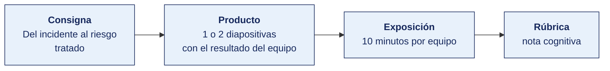

[Semana 03](README.md) · [Teoría](1-TEORIA.md) · **Dinámica de aula** · [Taller de laboratorio](3-TALLER.md)

# Dinámica de aula · Del incidente al riesgo tratado

**SI-084 · Auditoría de Sistemas** · Semana 03 · Actividad en aula, **dentro de los 100 min de la sesión de teoría** · calificación **cognitiva**

> ¿Un término no le resulta claro? Está definido en el [glosario técnico del curso](../GLOSARIO.md).

---

## Cómo funciona la actividad

## Qué entregas

| | |
|---|---|
| **Archivo** | `SI084-S03-DINAMICA-Grupo<N>.pdf` |
| **Plantilla obligatoria** | [SI084-PLANTILLA-DINAMICA.docx](../PLANTILLAS/SI084-PLANTILLA-DINAMICA.docx) |
| **Formato** | PDF exportado desde la plantilla en Word, con la carátula de la UPT y los apellidos, nombres y códigos de todos los integrantes |
| **Qué va dentro** | Lo que el grupo resolvió en aula. Las tablas de la sección **Producto** van completas, con los textos redactados, y cada decisión va justificada |
| **Dónde se sube** | Aula virtual, tarea «Dinámica · Semana 03» |
| **Cuándo vence** | Antes de cerrar la sesión de teoría |
| **Exposición** | 10 minutos por grupo en la sesión de teoría de la Semana 04 |

> No se califica un trabajo entregado en `.docx`, sin carátula, sin los códigos de los integrantes o con las tablas del producto vacías.

---

## Consigna

> **«Del incidente al riesgo tratado»**
> Cada equipo recibe la **bitácora de un incidente real de seguridad ocurrido en una empresa peruana del sector retail** (relato anonimizado con línea de tiempo, sistemas afectados y decisiones tomadas; está en **Material de trabajo**). Debe recorrer el camino inverso al que recorrió la empresa: **del incidente consumado, reconstruir el riesgo que debió estar registrado, evaluarlo y decidir su tratamiento**.

## Material de trabajo

Trabaja sobre esta bitácora. Es el relato anonimizado de un incidente ocurrido en una empresa peruana del sector retail, con nueve locales y venta en línea.

**Línea de tiempo del incidente**

| Momento | Hecho |
|---|---|
| Día 1, 02:14 | Un proceso automatizado comienza a cifrar archivos en el servidor `srv-app-02`, que aloja el sistema de punto de venta y la base de datos de clientes |
| Día 1, 02:40 | El proceso alcanza la unidad de red `\\srv-app-02\backups`, montada de forma permanente en el mismo servidor, donde se escribía el respaldo diario |
| Día 1, 06:05 | El primer local intenta abrir caja y no puede. Llama a la mesa de ayuda |
| Día 1, 07:30 | TI confirma el cifrado. Encuentra una nota de rescate en el escritorio del servidor |
| Día 1, 09:00 | Se decide operar con talonario físico. El talonario alcanza para 400 comprobantes en total |
| Día 1, 16:20 | Se agota el talonario en cuatro de los nueve locales. Esos locales dejan de vender |
| Día 2, 11:00 | Se localiza un respaldo en cinta de hace 11 días, en la oficina del contador. Es el último respaldo fuera de línea existente |
| Día 3, 18:00 | Se restaura desde la cinta. Se pierden 11 días de transacciones, que se reconstruyen a mano desde los comprobantes físicos y los reportes de la pasarela de pagos |
| Día 9 | La operación se normaliza |

**Cómo entró**

El análisis posterior determinó que el acceso se produjo por el servicio de escritorio remoto, publicado directamente a internet en el puerto 3389, con autenticación solo por contraseña. La cuenta usada fue `administrador`, con una contraseña de ocho caracteres que figuraba en listas públicas de contraseñas filtradas. No había segundo factor ni bloqueo por intentos fallidos.

**Controles que existían antes del incidente**

| Control | Estado real |
|---|---|
| Respaldo diario automatizado | Existía y se ejecutaba. Escribía en una unidad de red montada de forma permanente en el mismo servidor |
| Respaldo en cinta | Existía, pero se hacía cuando el contador lo recordaba. El último era de 11 días antes |
| Prueba de restauración | Nunca se había ejecutado |
| Antivirus | Instalado y actualizado. Sin detección por comportamiento |
| Cortafuegos perimetral | Existía. La regla que publicaba el puerto 3389 se creó tres años antes «temporalmente», para que un proveedor diera soporte remoto |
| Registro de accesos remotos | Activado. Nadie lo revisaba |

**Consecuencias medidas**

| Concepto | Monto o magnitud |
|---|---|
| Venta no realizada durante los 3 días de interrupción | S/ 486 000 |
| Costo de reconstrucción manual de 11 días de transacciones | 240 horas-persona |
| Multa por presentación tardía de comprobantes electrónicos | Sí, aplicada |
| Clientes cuyos datos personales quedaron expuestos | 41 800 registros, sin que se pudiera determinar si hubo exfiltración |
| Pago del rescate | No se pagó |

**Criterio de aceptación de riesgo de esta organización.** Riesgos con valor menor o igual a 6 pueden aceptarse. Por encima de 6 exigen plan de tratamiento con plazo.

## Producto

**Diapositiva 1 — Ficha del riesgo.**

| Campo | Contenido |
|---|---|
| Activo afectado y su dueño | |
| Amenaza / Vulnerabilidad explotada | |
| Controles que existían y por qué fallaron | |
| Probabilidad e impacto **inherentes** (1–5) con justificación de la escala | |
| Riesgo inherente y ubicación en la matriz | |

**Diapositiva 2 — Tratamiento.**

| Campo | Contenido |
|---|---|
| Decisión (mitigar / transferir / evitar / aceptar) y por qué | |
| Controles del Anexo A de la ISO/IEC 27001:2022 propuestos, **con su código** | |
| Riesgo residual estimado tras el tratamiento | |
| Dueño del riesgo que debe firmar la aceptación del residual | |
| Indicador con el que se verificará que el control opera | |

## Ejemplo resuelto

*El caso de este ejemplo es distinto del que le toca a tu grupo. Sirve para que veas el nivel de detalle que se espera, no para copiarlo.*

**Una ficha bien resuelta.** El incidente del ejemplo es una fuga de datos por almacenamiento en nube mal configurado, distinto del que te toca.

*Ficha del riesgo*

| Campo | Contenido |
|---|---|
| Activo afectado y su dueño | Repositorio de documentos de recursos humanos en almacenamiento de objetos en nube, con contratos, boletas y fichas médicas de 480 trabajadores. **Dueño del riesgo:** Gerente de Recursos Humanos. |
| Amenaza / Vulnerabilidad explotada | **Amenaza:** divulgación no autorizada de información. **Vulnerabilidad:** el contenedor de almacenamiento quedó con permiso de lectura pública tras una migración, y su dirección fue indexada por buscadores. |
| Controles que existían y por qué fallaron | Existía una política de clasificación que marcaba esos documentos como Restringidos, pero la clasificación no se traducía en ninguna configuración técnica. Existía revisión de accesos, pero solo sobre el ERP: el almacenamiento en nube no estaba en el alcance del inventario de activos. |
| Probabilidad e impacto inherentes | **Probabilidad 3 (Media).** La escala define 3 como «una vez al año»; los errores de configuración en migraciones ocurren con esa frecuencia en la organización, según el registro de cambios. **Impacto 5 (Catastrófico).** Hay datos sensibles de salud, la exposición es irreversible y activa la obligación de notificar a la autoridad de protección de datos. |
| Riesgo inherente y ubicación en la matriz | 3 × 5 = **15 · Crítico**. |

*Tratamiento*

| Campo | Contenido |
|---|---|
| Decisión y por qué | **Mitigar.** El criterio de aceptación de la organización es 6, y el riesgo inherente lo supera con holgura. Transferir no aplica: una póliza cubre el costo económico, no la exposición de datos sensibles ni la responsabilidad ante la autoridad. |
| Controles del Anexo A propuestos | **A.5.23 Information security for use of cloud services**, control nuevo de la edición 2022, para incorporar el almacenamiento en nube al inventario y fijar su configuración segura. **A.8.3 Information access restriction**, para que el permiso por defecto sea denegar. **A.8.9 Configuration management**, también nuevo en 2022, con verificación automática de que ningún contenedor queda público. **A.8.12 Data leakage prevention**, para detectar la exposición si vuelve a ocurrir. |
| Riesgo residual estimado | Probabilidad 1, Impacto 5 → **5 · Medio**. Queda por debajo del criterio de 6, así que **sí puede aceptarse**, con firma. |
| Dueño que firma la aceptación | Gerente de Recursos Humanos, dueño del proceso y de los datos. **Nunca el jefe de TI**, que es el custodio. |
| Indicador de que el control opera | Número de contenedores de almacenamiento con acceso público detectados por la verificación automática semanal. Meta: cero. Umbral de alerta: cualquier detección escala de inmediato al dueño del riesgo. |

**La diferencia entre aprobar y no aprobar.**

| Así no | Así sí |
|---|---|
| «Probabilidad alta porque es un riesgo común.» | «Probabilidad 3 porque la escala define 3 como una vez al año, y esa es la frecuencia de errores de configuración en migraciones según el registro de cambios.» |
| «Controles: mejorar la seguridad en la nube y capacitar.» | «A.5.23 para incorporar la nube al inventario, A.8.9 con verificación automática de que ningún contenedor queda público.» |
| «Riesgo residual: bajo.» | «Residual 1 × 5 = 5, por debajo del criterio de 6. Puede aceptarse, y por eso hace falta la firma.» |
| «Firma: el jefe de TI.» | «Firma: Gerente de Recursos Humanos, dueño del proceso y de los datos.» |

## Reglas

- 35 minutos en aula. Entrega como `S03_<equipo>_riesgo.pdf`.
- Se exige **al menos un control nuevo de la edición 2022** (A.5.7, A.5.23, A.5.30, A.8.9, A.8.11, A.8.12, A.8.16, A.8.23 o A.8.28).
- Prohibido proponer «capacitación al personal» como control único.
- Exposición de 10 minutos en la sesión de teoría de la Semana 04.

## Rúbrica cognitiva (20 puntos)

| Criterio | 5 | 3 | 1 |
|---|---|---|---|
| **Reconstrucción del riesgo** | Distingue amenaza, vulnerabilidad y activo sin confundirlos | Identifica el riesgo con alguna imprecisión conceptual | Describe el incidente en lugar del riesgo |
| **Escalas justificadas** | Probabilidad e impacto anclados a la definición operativa de la escala | Valores razonables sin justificación explícita | Valores sin criterio |
| **Controles citados** | Códigos exactos del Anexo A 2022, pertinentes, incluye un control nuevo | Controles pertinentes sin código | Controles genéricos o inexistentes |
| **Riesgo residual y firma** | Residual coherente con el control, dueño del riesgo correctamente identificado | Residual estimado sin dueño | Omite el residual |

---

---

[Semana 03](README.md) · [Teoría](1-TEORIA.md) · **Dinámica de aula** · [Taller de laboratorio](3-TALLER.md)

---

**Docente** · Dr. Oscar Juan Jimenez Flores
[oscarjimenezflores@upt.pe](mailto:oscarjimenezflores@upt.pe) · [LinkedIn](https://www.linkedin.com/in/oscar-jimenez-flores/) · [CTI Vitae — CONCYTEC](https://ctivitae.concytec.gob.pe/appDirectorioCTI/VerDatosInvestigador.do?id_investigador=33398)

Escuela Profesional de Ingeniería de Sistemas · Universidad Privada de Tacna · Tacna, Perú
