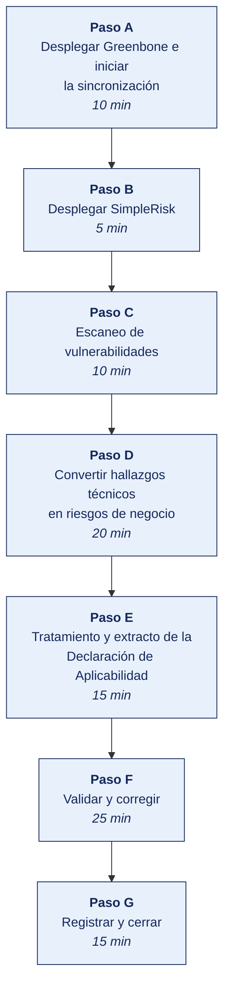

[Semana 03](README.md) · [Teoría](1-TEORIA.md) · [Dinámica de aula](2-DINAMICA.md) · **Taller de laboratorio**

# Taller de laboratorio 03 · Evaluación de riesgos con SimpleRisk y detección técnica con OpenVAS/Greenbone

**SI-084 · Auditoría de Sistemas** · Semana 03 · Sesión 2 en laboratorio · 100 min · calificación **procedimental**

> ¿Un término no le resulta claro? Está definido en el [glosario técnico del curso](../GLOSARIO.md).

---

## Secuencia del taller



## Qué entregas

| | |
|---|---|
| **Archivo** | `SI084-S03-TALLER-Grupo<N>.pdf` |
| **Plantilla obligatoria** | [SI084-PLANTILLA-TALLER.docx](../PLANTILLAS/SI084-PLANTILLA-TALLER.docx) |
| **Formato** | PDF exportado desde la plantilla en Word, con la carátula de la UPT, el índice actualizado y las capturas numeradas |
| **Qué va dentro** | Las secciones de la plantilla. La **5. Resultados y evidencias** se califica contra la tabla de resultados esperados de esta guía, y **cada resultado necesita la evidencia que lo demuestre**. No se copian de aquí los objetivos, la duración ni los resultados de aprendizaje |
| **Dónde se sube** | Aula virtual, tarea «Taller · Semana 03» |
| **Cuándo vence** | 48 horas después de la sesión de laboratorio |

> No se califica un informe entregado en `.docx`, sin carátula, sin los códigos de los integrantes o con resultados declarados sin evidencia.

---

## El reto

| | |
|---|---|
| **Situación** | El escáner devuelve cientos de vulnerabilidades ordenadas por CVSS. La gerencia pregunta cuáles importan y el CVSS no lo sabe, porque no conoce el negocio. |
| **Misión** | Convertir hallazgos técnicos en riesgos de negocio con probabilidad e impacto justificados, y demostrar con dos casos que el orden cambia. |
| **Criterio de éxito** | Existen dos casos documentados donde el orden por riesgo de negocio contradice al orden por CVSS, con la razón escrita. |

## 1. Información sobre el evento práctico

### 1.1. Título del evento práctico

Apreciación y tratamiento del riesgo de seguridad de la información sobre el entorno auditado, alimentada por evidencia técnica de vulnerabilidades obtenida con el escáner Greenbone/OpenVAS.

### 1.2. Objetivos

- Desplegar **SimpleRisk Community** y **Greenbone Community Edition (OpenVAS)** en Docker.
- Ejecutar un **escaneo autenticado y no autenticado** de vulnerabilidades sobre el entorno `si084-lab`.
- Interpretar los resultados en términos de **CVE, CVSS v3.1 y vector de ataque**, distinguiendo severidad técnica de riesgo de negocio.
- **Convertir hallazgos técnicos en riesgos de negocio** registrados con activo, amenaza, vulnerabilidad, probabilidad, impacto y dueño.
- Construir la **matriz de riesgo inherente y residual** y el **plan de tratamiento**.
- Elaborar un extracto de **Declaración de Aplicabilidad (SoA)** para los controles involucrados.

### 1.3. Tiempo de duración

**100 minutos.**

### 1.4. Resultados de Aprendizaje (RA)

- **RA1** Analiza e interpreta los conceptos y terminología de Auditoría de Sistemas.
- **RA2** Evalúa la seguridad de la información en Auditoría de Sistemas.

### 1.5. Recursos

| Recurso | Detalle |
|---|---|
| Entorno de las semanas 01–02 | `si084-lab` con `audit_net` |
| **Greenbone Community Containers** | https://greenbone.github.io/docs/latest/22.4/container/ |
| **SimpleRisk** | Imagen `simplerisk/simplerisk` — https://www.simplerisk.com/ |
| **MONARC** (alternativa) | https://www.monarc.lu/download/ — instalación por VM/Vagrant |
| Python 3.11+ con `pandas` | Conversión de reporte técnico a registro de riesgos |
| Espacio en disco | 10 GB libres (la base de datos de pruebas de Greenbone es grande) |

### 1.6. Seguridad

1. **El escaneo se ejecuta exclusivamente contra la red `audit_net`.** Escanear la red del campus o cualquier host fuera del laboratorio constituye acceso no autorizado, tipificado en la Ley 30096.
2. Se verifica el objetivo antes de lanzar. `docker network inspect audit_net` y se anota el rango exacto en el papel de trabajo.
3. El escaneo autenticado usa credenciales del laboratorio; nunca credenciales reales.
4. La sincronización de las bases de datos de Greenbone puede tardar; se inicia al comenzar la sesión y se trabaja en SimpleRisk mientras concluye.
5. Los reportes contienen rutas y versiones. Se tratan como información **Confidencial** en la clasificación del curso.

---

## 2. Procedimiento o Metodología

> **Documento del caso para esta semana.** La organización entrega **Relato del incidente del periodo**, en `CASOS/EMPRESA-<NN>-<slug>/documentos/incidente-detallado.md`. Es consistente con los datos de `datos/`. Las personas, usuarios y proveedores que menciona existen en los archivos. **No señala sus debilidades**; declara lo que la organización dice hacer.

### Paso A — Desplegar Greenbone e iniciar la sincronización

```bash
mkdir -p entorno/greenbone && cd entorno/greenbone
curl -fsSL -o docker-compose.yml \
  https://greenbone.github.io/docs/latest/_static/docker-compose-22.4.yml
export DOWNLOAD_DIR=$HOME/greenbone-community-container
docker compose -f docker-compose.yml -p greenbone-community-edition pull
docker compose -f docker-compose.yml -p greenbone-community-edition up -d
docker compose -p greenbone-community-edition logs -f gvmd | tail -20
```

**Interfaz web.** http://127.0.0.1:9392 — se crea el usuario administrador siguiendo la documentación oficial. **Mientras sincroniza los *feeds*, se continúa con el Paso B.**

> **Alternativa si el ancho de banda es insuficiente.** Ejecutar `nuclei` (`projectdiscovery/nuclei`) contra los mismos objetivos. Es mucho más liviano y produce hallazgos con severidad y referencias, suficientes para el ejercicio de conversión a riesgo.

### Paso B — Desplegar SimpleRisk

```yaml
# agregar a entorno/docker-compose.yml
  simplerisk-db:
    image: mariadb:11
    container_name: si084_srdb
    environment:
      MARIADB_ROOT_PASSWORD: SimpleRisk_lab
      MARIADB_DATABASE: simplerisk
    networks: [audit_net]

  simplerisk:
    image: simplerisk/simplerisk:latest
    container_name: si084_simplerisk
    depends_on: [simplerisk-db]
    ports:
      - "127.0.0.1:8083:80"
    networks: [audit_net]
```

```bash
docker compose up -d simplerisk-db simplerisk
```

**Acceso.** http://127.0.0.1:8083 — se completa el asistente de instalación apuntando al host `simplerisk-db`.

**Configuración del criterio antes de evaluar** (este es el paso que separa una evaluación auditable de una decorativa):

1. *Configure → Risk Formula*. Se selecciona el método **Classic (Likelihood × Impact)**.
2. Se definen las escalas 1–5 con **las definiciones operativas de la sección 1.4 de esta semana**, escritas en el campo de descripción.
3. Se fija el **criterio de aceptación**. Riesgos con valor ≤ 6 se pueden aceptar; > 6 requieren plan de tratamiento con plazo.
4. Se registran los **dueños de riesgo** (usuarios) por área — Finanzas, Operaciones, TI, RR. HH.

### Paso C — Escaneo de vulnerabilidades

En Greenbone, se identifica primero la subred del laboratorio:

```bash
docker network inspect audit_net --format '{{range .IPAM.Config}}{{.Subnet}}{{end}}'
docker inspect -f '{{.Name}} {{range .NetworkSettings.Networks}}{{.IPAddress}}{{end}}' \
  $(docker ps -q) | tee ../20_evidencia/E03_scan/objetivos.txt
```

En la interfaz de Greenbone:

1. *Configuration → Targets → New Target*. Se ingresa la lista de IP obtenidas, puertos `All IANA assigned TCP`.
2. *Credentials*. Se crea una credencial para el escaneo autenticado del contenedor PostgreSQL.
3. *Scans → Tasks → New Task*. `Full and fast`, se asocia el objetivo y se ejecuta.
4. Al terminar *Reports → Download* en formato **CSV** y **XML**, guardando en `20_evidencia/E03_scan/`.

Mientras corre el escaneo se realiza el reconocimiento manual:

```bash
docker run --rm --network audit_net instrumentisto/nmap \
  -sV -sC -p- --open 172.x.0.0/16 > ../20_evidencia/E03_scan/nmap_servicios.txt
```

### Paso D — Convertir hallazgos técnicos en riesgos de negocio

Este es el núcleo intelectual del laboratorio. **Un CVE con CVSS 9.8 no es un riesgo alto por sí solo**. Depende del activo, de su exposición y del impacto en el negocio.

```python
# 30_papeles_trabajo/PT03_tecnico_a_riesgo.py
import pandas as pd

# --- EVIDENCIA TÉCNICA ---
v = pd.read_csv("../20_evidencia/E03_scan/reporte_greenbone.csv")
v = v[v["Severity"] >= 4.0]      # se descartan los informativos

# --- CONTEXTO DE NEGOCIO · sin esto, el CVSS no significa nada ---
ACTIVOS = {
    "si084_db":        dict(nombre="Base de datos ERP",  dueno="Gerencia de Finanzas",
                            clasificacion="Restringida", expuesto=False, criticidad=5),
    "si084_juiceshop": dict(nombre="Portal de clientes", dueno="Gerencia Comercial",
                            clasificacion="Confidencial", expuesto=True,  criticidad=4),
    "si084_portal":    dict(nombre="Portal corporativo", dueno="Gerencia Comercial",
                            clasificacion="Pública",     expuesto=True,  criticidad=2),
    "si084_dvwa":      dict(nombre="App legada interna", dueno="Gerencia de Operaciones",
                            clasificacion="Interna",     expuesto=False, criticidad=3),
}

def probabilidad(cvss, expuesto):
    """La exposición a Internet eleva la probabilidad de explotación."""
    base = 1 if cvss < 4 else 2 if cvss < 7 else 3 if cvss < 9 else 4
    return min(5, base + (1 if expuesto else 0))

def impacto(criticidad, clasificacion):
    """El impacto lo determina el valor del activo, no la severidad técnica."""
    extra = {"Restringida": 1, "Confidencial": 0, "Interna": 0, "Pública": -1}
    return max(1, min(5, criticidad + extra.get(clasificacion, 0)))

filas = []
for _, r in v.iterrows():
    a = ACTIVOS.get(r["Host"].strip(), None)
    if not a:
        continue
    p = probabilidad(r["Severity"], a["expuesto"])
    i = impacto(a["criticidad"], a["clasificacion"])
    filas.append({
        "id_riesgo": f"R-{len(filas)+1:03d}",
        "activo": a["nombre"], "dueno_del_riesgo": a["dueno"],
        "clasificacion": a["clasificacion"],
        "amenaza": "Explotación remota de vulnerabilidad conocida",
        "vulnerabilidad": r["NVT Name"], "cve": r.get("CVEs", "N/D"),
        "cvss": r["Severity"], "probabilidad": p, "impacto": i,
        "riesgo_inherente": p * i,
        "nivel": "Crítico" if p*i >= 20 else "Alto" if p*i >= 12
                 else "Medio" if p*i >= 6 else "Bajo",
    })

reg = pd.DataFrame(filas).sort_values("riesgo_inherente", ascending=False)
reg.to_csv("../40_hallazgos/PT03_registro_riesgos.csv", index=False)
print(reg.head(15).to_string(index=False))
print("\nDistribución por nivel:\n", reg["nivel"].value_counts().to_string())
```

**Discusión obligatoria en el laboratorio (10 min).** Se localiza en el registro un caso donde **el CVSS es alto pero el riesgo de negocio es bajo** (activo público, sin datos) y otro donde **el CVSS es medio pero el riesgo es crítico** (base de datos con información restringida). Este contraste es la justificación de por qué el auditor no reporta la salida cruda del escáner.

### Paso E — Tratamiento y extracto de la Declaración de Aplicabilidad

Se cargan en SimpleRisk los **cinco riesgos de mayor valor** y, para cada uno:

1. *Risk Management → Submit Your Risk* — activo, amenaza, vulnerabilidad, probabilidad, impacto, dueño.
2. *Plan Your Mitigations*. Se selecciona la decisión de tratamiento y se describen los controles.
3. Se mapea cada control a su **código del Anexo A de la ISO/IEC 27001:2022**.
4. Se estima el **riesgo residual** y se identifica quién debe firmar su aceptación.

Extracto de SoA en `30_papeles_trabajo/PT03_soa_extracto.md`:

| Control | Título | ¿Aplica? | Justificación | Estado | Riesgo que trata |
|---|---|---|---|---|---|
| A.8.8 | Management of technical vulnerabilities | Sí | Existen vulnerabilidades explotables identificadas | No implementado | R-001, R-003 |
| A.8.9 | Configuration management | Sí | Configuraciones por defecto en producción | Parcial | R-002 |
| A.5.17 | Authentication information | Sí | Credenciales débiles en servicio de base de datos | No implementado | R-004 |
| A.8.24 | Use of cryptography | Sí | Transporte sin cifrar entre servicios | No implementado | R-005 |
| A.7.4 | Physical security monitoring | No | El entorno es virtualizado en nube del proveedor | N/A | — |

Sellado final:

```bash
sha256sum 20_evidencia/E03_scan/* 40_hallazgos/PT03_registro_riesgos.csv >> 20_evidencia/SHA256SUMS_E03.txt
git add . && git commit -m "E03: escaneo de vulnerabilidades, registro de riesgos y extracto de SoA"
```

---

### Paso F — Validar y corregir (25 min)

El resultado no vale por estar hecho, sino por resistir una comprobación. Se ejecutan estas tres y **se corrige lo que falle antes de cerrar la sesión**.

1. Comprobar que las escalas 1–5 tienen **definición operativa escrita**, y que dos personas distintas calificarían igual con ellas.
2. Verificar que los dos casos contrastantes existen y que la explicación nombra el factor de negocio que cambió el orden.
3. Revisar que el extracto de la Declaración de Aplicabilidad incluye al menos un control **excluido con justificación**.

> Lo que no se pueda corregir hoy se anota en la sección **Problemas y mejoras** de la evidencia, con lo que faltó y por qué. Un resultado parcial documentado con honestidad vale más que uno declarado sin prueba.

### Paso G — Registrar la evidencia y cerrar (15 min)

Se versiona lo producido, se anota la URL de cada resultado y se responde en dos frases la pregunta de transferencia — **qué riesgo correría una organización real si esto se hiciera mal**.

---

## 3. Resultados

> **Evidencia obligatoria en GitHub.** Todo resultado de este taller se versiona en el repositorio del equipo. El informe **no consigna capturas sueltas**. Consigna la **URL** del artefacto en GitHub. Una captura no permite verificar autoría, fecha ni contenido; un enlace sí.
>
> | Qué se entrega | Dónde vive | Qué se escribe en el informe |
> |---|---|---|
> | Código y archivos de configuración | Rama del taller, fusionada a `develop` vía Pull Request | URL del Pull Request |
> | Documentos y matrices | `docs/`, en formato de texto versionable | URL del archivo en la rama |
> | Capturas y videos que el taller exija | `docs/evidencias/S03/` | URL del archivo |
> | Salida de comandos | `docs/evidencias/S03/salidas/*.txt` | URL del archivo |
>
> **Etiqueta del taller.** Al cerrar el taller se crea la etiqueta `taller-03` sobre el commit entregado:
>
> ```bash
> git tag -a taller-03 -m "Taller 03 · SI084"
> git push origin taller-03
> ```
>
> La URL que se consigna en el informe apunta a esa etiqueta:
> `https://github.com/<organizacion>/<repositorio>/tree/taller-03`
>
> **El informe es lo que se califica; el repositorio es lo que lo prueba.** Cada resultado de la sección 3 del informe lleva la URL con la que se verifica, y **un resultado sin su URL se califica como no logrado**, por bien redactado que esté. Lo que no se puede abrir no se puede dar por hecho.

### 3.1. Los tres resultados que se califican

Son los que la rúbrica evalúa. El resto de la lista tiene que existir, pero no se califica fila por fila.

| Resultado | Qué demuestra | Dónde está |
|---|---|---|
| **El registro de riesgos** | Diez riesgos con activo, dueño, CVE, probabilidad, impacto y nivel | `PT03_registro_riesgos.csv` |
| **Los dos casos contrastantes** | CVSS alto con riesgo bajo y CVSS medio con riesgo crítico, explicados | Papel de trabajo |
| **El extracto de la Declaración de Aplicabilidad** | Cinco controles, uno de ellos excluido con su fundamento | `PT03_soa_extracto.md` |

### 3.2. Lista de comprobación del taller

Todo esto debe existir al cerrar la sesión.

| # | Resultado esperado | Verificación |
|---|---|---|
| 1 | Greenbone/OpenVAS operativo con *feeds* sincronizados (o Nuclei como alternativa documentada) | Captura de la interfaz |
| 2 | SimpleRisk configurado con escalas 1–5 **con definición operativa escrita** y criterio de aceptación | Captura de *Risk Formula* |
| 3 | Reporte de escaneo en CSV y XML en `E03_scan/`, con la lista de objetivos autorizados | Listado y contenido |
| 4 | `PT03_registro_riesgos.csv` con al menos 10 riesgos, cada uno con activo, dueño, CVE, probabilidad, impacto y nivel | Contenido del CSV |
| 5 | **Dos casos contrastantes documentados**. CVSS alto / riesgo bajo y CVSS medio / riesgo crítico, con la explicación | Papel de trabajo |
| 6 | Cinco riesgos cargados en SimpleRisk con su plan de tratamiento y control ISO mapeado | Captura de SimpleRisk |
| 7 | Extracto de SoA con al menos 5 controles, incluyendo uno **excluido con justificación** | `PT03_soa_extracto.md` |
| 8 | Hashes registrados en la cadena de custodia y *commit* en Git | `SHA256SUMS_E03.txt`, `git log` |

## Rúbrica procedimental (20 puntos)

Se aplica sobre el informe entregado y la evidencia enlazada en el repositorio. **Cada criterio se califica de forma independiente.**

| Criterio | 4 — Logrado | 2 — En proceso | 0 — Insuficiente |
|---|---|---|---|
| **Convertir hallazgos técnicos en riesgos de negocio** | Completo y correcto, con la evidencia que lo respalda | Completo con errores menores, o correcto pero sin toda la evidencia | Incompleto, o entregado sin ejecutar |
| **Tratamiento y extracto de la Declaración de Aplicabilidad** | Completo y correcto, con la evidencia que lo respalda | Completo con errores menores, o correcto pero sin toda la evidencia | Incompleto, o entregado sin ejecutar |
| **Evidencia verificable en el repositorio** | Cada resultado tiene su URL sobre la etiqueta `taller-NN`, y el enlace abre lo que dice | La mayoría tiene URL; alguna evidencia es una captura suelta | Se declaran resultados sin enlace, o el enlace no corresponde |
| **Trazabilidad de la evidencia** | Todo hallazgo o dato se rastrea hasta el archivo, registro y fecha que lo sustenta | Rastreable en su mayoría; algún dato sin origen | Se afirman hechos sin poder ubicarlos en la evidencia |
| **La evidencia entregada** | Las secciones de la plantilla completas; los papeles de trabajo quedan archivados y referenciados | Secciones completas con papeles de trabajo incompletos | Faltan secciones o no hay papeles de trabajo |

| Puntaje | Equivalencia |
|---|---|
| 18 – 20 | Destacado |
| 14 – 17 | Logrado |
| 6 – 13 | En proceso |
| 0 – 5 | Insuficiente |

> **Un resultado declarado sin evidencia enlazada no se califica**, aunque el trabajo se haya hecho. La tabla de la sección 3.1 es la lista de cotejo; esta rúbrica es lo que determina la nota.

## 4. Conclusiones

Mínimo tres. Líneas argumentales esperadas:

1. La severidad CVSS mide la explotabilidad técnica de una vulnerabilidad en abstracto; el riesgo mide la consecuencia para *esta* organización. Reportar CVSS como si fuera riesgo transfiere al negocio una decisión que el auditor no tomó.
2. Sin escalas con definición operativa y sin criterio de aceptación aprobado, la matriz de riesgo produce números que no son comparables entre evaluaciones ni entre evaluadores.
3. La Declaración de Aplicabilidad es el punto donde el análisis de riesgos se vuelve auditable. Cada control incluido o excluido debe poder rastrearse hasta un riesgo concreto del registro.

## 5. Referencias Bibliográficas

- ISO/IEC 27001:2022. *Information security, cybersecurity and privacy protection — ISMS — Requirements*. https://www.iso.org/standard/27001
- ISO/IEC 27002:2022. *Information security, cybersecurity and privacy protection — Information security controls*. https://www.iso.org/standard/75652.html
- ISO/IEC 27005:2022. *Guidance on managing information security risks*. https://www.iso.org/standard/80585.html
- ISO 31000:2018. *Risk management — Guidelines*. https://www.iso.org/standard/65694.html
- Resolución de Secretaría de Gobierno y Transformación Digital n.° 003-2023-PCM/SGTD. https://www.gob.pe/institucion/pcm/tema/transformacion-digital/normas-legales
- Resolución Ministerial 004-2016-PCM (uso obligatorio de la NTP ISO/IEC 27001 en el Sistema Nacional de Informática). https://www.gob.pe/institucion/pcm/normas-legales/292578-004-2016-pcm
- FIRST. *Common Vulnerability Scoring System v3.1: Specification Document*. https://www.first.org/cvss/v3-1/specification-document
- Greenbone AG. *Greenbone Community Documentation*. https://greenbone.github.io/docs/
- SimpleRisk. *SimpleRisk Documentation*. https://www.simplerisk.com/documentation
- NC3 Luxembourg. *MONARC — Optimised Risk Analysis Method*. https://www.monarc.lu/
- Alexander, A. G. *Diseño de un sistema de gestión de seguridad de información: óptica ISO 27001*.

## 6. Anexos

- `anexo_A_reporte_greenbone.pdf` — reporte ejecutivo del escaneo.
- `anexo_B_registro_riesgos.xlsx` — registro completo con matriz de calor.
- `anexo_C_soa_extracto.pdf` — Declaración de Aplicabilidad parcial.
- `anexo_D_autorizacion_escaneo.pdf` — declaración firmada de que el escaneo se limitó a `audit_net`.

---

---

[Semana 03](README.md) · [Teoría](1-TEORIA.md) · [Dinámica de aula](2-DINAMICA.md) · **Taller de laboratorio**

---

**Docente** · Dr. Oscar Juan Jimenez Flores
[oscarjimenezflores@upt.pe](mailto:oscarjimenezflores@upt.pe) · [LinkedIn](https://www.linkedin.com/in/oscar-jimenez-flores/) · [CTI Vitae — CONCYTEC](https://ctivitae.concytec.gob.pe/appDirectorioCTI/VerDatosInvestigador.do?id_investigador=33398)

Escuela Profesional de Ingeniería de Sistemas · Universidad Privada de Tacna · Tacna, Perú
