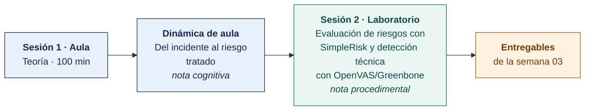

  
  &nbsp;&nbsp;&nbsp;&nbsp;&nbsp;&nbsp;
  

  <strong>Universidad Privada de Tacna</strong> 
  Facultad de Ingeniería · Escuela Profesional de Ingeniería de Sistemas

<h1 align="center">Semana 03 · Evaluación de la Seguridad Informática · NTP-ISO/IEC 27001:2022 y Gestión del Riesgo</h1>

  <strong>SI-084 · Auditoría de Sistemas</strong> 
  4 horas académicas de 50 min · 100 min de teoría con la dinámica incluida en aula · 100 min de taller en laboratorio

---

## Datos de la asignatura

| | |
|---|---|
| **Asignatura** | SI-084 · Auditoría de Sistemas |
| **Escuela** | Escuela Profesional de Ingeniería de Sistemas |
| **Ciclo** | X · 04 horas semanales · 03 créditos · Obligatorio |
| **Prerrequisito** | SI-985 Gestión de la Configuración de Software |
| **Unidad** | I — Seguridad de la Información en Auditoría de Sistemas |
| **Semana** | 03 de 17 |
| **Duración** | 4 horas académicas de 50 min · 100 min de teoría con la dinámica incluida en aula · 100 min de taller en laboratorio |
| **Resultados de aprendizaje** | **RA1** Analiza e interpreta los conceptos y terminología de Auditoría de Sistemas · **RA2** Evalúa la seguridad de la información en Auditoría de Sistemas |
| **Atributos del graduado** | AG-I08 Análisis de Problemas (CD2 y CD3, nivel 4) · AG-I11 Uso de Herramientas (CD2, nivel 4) |

### Lo que indica el sílabo

**Contenido conceptual.** Evaluación de la seguridad informática en auditoría, Normas de Gestión, Familia de seguridad, NTP ISO 27001, Gestión del riesgo, tratamiento del riesgo. Software para tratamiento del riesgo.

**Contenido procedimental.** Identifica incidentes de seguridad informática, propone políticas de seguridad informática, propone un plan de seguridad informático de acuerdo con la norma NTP ISO 27001.

## Materiales de esta semana

| | Documento | Qué encontrarás | Dónde y cuánto dura |
|---|---|---|---|
| 1 | **[Teoría](1-TEORIA.md)** | La familia de normas ISO/IEC 27000 · Las cláusulas certificables 4 a 10 · Gestión del riesgo de seguridad de la información | Aula · 100 min |
| 2 | **[Dinámica de aula](2-DINAMICA.md)** | Del incidente al riesgo tratado, con su material, su ejemplo resuelto y su rúbrica | Aula · dentro de los 100 min de la sesión de teoría |
| 3 | **[Taller de laboratorio](3-TALLER.md)** | Evaluación de riesgos con SimpleRisk y detección técnica con OpenVAS/Greenbone | Laboratorio · 100 min |

## Ruta de la semana

## Entregables

| Entregable | Formato y nombre del archivo | Vence |
|---|---|---|
| **Dinámica de aula** · Del incidente al riesgo tratado | PDF desde la [plantilla de dinámica](../PLANTILLAS/SI084-PLANTILLA-DINAMICA.docx) · `SI084-S03-DINAMICA-Grupo<N>.pdf` | Antes de cerrar la sesión de teoría |
| **Informe del taller de laboratorio N.º 03** | PDF en formato EPIS desde la [plantilla de taller](../PLANTILLAS/SI084-PLANTILLA-TALLER.docx) · `SI084-S03-TALLER-Grupo<N>.pdf` | 48 h después del taller |
| Registro de riesgos y extracto de SoA en el repositorio | Commit en Git | 48 h después del laboratorio |

> Ambos se entregan en **PDF**, con la carátula de la UPT y los códigos de todos los integrantes. Las plantillas obligatorias están en [`PLANTILLAS/`](../PLANTILLAS/).

## Cómo se evalúa

| Criterio | Instrumento | Peso |
|---|---|---|
| Cognitivo | Rúbrica de la ficha de riesgo + exposición de 10 min en la Semana 04 | 25 % |
| Procedimental | Lista de cotejo de los 8 resultados del laboratorio | 35 % |
| Actitudinal | Cumplimiento estricto del alcance autorizado del escaneo | 15 % |

## Preparación para la Semana 04

- **Leer.** ISO/IEC 27002:2022, tema A.8 Controles tecnológicos.
- **Leer.** Piattini y Del Peso, capítulo de controles de aplicación y controles generales.
- **Revisar.** CIS Benchmarks (https://www.cisecurity.org/cis-benchmarks) y la guía de Lynis (https://cisofy.com/lynis/).
- **Mantener el entorno operativo.** La Semana 04 audita su configuración con Lynis, OpenSCAP, Docker Bench y Trivy.

---

**Docente** · Dr. Oscar Juan Jimenez Flores
[oscarjimenezflores@upt.pe](mailto:oscarjimenezflores@upt.pe) · [LinkedIn](https://www.linkedin.com/in/oscar-jimenez-flores/) · [CTI Vitae — CONCYTEC](https://ctivitae.concytec.gob.pe/appDirectorioCTI/VerDatosInvestigador.do?id_investigador=33398)

Escuela Profesional de Ingeniería de Sistemas · Universidad Privada de Tacna · Tacna, Perú
