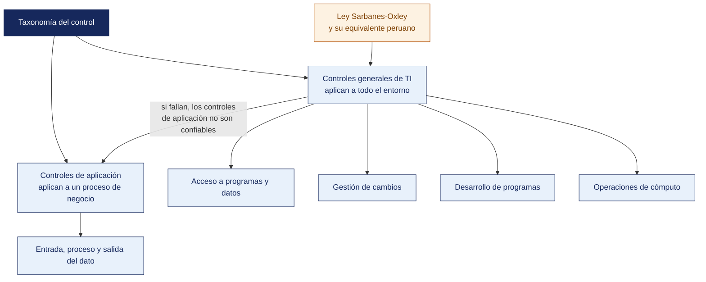

[Semana 04](README.md) · **Teoría** · [Dinámica de aula](2-DINAMICA.md) · [Taller de laboratorio](3-TALLER.md)

# Teoría · Controles de Auditoría de Aplicación, Físicos, Lógicos y de Calidad · La Ley SOX en el Perú

**SI-084 · Auditoría de Sistemas** · Semana 04 · Sesión 1 en aula · 2 horas académicas, 100 min, con la dinámica incluida

> ¿Un término no le resulta claro? Está definido en el [glosario técnico del curso](../GLOSARIO.md).

---

## Qué se trabaja en esta sesión

- Taxonomía de los controles de auditoría.
- Controles generales de TI.
- Controles de aplicación sobre el ciclo del dato.
- Controles físicos, ambientales y de calidad.
- La Ley Sarbanes-Oxley y su equivalente peruano.

## Distribución del tiempo

| Bloque | Minutos |
|---|---|
| Taxonomía de los controles de auditoría | 15 |
| Controles generales de TI | 15 |
| Controles de aplicación sobre el ciclo del dato | 15 |
| Controles físicos, ambientales y de calidad | 10 |
| La Ley Sarbanes-Oxley y su equivalente peruano | 10 |
| **Total de la sesión de aula** | **65** |

## Mapa de la sesión

---

## Taxonomía de los controles de auditoría

Un control es cualquier medida —política, procedimiento, práctica o estructura organizacional— diseñada para dar seguridad razonable de que los objetivos se alcanzarán y los eventos no deseados serán prevenidos, detectados o corregidos.

**Clasificación por momento de actuación.**

| Tipo | Actúa | Ejemplo en TI | Ventaja | Costo |
|---|---|---|---|---|
| **Preventivo** | Antes del evento | Validación de entrada, MFA, control de acceso | Evita el daño | Alto, fricciona la operación |
| **Detectivo** | Durante o después | Conciliación, revisión de bitácoras, alertas del SIEM | Descubre lo que el preventivo dejó pasar | Medio |
| **Correctivo** | Después del evento | Restauración de respaldo, plan de recuperación | Limita la consecuencia | Bajo, pero el daño ya ocurrió |
| **Disuasivo** | Sobre la voluntad | Política de sanciones, banner de monitoreo | Muy bajo costo | No impide al determinado |
| **Compensatorio** | Sustituye a uno inviable | Revisión posterior cuando no hay segregación de funciones | Viable en organizaciones pequeñas | Requiere disciplina |

> **Regla de diseño.** Un buen sistema de control combina las tres primeras categorías. Una organización con solo controles preventivos no sabe cuándo falló; una con solo detectivos vive apagando incendios.

**Ejemplo trabajado — un mismo riesgo, cinco controles.** Riesgo. *Un empleado transfiere fondos a una cuenta que no corresponde a un proveedor real.*

| Tipo | Control concreto | Qué pasa si es el único que existe |
|---|---|---|
| Preventivo | El alta de un proveedor exige validación del RUC contra el padrón de la SUNAT y aprobación de un segundo | El determinado puede coludirse con quien aprueba |
| Detectivo | Reporte semanal de proveedores nuevos, revisado por Contraloría interna | El fraude ocurre y se descubre después; el dinero puede haber salido |
| Correctivo | Procedimiento de reversión de transferencia dentro de las 24 h | Solo sirve si el detectivo actuó a tiempo |
| Disuasivo | Cláusula de sanción en el reglamento interno, firmada por el trabajador | No detiene a quien ya decidió hacerlo |
| Compensatorio | En una empresa de 6 personas donde no hay segundo aprobador: revisión mensual de todos los pagos por el contador externo | Depende de que el externo efectivamente revise |

Fíjese en que **ninguno alcanza solo**. Ese es el argumento de por qué el auditor evalúa el conjunto y no controla uno por uno.

**Preguntas para la sesión**

| Pregunta | Qué debe contener una buena respuesta |
|---|---|
| Un banco tiene MFA en todas sus aplicaciones y ningún control detectivo. ¿Qué riesgo asume? | Que no se entera de los accesos indebidos que el MFA no evitó: credenciales robadas con el segundo factor comprometido, o abuso por parte de un usuario legítimo |
| ¿Un respaldo es un control preventivo, detectivo o correctivo? | Correctivo. No evita el incidente ni lo detecta: limita la consecuencia. Quien lo llama preventivo confunde el momento en que actúa |
| ¿Cuándo es legítimo apoyarse en un control compensatorio? | Cuando el control ideal es inviable por tamaño o costo, la compensación cubre el mismo objetivo y **queda documentada la razón**. Nunca como excusa permanente |

**Clasificación por naturaleza.**

| Categoría | Alcance | Quién los evalúa |
|---|---|---|
| **Controles generales de TI (ITGC)** | Aplican a **todo** el ambiente de TI | Auditor de sistemas |
| **Controles de aplicación** | Aplican a **una** transacción o proceso de negocio | Auditor de sistemas junto al auditor de proceso |

**La dependencia jerárquica** es el concepto más importante de la semana. **Los controles de aplicación solo son confiables si los ITGC son efectivos**. Si cualquier desarrollador puede modificar el código en producción (ITGC de gestión de cambios roto), entonces la validación de que «el descuento no puede superar el 20 %» es irrelevante. Alguien pudo cambiarla ayer y devolverla hoy. Por eso el auditor **siempre evalúa primero los ITGC**.

## Controles generales de TI

| Dominio ITGC | Qué asegura | Pruebas típicas | COBIT 2019 | ISO/IEC 27001:2022 |
|---|---|---|---|---|
| **Gestión de accesos** | Solo los autorizados acceden y solo a lo que necesitan | Revisión de altas/bajas, permisos efectivos, cuentas privilegiadas, revisión periódica | DSS05, DSS06 | A.5.15–A.5.18, A.8.2–A.8.5 |
| **Gestión de cambios** | Todo cambio a producción es autorizado, probado y trazable | Muestra de cambios: ¿aprobación? ¿evidencia de prueba? ¿segregación desarrollo-producción? ¿plan de reversión? | BAI06, BAI07 | A.8.32, A.8.31 |
| **Operaciones de TI** | Los procesos programados se ejecutan y los incidentes se gestionan | Revisión de *jobs* fallidos, respaldo y restauración, gestión de incidentes | DSS01, DSS02, DSS04 | A.8.13, A.8.14, A.5.24–A.5.26 |
| **Desarrollo y adquisición** | El software cumple los requisitos y no introduce riesgos | Metodología, pruebas, aceptación del usuario, revisión de código | BAI03, BAI05 | A.8.25–A.8.31 |

**Prueba de diseño vs. prueba de eficacia operativa.** Son dos pruebas distintas y el informe debe distinguirlas:

- **Diseño.** ¿El control, tal como está definido, mitigaría el riesgo si se ejecutara siempre? Se evalúa leyendo el procedimiento y entrevistando.
- **Eficacia operativa.** ¿El control **efectivamente se ejecutó** durante todo el periodo auditado? Se evalúa con muestreo y evidencia de cada ejecución.

Un control bien diseñado que se ejecutó 8 de 12 meses **falla la prueba de eficacia operativa**, y ese es un hallazgo distinto —y a menudo más grave— que un control mal diseñado.

**Ejemplo trabajado — el mismo control, las dos pruebas.** Control. *Todo cambio a producción requiere aprobación del jefe de sistemas antes de aplicarse.*

| | Prueba de diseño | Prueba de eficacia operativa |
|---|---|---|
| **Qué se pregunta** | ¿El procedimiento, tal como está escrito, evitaría un cambio no autorizado? | ¿Se aprobaron efectivamente los cambios del periodo, antes de aplicarse? |
| **Cómo se prueba** | Se lee el procedimiento y se entrevista al responsable | Se toma la población de cambios del periodo y se verifica la evidencia de aprobación de cada uno |
| **Evidencia** | El procedimiento firmado | El registro de cambios, contrastado con los despliegues reales del sistema |
| **Resultado posible A** | Diseño adecuado | 14 de 14 cambios aprobados → **el control opera** |
| **Resultado posible B** | Diseño adecuado | 9 de 14 aprobados, y 3 de los 5 sin aprobar son de urgencia → **falla la eficacia operativa** |
| **Resultado posible C** | El procedimiento permite que el mismo desarrollador apruebe → **falla el diseño** | Irrelevante: si el diseño falla, no se prueba la eficacia |

> **El orden importa.** Si el diseño falla, la prueba de eficacia no se ejecuta. No tiene sentido verificar la operación de un control que no mitigaría el riesgo aunque operara siempre.

**Preguntas para la sesión**

| Pregunta | Qué debe contener una buena respuesta |
|---|---|
| El auditado dice: «el control existe, lo que pasa es que no lo documentamos». ¿Es un hallazgo? | Sí. Un control que no deja rastro no puede verificarse. La condición no es que el control no exista, sino que **no hay evidencia de su operación** durante el periodo |
| En una empresa de 8 personas, el jefe de sistemas desarrolla, prueba y despliega. ¿Qué se recomienda? | No «contratar más gente». Un control compensatorio: revisión posterior por un tercero —el contador externo o la gerencia— de los cambios aplicados, con registro. Se declara como compensatorio y por qué |
| ¿Por qué el auditor evalúa primero los ITGC y no los controles de aplicación? | Porque si los ITGC fallan, cualquier conclusión sobre los controles de aplicación pierde sustento: la validación pudo alterarse sin dejar rastro |

## Controles de aplicación sobre el ciclo del dato

Se organizan siguiendo el recorrido del dato dentro del sistema:

| Etapa | Objetivo de control | Controles concretos |
|---|---|---|
| **Entrada** | Que el dato ingrese completo, exacto y una sola vez | Validación de formato, rango y tipo; dígito verificador (p. ej. el del RUC); listas de valores; campos obligatorios; **control de duplicados**; autorización previa a la captura |
| **Procesamiento** | Que el cálculo sea correcto y no se pierdan ni dupliquen registros | Totales de control (*hash totals*, *record counts*); conciliación entrada-salida; control de secuencia; manejo de excepciones a un archivo de rechazos revisable; reproceso controlado |
| **Salida** | Que el resultado llegue completo y solo a quien corresponde | Conciliación de totales; distribución controlada de reportes; marcado de clasificación; registro de impresión y exportación |
| **Archivo y datos maestros** | Que los datos permanentes sean íntegros | Restricciones referenciales; autorización dual para cambios de datos maestros (proveedores, cuentas bancarias); bitácora de cambios |
| **Pistas de auditoría** | Que toda transacción sea reconstruible | Registro inalterable de quién, qué, cuándo y desde dónde |

**Los seis objetivos de aserción.** El auditor pregunta, para cada aplicación — ¿los datos son **completos**, **exactos**, **válidos**, **autorizados**, **oportunos** y **restringidos**? Cada control de aplicación sirve a al menos uno de estos seis objetivos, y todo control que no sirva a ninguno es un control decorativo.

**Ejemplo trabajado — control de cambio de cuenta bancaria del proveedor.** Es el vector del fraude BEC (*Business Email Compromise*), uno de los de mayor pérdida económica global:

| Objetivo | Control | Prueba de auditoría |
|---|---|---|
| Autorizado | Doble aprobación fuera del canal de solicitud (llamada al contacto registrado) | Muestrear 25 cambios y verificar evidencia de la verificación telefónica |
| Trazable | Bitácora inalterable del cambio con valor anterior y nuevo | Consultar la tabla de auditoría y verificar que no sea editable |
| Detectivo | Reporte semanal de cambios de datos bancarios revisado por Tesorería | Verificar firma o registro de revisión en 12 semanas del periodo |
| Preventivo | Bloqueo de pagos durante 48 h tras un cambio de cuenta | Intentar un pago inmediato en el ambiente de pruebas |

## Controles físicos, ambientales y de calidad

**Físicos y ambientales (ISO/IEC 27001:2022, tema A.7).** Aunque muchas empresas migraron a la nube, el control físico no desaparece — **se transfiere al proveedor y debe auditarse por certificación de tercero** (informe SOC 2 Tipo II, certificado ISO/IEC 27001 con su alcance leído en detalle). En lo que permanece en las instalaciones —oficinas, dispositivos de usuario, cableado, respaldos en cinta— se auditan — perímetro (A.7.1), controles de entrada (A.7.2), protección contra amenazas físicas y ambientales (A.7.5), **escritorio y pantalla limpios** (A.7.7), seguridad del cableado (A.7.12), mantenimiento (A.7.13) y **eliminación o reutilización segura de equipos** (A.7.14).

**Controles de calidad del software.** La NTP-ISO/IEC 12207 estructura los procesos del ciclo de vida y la serie ISO/IEC 25000 (SQuaRE) define el modelo de calidad del producto con ocho características — adecuación funcional, eficiencia de desempeño, compatibilidad, usabilidad, fiabilidad, **seguridad**, mantenibilidad y portabilidad. Para el auditor, la calidad es auditable cuando existe una métrica, un umbral aceptado y evidencia de medición — «cobertura de pruebas ≥ 70 %», «cero vulnerabilidades críticas en el análisis de dependencias antes del despliegue», «defectos en producción por versión ≤ 3».

## La Ley Sarbanes-Oxley y su equivalente peruano

**Qué es SOX.** La *Sarbanes-Oxley Act of 2002* fue la respuesta legislativa de los Estados Unidos a los fraudes contables de Enron, WorldCom y Tyco. Dos secciones concentran el impacto sobre TI:

| Sección | Exigencia | Consecuencia para TI |
|---|---|---|
| **302** | El CEO y el CFO **certifican personalmente** la veracidad de los estados financieros y la efectividad de los controles de divulgación | La certificación depende de que los sistemas que producen la cifra sean confiables |
| **404** | La dirección debe evaluar y **el auditor externo debe atestiguar** la efectividad del control interno sobre el reporte financiero (ICFR) | Los **ITGC** de los sistemas que alimentan los estados financieros entran en el alcance obligatorio |

El marco de referencia usado es **COSO (*Committee of Sponsoring Organizations of the Treadway Commission*) Internal Control — Integrated Framework (2013)**, con sus cinco componentes — ambiente de control, evaluación de riesgos, actividades de control, información y comunicación, y actividades de supervisión.

**Por qué importa en el Perú.** SOX no es ley peruana, pero alcanza al país por tres vías:

1. **Subsidiarias de empresas listadas en EE. UU.** Mineras, bancos y compañías de consumo masivo con matriz listada en NYSE o NASDAQ aplican SOX a sus operaciones peruanas. Los ITGC del ERP en Lima son evaluados por el auditor externo de la matriz.
2. **Empresas peruanas con ADR (*American Depositary Receipt*) o emisión de deuda en mercados estadounidenses.**
3. **Efecto de arrastre normativo.** El diseño de control interno de SOX se convirtió en el estándar de facto para las auditorías externas y los directorios.

**El marco peruano equivalente.** El Perú construyó su propia arquitectura de control:

| Ámbito | Norma | Exigencia relevante |
|---|---|---|
| **Sistema financiero, de seguros y AFP** | **Resolución SBS N.º 504-2021** (vigente desde el 1 de julio de 2021; modificada por las Resoluciones SBS 1515-2021 y 3797-2023) | Obliga a implementar un **Sistema de Gestión de Seguridad de la Información y Ciberseguridad (SGSI-C)**, con roles definidos, gestión de incidentes, autenticación reforzada y reporte a la SBS. Modificó además los Reglamentos de Auditoría Interna y de Auditoría Externa |
| **Mercado de valores** | Código de Buen Gobierno Corporativo para las Sociedades Peruanas (SMV) y reporte anual de cumplimiento | Divulgación del sistema de control interno y de la gestión de riesgos |
| **Sector público** | Ley 28716 de Control Interno de las Entidades del Estado y directivas de la Contraloría General de la República | Implementación y evaluación del sistema de control interno; el Órgano de Control Institucional audita TI |
| **Gobierno digital** | Decreto Legislativo 1412 y D. S. 029-2021-PCM | Líder de Gobierno Digital, Oficial de Seguridad de la Información, uso obligatorio de la NTP-ISO/IEC 27001 vigente |

> **Conclusión operativa.** Cuando un estudiante audite una empresa peruana debe preguntar primero **a qué régimen pertenece** — financiero (SBS), mercado de valores (SMV), público (Contraloría) o privado no regulado. El criterio de auditoría cambia por completo, y aplicar el criterio equivocado invalida el hallazgo.

---

---

[Semana 04](README.md) · **Teoría** · [Dinámica de aula](2-DINAMICA.md) · [Taller de laboratorio](3-TALLER.md)

---

**Docente** · Dr. Oscar Juan Jimenez Flores
[oscarjimenezflores@upt.pe](mailto:oscarjimenezflores@upt.pe) · [LinkedIn](https://www.linkedin.com/in/oscar-jimenez-flores/) · [CTI Vitae — CONCYTEC](https://ctivitae.concytec.gob.pe/appDirectorioCTI/VerDatosInvestigador.do?id_investigador=33398)

Escuela Profesional de Ingeniería de Sistemas · Universidad Privada de Tacna · Tacna, Perú
