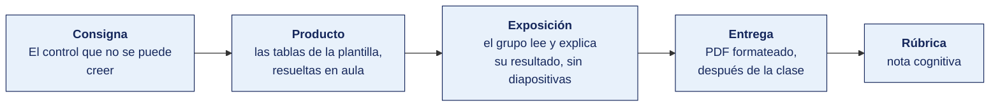

[Semana 04](README.md) · [Teoría](1-TEORIA.md) · **Dinámica de aula** · [Taller de laboratorio](3-TALLER.md)

# Dinámica de aula · El control que no se puede creer

**SI-084 · Auditoría de Sistemas** · Semana 04 · Actividad en aula, **dentro de los 100 min de la sesión de teoría** · calificación **cognitiva**

> ¿Un término no le resulta claro? Está definido en el [glosario técnico del curso](../GLOSARIO.md).

---

## Cómo funciona la actividad

## Qué entregas

| | |
|---|---|
| **Archivo** | `SI084-S04-DINAMICA-Grupo<N>.pdf` |
| **Plantilla obligatoria** | [SI084-PLANTILLA-DINAMICA.docx](../PLANTILLAS/SI084-PLANTILLA-DINAMICA.docx) |
| **Formato** | PDF exportado desde la plantilla en Word, con la carátula de la UPT y los apellidos, nombres y códigos de todos los integrantes |
| **Qué va dentro** | Lo que el grupo resolvió en aula. Las tablas de la sección **Producto** van completas, con los textos redactados, y cada decisión va justificada |
| **Dónde se sube** | Aula virtual, tarea «Dinámica · Semana 04» |
| **Cuándo vence** | Hasta 24 h después de la sesión de teoría. La tabla se resuelve en aula; el PDF se formatea y se sube después |
| **Exposición** | En la ronda de cierre de **esta misma sesión**. El grupo **lee y explica su resultado** ante el aula, con el documento a la vista. No se usan diapositivas |

> No se califica un trabajo entregado en `.docx`, sin carátula, sin los códigos de los integrantes o con las tablas del producto vacías.

---

## Consigna

> **«El control que no se puede creer»**
> Sobre la narrativa del proceso de compras y pagos que está en **Material de trabajo**, su equipo debe identificar **tres riesgos**, decir qué control existe para cada uno —o que no existe ninguno— y clasificarlo. **Después, dos conclusiones.** Qué control **no se puede concluir efectivo** por culpa del entorno de TI, y cuál falla **el diseño** y cuál **la eficacia operativa**.

Es el concepto que la teoría llama el más importante de la semana. *Los controles de aplicación solo son confiables si los ITGC (controles generales de TI) son efectivos.* Aquí se comprueba con un proceso real.

## Cómo se desarrolla · 35 minutos

| | Bloque | Quién | Minutos |
|---|---|---|---|
| **1** | **Tres riesgos.** Localizados en un paso concreto de la narrativa. **Uno de los tres debe ser un riesgo que no tiene ningún control** | Equipo | 9 |
| **2** | **Clasificación.** Para cada uno, el control que existe, su tipo y a cuál de los seis objetivos de aserción sirve | Equipo | 10 |
| **3** | **Las dos conclusiones.** La dependencia con el entorno de TI, y cuál control falla el diseño y cuál la eficacia operativa | Equipo | 8 |
| **4** | **Ronda en aula.** Tres equipos leen su riesgo sin control. Se contrasta con los datos del período | Todos | 8 |

## Material de trabajo

Trabaja sobre esta narrativa. Es el proceso de compras y pagos de una empresa distribuidora peruana de 60 empleados.

**El proceso, tal como lo describió el Jefe de Administración en la entrevista**

> Cuando un área necesita algo, el jefe del área entra al ERP y crea una requisición. La requisición llega al área de Compras. El analista de compras pide dos cotizaciones si el monto pasa de S/ 5 000; por debajo de eso compra al proveedor de siempre.
>
> El analista crea la orden de compra en el ERP. Si el monto es menor a S/ 20 000, él mismo la aprueba con su usuario. Si pasa de ese monto, la aprueba el Jefe de Administración. El sistema no deja aprobar al mismo usuario que creó la orden cuando el monto es alto, pero por debajo de S/ 20 000 sí lo permite.
>
> Cuando llega la mercadería, el almacenero la recibe y registra el ingreso en el ERP contra la orden de compra. El sistema deja registrar hasta un 5 % más de lo que decía la orden; si es más, pide una aprobación del Jefe de Almacén.
>
> La factura del proveedor llega por correo a Contabilidad. La asistente la registra en el ERP y el sistema hace el cruce automático de tres vías entre la orden, el ingreso y la factura. Si algo no calza, el ERP marca la factura como observada y no permite programarla para pago.
>
> Tesorería toma las facturas conformes y arma la propuesta de pago semanal en una hoja de cálculo que exporta del ERP. Ahí a veces agrega pagos que no están en el ERP, como los servicios y los impuestos, que se pagan directo desde la banca en línea. La propuesta la aprueba el Jefe de Administración por correo. Con esa aprobación, Tesorería carga el archivo de pagos a la banca en línea y libera.
>
> El proveedor nuevo lo crea Compras en el ERP, con su RUC y su cuenta bancaria. Si el proveedor cambia de cuenta, avisa por correo y Tesorería actualiza el dato directamente.

**Sistemas y roles involucrados**

| Sistema | Qué hace | Quién accede |
|---|---|---|
| ERP, módulo Compras | Requisición, orden de compra, recepción | Compras, Almacén, Jefe de Administración |
| ERP, módulo Contabilidad | Registro de factura y cruce de tres vías | Contabilidad |
| Hoja de cálculo de propuesta de pago | Consolida las facturas conformes y los pagos directos | Tesorería |
| Banca en línea | Ejecución del pago | Tesorería, con doble clave: la suya y un token físico que guarda el Jefe de Administración |
| Correo institucional | Aprobación de la propuesta de pago | Jefe de Administración |

**Datos del período**

| Dato | Valor |
|---|---|
| Órdenes de compra emitidas | 1 240 |
| Órdenes por debajo de S/ 20 000 | 1 108 |
| Recepciones registradas | 1 842 |
| Facturas registradas | 1 795 |
| Facturas observadas por el cruce de tres vías | 63 |
| Proveedores creados en el período | 47 |
| Cambios de cuenta bancaria de proveedores | 12 |
| Pagos ejecutados | 2 310 |
| Pagos que no provenían del ERP | 519 |

**El entorno de TI, según la entrevista al Jefe de Sistemas**

> El ERP lo mantiene un proveedor externo. Los cambios se piden por correo y se aplican directamente en producción, sin registro de aprobación y sin ambiente de pruebas.
> Las bajas de personal se comunican a TI por correo. En el período hubo 7 ceses y, al cierre, 3 de esos usuarios seguían activos en el ERP.
> El respaldo del ERP se ejecuta a diario y queda registrado. La restauración se probó una sola vez, en 2023.

## Producto

**Una tabla de tres filas**, un riesgo por fila. **Uno de los tres no debe tener control.**

| Paso del proceso | Riesgo concreto | Control que existe, o «ninguno» | Tipo | Objetivo de aserción |
|---|---|---|---|---|

**Y dos conclusiones, de una línea cada una.**

| | Contenido |
|---|---|
| **La dependencia** | Qué control **de aplicación** no se puede concluir efectivo y qué **dominio ITGC** lo arrastra, con el hecho del entorno que lo prueba |
| **Diseño o eficacia** | Cuál control falla **el diseño** y cuál **la eficacia operativa**, con la frase de la narrativa o el dato del período que lo prueba |

> **Dónde va.** Este producto se presenta en la **sección 2 de la [plantilla de dinámica](../PLANTILLAS/SI084-PLANTILLA-DINAMICA.docx)**, «El producto». No se copia la consigna ni la teoría. Solo el resultado y lo que lo sostiene.

## Ejemplo resuelto

*El caso de este ejemplo es distinto del que le toca a tu grupo. Sirve para que veas el nivel de detalle que se espera, no para copiarlo.*

**El proceso del ejemplo es ventas y cobranza, no el de compras y pagos que le toca.**

*La tabla · una fila resuelta de cada clase*

| Paso del proceso | Riesgo concreto | Control que existe, o «ninguno» | Tipo | Objetivo de aserción |
|---|---|---|---|---|
| Emisión del pedido con descuento | El vendedor otorga descuentos por encima de la política y se pierde margen, o se acuerda con el cliente | El ERP bloquea el pedido si el descuento pasa del 10 %; por encima exige aprobación del Jefe Comercial, que queda registrada | **Preventivo**, automático | **Exactos** |
| Cobranza en efectivo en ruta | El cobrador recibe el efectivo y lo deposita días después, o no lo deposita | **Ninguno.** El depósito se concilia al cierre de mes, cuando el faltante ya ocurrió | — | **Oportunos** |

*Las dos conclusiones*

> **La dependencia.** El bloqueo del 10 % es un control **de aplicación** y **no se puede concluir efectivo**, porque el ITGC de **gestión de cambios** está roto. Cualquiera con acceso a producción pudo mover el parámetro y devolverlo, sin dejar rastro. El auditor no puede apoyarse en un control cuya definición pudo alterarse.

> **Diseño o eficacia.** La revisión mensual de márgenes por Contabilidad **falla la eficacia operativa**, no el diseño. El procedimiento está bien planteado, pero el reporte está firmado en 8 de los 12 meses del período. El control existe y no operó todo el período.

**La diferencia entre aprobar y no aprobar**

| Así no | Así sí |
|---|---|
| «Riesgo: errores en los descuentos.» | «El vendedor otorga descuentos por encima de la política y se pierde margen, o se acuerda con el cliente.» |
| «Falta control en la cobranza.» | «Ninguno. El depósito se concilia al cierre de mes, cuando el faltante ya ocurrió.» |
| «El control de descuentos no sirve.» | «No se puede concluir efectivo: la gestión de cambios está rota y el parámetro pudo moverse sin rastro.» |
| «La revisión mensual falla.» | «Falla la eficacia operativa, no el diseño: firmada 8 de 12 meses.» |

## Reglas

- 35 min en aula, dentro de la sesión de teoría.
- El riesgo se redacta con **qué puede salir mal y con qué consecuencia**. «Riesgo de fraude» no se califica.
- El riesgo se ancla a **un paso concreto** de la narrativa, no al proceso en general.
- El tipo es uno de los cinco de la teoría — preventivo, detectivo, correctivo, disuasivo o compensatorio, y se elige por **el momento en que actúa**.
- El objetivo de aserción es uno de los seis de la teoría — completos, exactos, válidos, autorizados, oportunos o restringidos.
- **No se pide diseñar el muestreo.** El tamaño de muestra y el muestreo por atributos se ven más adelante en el curso.
- La exposición es la ronda de cierre de esta misma sesión. El grupo **lee y explica su resultado**. No se usan diapositivas.

## Rúbrica cognitiva (20 puntos)

| Criterio | 5 | 3 | 1 |
|---|---|---|---|
| **El riesgo** | Los tres anclados a un paso concreto, con el mecanismo y la consecuencia | Dos así redactados | «Riesgo de fraude» o «riesgo de error», sin mecanismo |
| **Clasificación** | Tipo y objetivo de aserción correctos en las tres filas | Correctos en dos | Confunde el momento en que actúa el control |
| **La dependencia ITGC** | Nombra el dominio ITGC roto y explica por qué arrastra a ese control de aplicación | Menciona la dependencia sin nombrar el dominio | Ausente, o dice que el control «no sirve» |
| **Diseño o eficacia** | Distingue las dos pruebas y sostiene cada una con la frase o el dato | Distingue las dos sin sostenerlas | Las confunde |

---

---

[Semana 04](README.md) · [Teoría](1-TEORIA.md) · **Dinámica de aula** · [Taller de laboratorio](3-TALLER.md)

---

**Docente** · Dr. Oscar Juan Jimenez Flores
[oscarjimenezflores@upt.pe](mailto:oscarjimenezflores@upt.pe) · [LinkedIn](https://www.linkedin.com/in/oscar-jimenez-flores/) · [CTI Vitae — CONCYTEC](https://ctivitae.concytec.gob.pe/appDirectorioCTI/VerDatosInvestigador.do?id_investigador=33398)

Escuela Profesional de Ingeniería de Sistemas · Universidad Privada de Tacna · Tacna, Perú
