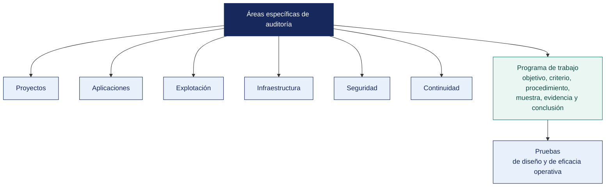

[Semana 05](README.md) · **Teoría** · [Dinámica de aula](2-DINAMICA.md) · [Taller de laboratorio](3-TALLER.md)

# Teoría · Áreas Específicas de Auditoría · Programa de Trabajo y Pruebas de Auditoría

**SI-084 · Auditoría de Sistemas** · Semana 05 · Sesión 1 en aula · 2 horas académicas, 100 min, con la dinámica incluida

> ¿Un término no le resulta claro? Está definido en el [glosario técnico del curso](../GLOSARIO.md).

---

## La pregunta de esta sesión

Dos auditores reciben el mismo encargo sobre la misma organización, con el mismo alcance y los mismos días. El primero entrega catorce hallazgos sobre accesos. El segundo entrega tres, y uno de ellos es que **la facturación nocturna falla y nadie se entera hasta el día siguiente**.

El comité pregunta cómo es posible que dos profesionales miren lo mismo y vean cosas tan distintas. La respuesta no está en su experiencia. Está en el papel que ninguno de los dos enseñó.

> **La pregunta que ordena esta sesión.** *¿Qué documento hace que dos auditores distintos, sobre la misma organización, lleguen a conclusiones comparables?*

## Antes de empezar

| Lo que necesita traer | De dónde sale |
|---|---|
| La estructura de un hallazgo y la noción de criterio | Semana 01 |
| Los principios de diseño de controles y sus pruebas | Semana 02 |
| La gestión del riesgo y la escala declarada antes de calificar | Semana 03 |
| La diferencia entre prueba de diseño y de eficacia operativa | Semana 04 |

> **Exploración (5 min), antes de cualquier definición.** Con el caso a la vista, el aula responde y las respuestas quedan anotadas. *¿Cuál de los dos hizo mejor trabajo? ¿Qué habría que ver para saberlo? ¿Puede un encargo de tres hallazgos valer más que uno de catorce?* No se corrige nada todavía.

## Distribución del tiempo

| Momento | Minutos |
|---|---|
| El caso de los dos auditores y la exploración inicial | 8 |
| **Bloque 1.** Las ocho áreas auditables y cómo se acota el alcance · con su microaplicación | 20 |
| **Bloque 2.** El programa de trabajo y la estructura del procedimiento · con su microaplicación | 25 |
| **Bloque 3.** Ejemplo trabajado de programa de trabajo | 7 |
| Cierre, respuesta a la pregunta de la sesión y puente a la dinámica | 5 |
| **Total de la sesión de aula** | **65** |

## Mapa de la sesión

---

## Bloque 1 · Las áreas auditables

> **La pregunta del bloque.** *El cliente pide auditar todo. ¿Qué se responde, y por qué acotar no es una limitación?*

Piattini y Del Peso estructuran la auditoría informática en áreas especializadas. Cada una tiene su propio universo de riesgos, su propio criterio y su propio repertorio de pruebas. El auditor las recorre según el alcance acordado, no todas siempre.

| Área | Objeto de la evaluación | Riesgos característicos | Criterio principal |
|---|---|---|---|
| **Auditoría de la función informática** | Organización, planificación, presupuesto, personal, contratos y gobierno del área de TI | TI desalineada del negocio, dependencia de una sola persona, contratos sin nivel de servicio | COBIT 2019 (APO), ISO/IEC 38500:2024 |
| **Auditoría de desarrollo de proyectos** | Metodología, gestión de requisitos, pruebas, aceptación, gestión de cambios del proyecto | Proyecto sin caso de negocio, requisitos no trazables, puesta en producción sin aceptación | NTP-ISO/IEC 12207, COBIT BAI |
| **Auditoría de aplicaciones** | Controles de entrada, procesamiento, salida, interfaces y pistas de auditoría de un sistema en producción | Cálculo erróneo, transacción no autorizada, pérdida de trazabilidad | Controles de aplicación, OWASP (*Open Worldwide Application Security Project*) ASVS |
| **Auditoría de la explotación** | **Operación diaria.** Procesos programados, respaldos, gestión de incidentes, capacidad, monitoreo | *Job* crítico que falla sin alerta, respaldo que nunca se restauró, saturación no prevista | COBIT DSS01–DSS04, ISO/IEC 27001 A.8.13–A.8.16 |
| **Auditoría de infraestructura y comunicaciones** | Servidores, red, segmentación, servicios expuestos, dispositivos perimetrales, nube | Superficie expuesta no inventariada, red plana, servicio olvidado en producción | CIS Benchmarks, ISO/IEC 27001 A.8.20–A.8.23 |
| **Auditoría de seguridad** | SGSI (Sistema de Gestión de Seguridad de la Información) — políticas, gestión de accesos, cifrado, gestión de vulnerabilidades, respuesta a incidentes | Política sin operación, vulnerabilidades sin ciclo de remediación | ISO/IEC 27001:2022 |
| **Auditoría de continuidad operativa** | BCP, DRP, BIA (*Business Impact Analysis*, análisis de impacto al negocio), RTO/RPO, pruebas de recuperación | Plan escrito y nunca probado, RTO declarado imposible de cumplir | ISO 22301:2019 |
| **Auditoría jurídica de entornos informáticos** | **Cumplimiento legal.** Datos personales, licenciamiento, evidencia digital, contratos | Tratamiento de datos sin base legal, software sin licencia, contratos sin cláusulas de seguridad | Ley 29733, D. Leg. 822, D. Leg. 1412 |

**Criterio para acotar el alcance.** El auditor no elige áreas por gusto. Las deriva del **análisis de riesgo** y de los **objetivos del encargo**. Auditar las ocho áreas en una MYPE con dos personas en TI es desproporcionado; no auditar continuidad en una empresa cuya facturación depende de un único servidor es negligencia profesional.

**Ejemplo trabajado — la misma empresa, cinco encargos distintos.** Una agroexportadora con 142 trabajadores. Según el área que se elija, el encargo cambia por completo:

| Área auditable | Pregunta que responde el encargo | Evidencia que se pide | Norma que da el criterio |
|---|---|---|---|
| **Seguridad de la información** | ¿Los datos de trazabilidad de lote están protegidos contra pérdida y alteración? | Matriz de accesos, registro de respaldos, bitácora de cambios | NTP-ISO/IEC 27001:2022, A.8.13 |
| **Continuidad** | ¿Cuánto puede estar detenida la planta sin daño irreparable, y está preparado? | BIA, prueba de restauración, plan de contingencia | ISO 22301:2019 |
| **Cumplimiento legal** | ¿El tratamiento de datos del personal cumple la Ley 29733? | Registro de tratamiento, consentimientos, contratos con el proveedor de planilla | Ley 29733 y D. S. 016-2024-JUS |
| **Función informática** | ¿El área de TI tiene los recursos y el gobierno para sostener la operación? | Organigrama, presupuesto, contratos, inventario | COBIT 2019, APO01 y APO07 |
| **Ciclo de vida del software** | ¿El sistema de trazabilidad hecho a medida es mantenible y confiable? | Repositorio, registro de cambios, trazabilidad de requisitos | NTP-ISO/IEC 12207 |

> **Un encargo que abarque las cinco no cabe en un semestre ni en un presupuesto real.** Delimitar el alcance no es una limitación. Es la primera decisión profesional del encargo, y se declara por escrito.

> **Microaplicación (5 min) · cinco encargos, una empresa.** Con la tabla de las cinco áreas a la vista, cada pareja **elige un área y escribe en una línea la pregunta que respondería su encargo**. Se leen tres y se comprueba que ninguna se solapa.

| Caso | Qué debe contener una buena respuesta |
|---|---|
| El cliente pide «auditar todo el sistema». ¿Qué se responde? | Que se acote. Se ofrecen dos o tres alcances viables con lo que cada uno responde, y se deja constancia de lo que queda fuera |
| ¿Puede un mismo hecho ser hallazgo en dos áreas distintas? | Sí. Un respaldo sin probar es hallazgo de seguridad y de continuidad, con criterios distintos. Se reporta una vez, con el criterio del alcance contratado |
| ¿Qué se hace con lo que se detecta fuera del alcance? | Se comunica, se deja constancia y **no se desarrolla**. Ampliar el alcance sin acuerdo compromete el encargo |
> **El error frecuente del bloque.** Elegir las áreas por afinidad técnica en lugar de por riesgo. El auditor que domina accesos audita accesos, y de ahí salen los catorce hallazgos del primer caso. Las áreas se derivan del **análisis de riesgo y de los objetivos del encargo**, no de lo que el equipo sabe hacer mejor.

## Bloque 2 · El programa de trabajo de auditoría

> **La pregunta del bloque.** *¿Qué tiene que decir un procedimiento para que otro auditor lo ejecute sin preguntar nada?*

**Qué es.** El programa de trabajo (*audit program*) es el documento que traduce los objetivos de auditoría en **procedimientos concretos y ejecutables**. Es lo que permite que dos auditores distintos, sobre la misma organización, lleguen a conclusiones comparables. La ISO 19011:2018 y el marco ITAF de ISACA lo exigen antes del trabajo de campo.

**Estructura de un procedimiento de auditoría.** Cada línea del programa contiene, sin excepción:

| Campo | Contenido | Por qué es indispensable |
|---|---|---|
| **N.º** | Identificador del procedimiento | Referencia cruzada con el papel de trabajo y el hallazgo |
| **Objetivo de control** | Qué se busca asegurar | Sin objetivo, la prueba es una curiosidad |
| **Riesgo asociado** | Qué pasa si el control falla | Justifica el esfuerzo dedicado |
| **Criterio** | Norma, control o política, **con código** | Es la referencia contra la que se compara |
| **Tipo de prueba** | Indagación / Observación / Inspección / Reejecución / Procedimiento analítico | Determina la fuerza de la evidencia |
| **Población** | Universo del que se extrae la muestra, con su tamaño | Define el alcance de la conclusión |
| **Muestra y método** | Tamaño y forma de selección (aleatoria, sistemática, por atributos, dirigida) | Determina si la conclusión es extrapolable |
| **Procedimiento** | Los pasos exactos, en imperativo | Permite la reejecución por un tercero |
| **Evidencia a obtener** | Qué artefacto se guardará | Alimenta la cadena de custodia |
| **Definición de excepción** | Qué constituye una desviación, fijado **antes** de ver los datos | Impide ajustar el criterio al resultado |
| **Ejecutado por / Revisado por / Fecha** | Trazabilidad y supervisión | Requisito de calidad del encargo |

**Jerarquía de la evidencia.** No toda evidencia pesa igual. De menor a mayor fuerza:

| Nivel | Tipo de prueba | Ejemplo | Fuerza |
|---|---|---|---|
| 1 | **Indagación** (preguntar) | «El jefe de TI declaró que se revisan los accesos trimestralmente» | **Muy baja.** Nunca sostiene una conclusión por sí sola |
| 2 | **Observación** (mirar hacer) | Presenciar el cierre de caja | **Baja.** El observado se comporta distinto |
| 3 | **Inspección de documentos** | Acta de revisión de accesos firmada | Media |
| 4 | **Inspección del sistema** | Consulta directa a la base de datos de auditoría | Alta |
| 5 | **Reejecución** | El auditor recalcula la planilla con los datos fuente | Muy alta |
| 6 | **Procedimiento analítico automatizado (CAAT)** | Análisis del 100 % de la población con un script | **Máxima.** Elimina el riesgo de muestreo |

> **Regla de ITAF.** Una conclusión sostenida únicamente en indagación es una opinión del auditado, no un hallazgo del auditor.

**Muestreo.** Para controles que se ejecutan con una frecuencia dada, la práctica profesional consolidada sugiere tamaños mínimos para pruebas de atributos con expectativa de cero desviaciones:

| Frecuencia del control | Población anual aproximada | Muestra mínima usual |
|---|---|---|
| Anual | 1 | 1 |
| Trimestral | 4 | 2 |
| Mensual | 12 | 2–5 |
| Semanal | 52 | 5–15 |
| Diaria | 250 | 20–40 |
| Múltiples veces al día | > 250 | 25–60 |

Cuando el CAAT permite analizar el **100 % de la población**, el muestreo se vuelve innecesario y la conclusión gana fuerza. Esa es la razón de ser de la Semana 06.

**Ejemplo trabajado — un procedimiento mal escrito y su corrección.**

| | Así no | Así sí |
|---|---|---|
| Procedimiento | «Revisar los accesos al sistema» | «Extraer la relación completa de usuarios habilitados del ERP al 31/12. Cruzarla con la relación de ceses de RR. HH. del periodo. Para cada coincidencia, verificar la fecha del último acceso» |
| Alcance | No dice | 100 % de la población, sin muestreo |
| Evidencia a obtener | No dice | Extracción firmada por el jefe de sistemas, con fecha y hora |
| Criterio | No dice | NTP-ISO/IEC 27001:2022, A.5.18; política interna de accesos, numeral 4.2 |
| Qué constituye excepción | No dice | Todo usuario habilitado cuyo titular cesó antes del 31/12 |
| Quién lo ejecuta y en cuánto | No dice | Auditor junior, 4 horas |

**El procedimiento de la izquierda no es ejecutable por otra persona.** Ese es el estándar. Un programa de trabajo bien escrito permite que un auditor distinto obtenga el mismo resultado.

> **Microaplicación (6 min) · el procedimiento que no se puede ejecutar.** El docente escribe en la pizarra un procedimiento real y defectuoso — *«revisar los accesos del ERP»*— y el aula, en parejas, **le añade lo que le falta** hasta que sea ejecutable. Se compara con la estructura de la tabla.

| Caso | Qué debe contener una buena respuesta |
|---|---|
| ¿Por qué se define la excepción **antes** de ejecutar la prueba? | Para no decidir después, viendo los datos, qué cuenta como excepción. Definirla a posteriori permite acomodar el resultado |
| ¿Cuándo se justifica muestrear en lugar de probar el 100 %? | Cuando la población no es procesable automáticamente. Con datos extraíbles, el muestreo es difícil de justificar. La herramienta permite el censo |
| Un procedimiento tarda el triple de lo estimado. ¿Qué se hace? | Se registra en los papeles de trabajo, se comunica al responsable del encargo y se decide. Ampliar horas o reducir alcance. **Lo que no se hace es acelerar la prueba** |
> **El error frecuente del bloque.** Definir la excepción después de mirar los datos. Es el error que invalida la prueba entera, porque el criterio se acomoda a lo que se encontró. La excepción se escribe **antes**, y si al ejecutarla el resultado incomoda, ese resultado es el hallazgo.

## Bloque 3 · Ejemplo trabajado de programa de trabajo

Se construye en pizarra, con participación del grupo, el programa para un objetivo del área de **explotación**:

**Objetivo de control.** *La información crítica se respalda y su restauración se verifica periódicamente.*
**Riesgo.** *Pérdida irreversible de información de negocio ante falla, error humano o ransomware.*
**Criterio.** ISO/IEC 27001:2022, control **A.8.13 Information backup**; COBIT 2019, **DSS04.07 Manage backup arrangements**.

| N.º | Procedimiento | Tipo | Población / Muestra | Excepción |
|---|---|---|---|---|
| E-01 | Obtener la política de respaldo vigente y verificar que defina alcance, frecuencia, retención, ubicación y responsable | Inspección documental | 1 política | Ausencia, o vigencia superior a 2 años sin revisión |
| E-02 | Obtener el inventario de sistemas críticos y verificar que **cada uno** figure en el alcance de la política | Inspección | 100 % de los sistemas críticos | Cualquier sistema crítico fuera del alcance |
| E-03 | Extraer el registro de ejecuciones de respaldo del periodo y calcular la tasa de éxito por sistema | **CAAT — 100 %** | 12 meses | Tasa < 98 %, o cualquier fallo sin registro de atención |
| E-04 | Seleccionar 5 fechas al azar y verificar la existencia física del respaldo y su integridad (hash) | Inspección del sistema | 5 de 365 | Respaldo inexistente o hash no coincidente |
| E-05 | Verificar que exista **al menos una copia fuera de línea o inmutable** (regla 3-2-1) | Inspección | 100 % de los sistemas críticos | Todas las copias accesibles desde la red de producción |
| E-06 | Obtener las actas de prueba de restauración del periodo y verificar que el tiempo real de restauración cumpla el RTO declarado | Inspección documental | 100 % de las pruebas | Ninguna prueba realizada, o tiempo real > RTO |
| E-07 | **Reejecutar** una restauración en ambiente aislado y medir el tiempo real | **Reejecución** | 1 sistema crítico | Restauración fallida o tiempo > RTO |
| E-08 | Verificar el cifrado de los respaldos y el control de acceso a su repositorio | Inspección del sistema | 100 % | Respaldo sin cifrar o accesible sin autenticación |

Discusión — **por qué E-07 vale más que E-01 a E-06 juntos**, y por qué casi ninguna organización la supera la primera vez.

## Cierre · qué se lleva de aquí

**La respuesta a la pregunta con la que abrimos.** El documento es el **programa de trabajo**. El segundo auditor no fue más listo — derivó sus áreas del riesgo, escribió procedimientos con población, muestra y excepción definida antes de mirar, y por eso llegó a la facturación nocturna. El primero ejecutó lo que sabía hacer. La ISO 19011 y el marco ITAF exigen el programa **antes** del trabajo de campo precisamente por esto.

**Las tres ideas que deben quedar.**

| Idea | Por qué importa en el ejercicio profesional |
|---|---|
| El alcance se deriva del riesgo, y acotarlo es la primera decisión profesional del encargo | Un encargo que abarca las ocho áreas en una organización pequeña no cabe en ningún presupuesto real |
| Cada procedimiento declara población, muestra con su razón, operación y qué es una excepción | Es lo que hace el trabajo reproducible y lo que permite defenderlo ante el auditado |
| La excepción se define antes de ver los datos | Sin eso, el criterio se acomoda al resultado y la prueba no prueba nada |

**Volviendo a la exploración del inicio.** Se releen las respuestas iniciales. La mayoría juzga al segundo auditor por el número de hallazgos o por su gravedad. Lo que en realidad lo distingue no se ve en el informe — se ve en el programa que escribió antes de empezar.

**Lo que sigue.** La [dinámica de esta sesión](2-DINAMICA.md) asigna a cada equipo un área auditable distinta y pide **el programa de trabajo completo de un objetivo de control**, con cinco procedimientos. La consigna exige lo que acaba de ver — una reejecución, un análisis sobre el 100 % de la población, y ninguna prueba sostenida solo en preguntar.

**La pregunta de cierre.** *si mañana un ransomware cifra el servidor principal, ¿cuánta información se pierde y cuánto tiempo estará la empresa detenida?* Una organización que no puede responder con un número respaldado por una prueba real de restauración **no tiene respaldo. Tiene la esperanza de tenerlo**.
---

---

[Semana 05](README.md) · **Teoría** · [Dinámica de aula](2-DINAMICA.md) · [Taller de laboratorio](3-TALLER.md)

---

**Docente** · Dr. Oscar Juan Jimenez Flores
[oscarjimenezflores@upt.pe](mailto:oscarjimenezflores@upt.pe) · [LinkedIn](https://www.linkedin.com/in/oscar-jimenez-flores/) · [CTI Vitae — CONCYTEC](https://ctivitae.concytec.gob.pe/appDirectorioCTI/VerDatosInvestigador.do?id_investigador=33398)

Escuela Profesional de Ingeniería de Sistemas · Universidad Privada de Tacna · Tacna, Perú
