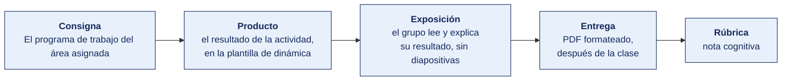

[Semana 05](README.md) · [Teoría](1-TEORIA.md) · **Dinámica de aula** · [Taller de laboratorio](3-TALLER.md)

# Dinámica de aula · El programa de trabajo del área asignada

**SI-084 · Auditoría de Sistemas** · Semana 05 · Actividad en aula, **dentro de los 100 min de la sesión de teoría** · calificación **cognitiva**

> ¿Un término no le resulta claro? Está definido en el [glosario técnico del curso](../GLOSARIO.md).

---

## Cómo funciona la actividad

## Qué entregas

| | |
|---|---|
| **Archivo** | `SI084-S05-DINAMICA-Grupo<N>.pdf` |
| **Plantilla obligatoria** | [SI084-PLANTILLA-DINAMICA.docx](../PLANTILLAS/SI084-PLANTILLA-DINAMICA.docx) |
| **Formato** | PDF exportado desde la plantilla en Word, con la carátula de la UPT y los apellidos, nombres y códigos de todos los integrantes |
| **Qué va dentro** | Lo que el grupo resolvió en aula. Las tablas de la sección **Producto** van completas, con los textos redactados, y cada decisión va justificada |
| **Dónde se sube** | Aula virtual, tarea «Dinámica · Semana 05» |
| **Cuándo vence** | Hasta 24 h después de la sesión de teoría. La tabla se resuelve en aula; el PDF se formatea y se sube después |
| **Exposición** | En la ronda de cierre de **esta misma sesión**. El grupo **lee y explica su resultado** ante el aula, con el documento a la vista. No se usan diapositivas |

> No se califica un trabajo entregado en `.docx`, sin carátula, sin los códigos de los integrantes o con las tablas del producto vacías.

---

## Consigna

> **«El programa de trabajo del área asignada»**
> A cada equipo se le asigna **un área auditable distinta** (función informática, desarrollo de proyectos, aplicaciones, explotación, infraestructura, seguridad, continuidad o jurídica) aplicada a **su empresa real** o al caso simulado de respaldo. Debe producir el **programa de trabajo completo de un objetivo de control de esa área**.

| | |
|---|---|
| **Su papel** | **Auditor encargado del área asignada**, que mañana entrega el encargo a otro |
| **Misión** | Escribir un programa que otro auditor pueda ejecutar **sin preguntarle nada** |
| **Restricción** | **La indagación no sostiene ningún procedimiento por sí sola.** Obligatorios una reejecución y un CAAT sobre el 100 % de la población |

Que el equipo escriba un programa de trabajo que **otro auditor pueda ejecutar sin preguntarle nada**. Cada equipo recibe un área auditable distinta, de modo que el aula reconstruye entre todos el mapa completo de áreas sobre organizaciones distintas.

## Cómo se desarrolla · 35 minutos

| | Bloque | Quién | Minutos |
|---|---|---|---|
| **1** | **Acotar el área.** Se declara el área asignada y **qué sistema concreto queda dentro del alcance**. Un área entera no cabe en un programa de cinco procedimientos, y acotar es la primera decisión profesional del encargo. | Equipo | 7 |
| **2** | **Objetivo de control y riesgo.** Se enuncia el objetivo de control en una oración y se le asocia el riesgo con el valor que ese riesgo tuvo en la matriz de la Semana 03. | Equipo | 7 |
| **3** | **Criterio con código.** Se cita la norma o el objetivo de gobierno aplicable **con su identificador**. Sin código, el procedimiento no es defendible ante el auditado. | Equipo | 7 |
| **4** | **Los cinco procedimientos.** Cada uno en imperativo, con tipo de prueba, población, evidencia a obtener y **la definición de qué constituye excepción, escrita antes de mirar los datos**. | Equipo | 8 |
| **5** | **Justificar la muestra.** El tamaño y el método de selección se derivan de la frecuencia del control. Cuando el dato es procesable, se evalúa examinar la población completa en lugar de muestrear. | Equipo | 6 |

## Material de trabajo

**No se busca información fuera del aula.** Cada equipo trabaja con la organización que se le asignó del banco de casos, en `CASOS/EMPRESA-<NN>-<slug>/`. Las diez organizaciones tienen cifras, personas y documentos distintos, de modo que ningún equipo puede reutilizar el resultado de otro.

**El documento del caso depende del área auditable que se le asignó al equipo.** Se trabaja con la ficha de la organización y con el documento de su área.

| Para qué | Archivo del caso | Qué contiene |
|---|---|---|
| Contexto obligatorio para todas las áreas | `FICHA.md` | Personal de TI, presupuesto, sistemas y su soporte, y procesos de negocio. Secciones B, C y D |
| Área **función informática** | `documentos/organigrama-y-accesos.md` | Dependencia jerárquica de TI, existencia del comité y estado de la política |
| Área **seguridad** | `documentos/registro-datos-y-licencias.md` · `datos/usuarios_erp.csv` | Tratamiento de datos, licencias y la relación de usuarios habilitados |
| Área **continuidad** | `documentos/politica-de-respaldo.md` · `datos/bia.csv` | Política de respaldo declarada y objetivos temporales por actividad |
| Área **aplicaciones** o **explotación** | `documentos/narrativa-proceso-compras.md` · `datos/pagos.csv` | El proceso soportado por el sistema y la población de transacciones |
| Área **desarrollo de proyectos** | `documentos/ciclo-de-vida-del-software.md` | Cómo se construye y se pasa a producción el software propio |
| Área **jurídica** | `documentos/registro-datos-y-licencias.md` · `documentos/contratos-proveedores.md` | Licencias, datos personales y obligaciones contractuales |

## Lo que la teoría de hoy te da

Esta dinámica aplica piezas concretas de la sesión de teoría de hoy. Se usan tal cual, sin buscar nada más.

| De la teoría | Para qué se usa aquí |
|---|---|
| [Las áreas auditables](1-TEORIA.md) | Fija el criterio para acotar el alcance. El área se deriva del riesgo y del objetivo del encargo, no del gusto del equipo |
| [El programa de trabajo de auditoría](1-TEORIA.md) | Da la estructura obligatoria de cada procedimiento y la jerarquía de la evidencia, que decide qué prueba vale más |
| [Ejemplo trabajado de programa de trabajo](1-TEORIA.md) | Es el formato exacto del producto. Se replica su nivel de detalle sobre el área asignada |

## Producto

**Producto 1 — Encabezado del programa.**

| Campo | Contenido |
|---|---|
| Área auditable y sistema alcanzado | |
| Objetivo de control | |
| Riesgo asociado, con su valor de la matriz de la Semana 03 | |
| Criterio con código (ISO/IEC 27001, COBIT 2019 u otro) | |

**Producto 2 — Los procedimientos.** Mínimo **cinco**, en tabla, con tipo de prueba, población, muestra con su justificación, procedimiento en imperativo, evidencia a obtener y definición de excepción.

> **Dónde va.** Este producto se presenta en la **sección 2 de la [plantilla de dinámica](../PLANTILLAS/SI084-PLANTILLA-DINAMICA.docx)**, «El producto». No se copia la consigna ni la teoría. Solo el resultado y lo que lo sostiene.

## Ejemplo resuelto

*El caso de este ejemplo es distinto del que le toca a tu grupo. Sirve para que veas el nivel de detalle que se espera, no para copiarlo.*

**Un programa bien resuelto.** El ejemplo desarrolla el área de explotación, que no es la que te asignaron.

*Encabezado del programa*

| Campo | Contenido |
|---|---|
| Área auditable y sistema alcanzado | **Explotación de sistemas. Alcance.** La ejecución de los procesos programados del ERP en el ambiente de producción. |
| Objetivo de control | Verificar que todo proceso programado que falla es detectado, escalado y resuelto dentro del tiempo comprometido, y que su reejecución no duplica ni omite transacciones. |
| Riesgo asociado | R-007 «La facturación nocturna falla y nadie lo detecta hasta el día siguiente». Valor en la matriz de la Semana 03: probabilidad 3 × impacto 4 = **12 · Alto**. |
| Criterio con código | COBIT 2019, **DSS01.01 Perform operational procedures**. ISO/IEC 27001:2022, **A.8.16 Monitoring activities**, control nuevo de la edición 2022. |

*Dos de los cinco procedimientos*

| # | Tipo de prueba | Población | Muestra y justificación | Procedimiento | Evidencia a obtener | Qué es una excepción |
|---|---|---|---|---|---|---|
| P-01 | Diseño | — | No aplica: es prueba de existencia | Obtener el calendario de procesos programados y la matriz de escalamiento vigente. Verificar que cada proceso tiene responsable, ventana de ejecución y destinatario de la alerta. | Calendario y matriz con fecha de aprobación y firma | Un proceso programado sin responsable o sin destinatario de alerta |
| P-02 | Eficacia operativa | 96 ejecuciones fallidas del período, según el registro del planificador | 20, por muestreo por atributos, 90 % de confianza y desviación tolerable del 10 %; selección aleatoria con semilla registrada | Para cada falla seleccionada, rastrear la alerta emitida, el ticket generado, la hora de atención y la evidencia de la reejecución. Contrastar la hora de la falla con la hora del ticket. | Registro del planificador, correo o alerta, ticket con marcas de tiempo y bitácora de reejecución | Una falla sin ticket, o con ticket abierto más de 4 horas después de la falla, o una reejecución sin evidencia de validación de duplicados |

**La diferencia entre aprobar y no aprobar.**

| Así no | Así sí |
|---|---|
| «Revisar los procesos programados.» | «Rastrear la alerta, el ticket, la hora de atención y la evidencia de reejecución de 20 fallas seleccionadas.» |
| «Muestra: la que sea representativa.» | «20 sobre 96, muestreo por atributos, 90 % de confianza, desviación tolerable 10 %, semilla registrada.» |
| «Excepción: que el control falle.» | «Excepción: falla sin ticket, o ticket abierto más de 4 horas después, o reejecución sin validación de duplicados.» |

## Reglas

- 35 min en aula, dentro de la sesión de teoría.
- **Obligatorio.** Al menos un procedimiento de **reejecución** y al menos uno de tipo **CAAT sobre el 100 % de la población**.
- **Prohibido.** Que la indagación sea el único sustento de cualquier procedimiento.
- El tamaño de muestra debe derivarse de la frecuencia del control, citando la tabla de la sección 1.3.
- La exposición es la ronda de cierre de esta misma sesión. El grupo **lee y explica su resultado**. No se usan diapositivas.

## Rúbrica cognitiva (20 puntos)

| Criterio | 5 | 3 | 1 |
|---|---|---|---|
| **Objetivo y criterio** | Objetivo de control preciso y criterio citado con código exacto y pertinente al área | Objetivo correcto, criterio sin código | Objetivo confundido con la actividad |
| **Fuerza de la evidencia** | Incluye reejecución y CAAT; ningún procedimiento se sostiene solo en indagación | Incluye pruebas de nivel 3–4; sin reejecución | Predomina la indagación |
| **Muestreo** | Población definida y muestra justificada por la frecuencia del control | Muestra razonable sin justificación explícita | Muestra arbitraria o ausente |
| **Reproducibilidad** | Un tercero podría ejecutar los procedimientos sin preguntar nada | Procedimientos comprensibles pero ambiguos en algún paso | Procedimientos enunciados como intenciones |

---

---

[Semana 05](README.md) · [Teoría](1-TEORIA.md) · **Dinámica de aula** · [Taller de laboratorio](3-TALLER.md)

---

**Docente** · Dr. Oscar Juan Jimenez Flores
[oscarjimenezflores@upt.pe](mailto:oscarjimenezflores@upt.pe) · [LinkedIn](https://www.linkedin.com/in/oscar-jimenez-flores/) · [CTI Vitae — CONCYTEC](https://ctivitae.concytec.gob.pe/appDirectorioCTI/VerDatosInvestigador.do?id_investigador=33398)

Escuela Profesional de Ingeniería de Sistemas · Universidad Privada de Tacna · Tacna, Perú
