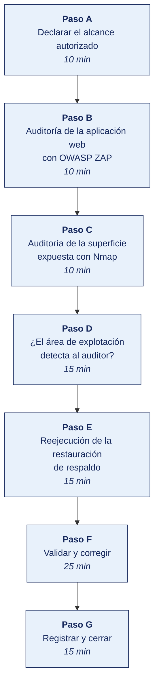

[Semana 05](README.md) · [Teoría](1-TEORIA.md) · [Dinámica de aula](2-DINAMICA.md) · **Taller de laboratorio**

# Taller de laboratorio 05 · Auditoría de aplicaciones con OWASP ZAP y de infraestructura con Nmap y Wazuh

**SI-084 · Auditoría de Sistemas** · Semana 05 · Sesión 2 en laboratorio · 100 min · calificación **procedimental**

> ¿Un término no le resulta claro? Está definido en el [glosario técnico del curso](../GLOSARIO.md).

---

## Secuencia del taller



## Qué entregas

| | |
|---|---|
| **Archivo** | `SI084-S05-TALLER-Grupo<N>.pdf` |
| **Plantilla obligatoria** | [SI084-PLANTILLA-TALLER.docx](../PLANTILLAS/SI084-PLANTILLA-TALLER.docx) |
| **Formato** | PDF exportado desde la plantilla en Word, con la carátula de la UPT, el índice actualizado y las capturas numeradas |
| **Qué va dentro** | Las secciones de la plantilla. La **5. Resultados y evidencias** se califica contra la tabla de resultados esperados de esta guía, y **cada resultado necesita la evidencia que lo demuestre**. No se copian de aquí los objetivos, la duración ni los resultados de aprendizaje |
| **Dónde se sube** | Aula virtual, tarea «Taller · Semana 05» |
| **Cuándo vence** | 48 horas después de la sesión de laboratorio |

> No se califica un informe entregado en `.docx`, sin carátula, sin los códigos de los integrantes o con resultados declarados sin evidencia.

---

## El reto

| | |
|---|---|
| **Situación** | Se va a ejecutar una prueba que toca sistemas en producción. Sin alcance firmado antes de la primera ejecución, la prueba es una intrusión. |
| **Misión** | Declarar el alcance autorizado, ejecutar las pruebas dentro de él y medir si el área de explotación detecta al auditor. |
| **Criterio de éxito** | La marca temporal del alcance firmado es anterior a la primera evidencia generada, y el tiempo de detección está medido en segundos. |

## 1. Información sobre el evento práctico

### 1.1. Título del evento práctico

Ejecución de un programa de trabajo real sobre dos áreas auditables —aplicaciones e infraestructura— aplicando pruebas de inspección del sistema y de reejecución con herramientas libres, y contrastando la evidencia contra la OWASP (*Open Worldwide Application Security Project*) Web Security Testing Guide y los controles del Anexo A.

### 1.2. Objetivos

- Ejecutar una **auditoría de aplicación web** sobre el portal del entorno auditado con **OWASP ZAP**, en modo pasivo y activo.
- Levantar el **inventario real de la superficie expuesta** con **Nmap** y contrastarlo con el inventario declarado.
- Desplegar **Wazuh** como control detectivo y verificar si el área de explotación **detecta** las pruebas del auditor.
- Auditar el control de **respaldo y restauración** ejecutando una **prueba de reejecución** real con `restic`.
- Redactar los papeles de trabajo siguiendo la estructura del programa de trabajo de la sección 1.3.

### 1.3. Tiempo de duración

**100 minutos.**

### 1.4. Resultados de Aprendizaje (RA)

- **RA1** Analiza e interpreta los conceptos y terminología de Auditoría de Sistemas.
- **RA2** Evalúa la seguridad de la información en Auditoría de Sistemas.

### 1.5. Recursos

| Recurso | Detalle |
|---|---|
| Entorno `si084-lab` | Semanas 01–04 operativas |
| **OWASP ZAP** | Imagen `zaproxy/zap-stable` — https://www.zaproxy.org/ |
| **Nmap** | Imagen `instrumentisto/nmap` — https://nmap.org/ |
| **Wazuh** | https://documentation.wazuh.com/current/deployment-options/docker/ |
| **restic** | https://restic.net/ |
| **OWASP WSTG** | https://owasp.org/www-project-web-security-testing-guide/ |
| Python 3.11+ | Procesamiento de reportes |

### 1.6. Seguridad

> **Este laboratorio ejecuta pruebas activas.** El escaneo activo de ZAP envía cargas maliciosas reales.

1. **Solo** contra `127.0.0.1` y la red `audit_net`. Se documenta el alcance autorizado **antes** de ejecutar, en `10_planificacion/alcance_E05.md`.
2. Se prohíbe explícitamente apuntar ZAP, Nmap o cualquier herramienta a un dominio de la universidad, a un servicio en la nube o a la empresa real auditada. **Las pruebas técnicas sobre la empresa real requieren autorización escrita firmada y no se realizan en este curso.**
3. El escaneo activo puede corromper los datos del entorno; se acepta porque es desechable (`docker compose down -v` lo reconstruye).
4. Wazuh requiere ajustar `vm.max_map_count`; se documenta el cambio como modificación del anfitrión.

---

## 2. Procedimiento o Metodología

### Paso A — Declarar el alcance autorizado

Ningún auditor ejecuta antes de declarar. Se crea `10_planificacion/alcance_E05.md`:

```markdown
# Alcance autorizado — Evidencia E05

| Campo | Valor |
|---|---|
| Sistemas alcanzados | si084_juiceshop (127.0.0.1:3000), si084_portal (127.0.0.1:8082), red audit_net |
| Sistemas EXCLUIDOS | Toda dirección fuera de 127.0.0.1 y de la subred audit_net |
| Ventana autorizada | Sesión de laboratorio de la Semana 05, 2 horas |
| Tipo de pruebas | Escaneo pasivo y activo, reconocimiento de red, reejecución de restauración |
| Autorizado por | Docente del curso SI-084 |
| Restricciones | Prohibida toda prueba contra la empresa real auditada |
```

### Paso B — Auditoría de la aplicación web con OWASP ZAP

**B.1 — Escaneo pasivo (prueba de inspección, sin riesgo).**

```bash
mkdir -p 20_evidencia/E05_app && cd 20_evidencia/E05_app

docker run --rm --network host -v "$PWD":/zap/wrk/:rw \
  -t zaproxy/zap-stable zap-baseline.py \
  -t http://127.0.0.1:3000 \
  -r zap_baseline_juiceshop.html -J zap_baseline_juiceshop.json -I
```

El escaneo *baseline* solo navega y observa — detecta **ausencia de cabeceras de seguridad**, cookies sin `HttpOnly`/`Secure`/`SameSite`, contenido mixto y divulgación de información. Es la prueba que un auditor puede ejecutar sobre producción sin riesgo.

**B.2 — Escaneo activo (prueba de reejecución, con riesgo).**

```bash
docker run --rm --network host -v "$PWD":/zap/wrk/:rw \
  -t zaproxy/zap-stable zap-full-scan.py \
  -t http://127.0.0.1:3000 \
  -r zap_full_juiceshop.html -J zap_full_juiceshop.json -I
```

**B.3 — Mapeo a la OWASP WSTG y al Top 10.** Cada alerta de ZAP se traduce al identificador de la guía de pruebas, que es el criterio citable:

| Alerta típica de ZAP | Identificador WSTG | OWASP Top 10 2021 | Control ISO/IEC 27001:2022 |
|---|---|---|---|
| Content Security Policy ausente | WSTG-CONF-12 | A05 Security Misconfiguration | A.8.9 |
| Cookie sin `HttpOnly` | WSTG-SESS-02 | A07 Identification & Auth. Failures | A.8.5 |
| SQL Injection | WSTG-INPV-05 | A03 Injection | A.8.28 |
| Cross-Site Scripting reflejado | WSTG-INPV-01 | A03 Injection | A.8.28 |
| Componente con vulnerabilidad conocida | WSTG-CONF-01 | A06 Vulnerable Components | A.8.8 |
| Ausencia de HSTS | WSTG-CONF-07 | A02 Cryptographic Failures | A.8.24 |

```python
# 30_papeles_trabajo/PT05_alertas_app.py
import json, pandas as pd
d = json.load(open("../20_evidencia/E05_app/zap_full_juiceshop.json"))
alertas = [{"riesgo": a["riskdesc"].split(" ")[0], "alerta": a["alert"],
            "cwe": a.get("cweid"), "instancias": len(a.get("instances", [])),
            "solucion": a.get("solution","")[:120]}
           for s in d["site"] for a in s["alerts"]]
df = pd.DataFrame(alertas).sort_values("instancias", ascending=False)
df.to_csv("../40_hallazgos/PT05_alertas_zap.csv", index=False)
print(df.groupby("riesgo").size().to_string())
print(df.head(12).to_string(index=False))
```

### Paso C — Auditoría de la superficie expuesta con Nmap

La prueba de auditoría no es «escanear». Es **contrastar lo declarado contra lo real**.

```bash
SUBNET=$(docker network inspect audit_net --format '{{range .IPAM.Config}}{{.Subnet}}{{end}}')
echo "Subred autorizada: $SUBNET" | tee ../E05_infra_alcance.txt

mkdir -p ../E05_infra && cd ../E05_infra

# Descubrimiento de hosts
docker run --rm --network audit_net instrumentisto/nmap -sn $SUBNET -oN nmap_hosts.txt

# Servicios, versiones y scripts por defecto
docker run --rm --network audit_net instrumentisto/nmap \
  -sV -sC -p- --open $SUBNET -oA nmap_servicios

# Configuración TLS de los servicios que la ofrezcan
docker run --rm --network audit_net instrumentisto/nmap \
  --script ssl-enum-ciphers -p 443,8443 $SUBNET -oN nmap_tls.txt
```

**Papel de trabajo PT05-B — Contraste de inventarios.** Se construye la tabla que produce el hallazgo:

| Servicio hallado por Nmap | Puerto | Versión | ¿Figura en el inventario declarado? | ¿Tiene dueño identificado? | ¿Está en el alcance del SGSI (Sistema de Gestión de Seguridad de la Información)? | Observación |
|---|---|---|---|---|---|---|

> **El hallazgo clásico** no es el puerto abierto — es el **servicio que nadie sabía que existía**. Un servicio sin dueño no se parchea, no se monitorea y no se apaga. **Criterio.** ISO/IEC 27001:2022, **A.5.9 Inventory of information and other associated assets**.

### Paso D — ¿El área de explotación detecta al auditor?

Se despliega **Wazuh** como control detectivo y se responde una pregunta de auditoría que rara vez se hace. *cuando alguien atacó este sistema, ¿la organización se enteró?*

```bash
cd ../../entorno
git clone --depth 1 https://github.com/wazuh/wazuh-docker.git -b v4.9.0
cd wazuh-docker/single-node
docker compose -f generate-indexer-certs.yml run --rm generator
docker compose up -d
```

**Panel.** https://127.0.0.1:443 (usuario `admin`, contraseña en `docker-compose.yml`).

Se despliega el agente en un contenedor testigo y se **reejecuta** la prueba del Paso B contra el portal WordPress. Luego, en el panel de Wazuh:

| Prueba de detección | Qué se busca en Wazuh | Veredicto |
|---|---|---|
| **D-01** ¿Se registró el escaneo de puertos? | Alertas de la regla de detección de escaneo | Detectado / No detectado |
| **D-02** ¿Se registraron los intentos de inyección? | Alertas del decodificador de logs del servidor web | |
| **D-03** ¿Cuánto tardó la alerta desde el evento? | Diferencia entre `timestamp` del log y de la alerta | **Tiempo medio de detección (MTTD)** |
| **D-04** ¿La alerta llegó a alguien? | Configuración de notificaciones activa | |
| **D-05** ¿Los registros son inalterables? | Permisos y retención del almacén de eventos | |

> **La conclusión de auditoría en explotación no es «hay un SIEM».** Es *«el SIEM generó la alerta X en N segundos, la alerta no estaba configurada para notificar a nadie, y el registro de eventos es modificable por el mismo administrador que opera los servidores»*. Criterios. **A.8.15 Logging**, **A.8.16 Monitoring activities**, **A.5.25 Assessment and decision on information security events**.

### Paso E — Reejecución de la restauración de respaldo

La prueba de mayor fuerza probatoria del programa E-07 de la sección 1.4:

```bash
mkdir -p ~/respaldo_lab && cd 20_evidencia/E05_infra

export RESTIC_REPOSITORY=~/respaldo_lab
export RESTIC_PASSWORD='lab-si084'

R="docker run --rm -v $HOME/respaldo_lab:/repo -v $PWD/dump:/datos \
   -e RESTIC_REPOSITORY=/repo -e RESTIC_PASSWORD=lab-si084 restic/restic"

# 1. Generar el respaldo de la base de datos del ERP
mkdir -p dump
docker exec si084_db pg_dump -U erp_app erp > dump/erp_$(date -u +%Y%m%dT%H%M%SZ).sql
sha256sum dump/*.sql | tee hash_original.txt

# 2. Inicializar el repositorio y respaldar
$R init || true
$R backup /datos
$R snapshots

# 3. PRUEBA DE REEJECUCIÓN · restaurar y medir el tiempo real
T0=$(date -u +%s)
$R restore latest --target /datos/restaurado
T1=$(date -u +%s)
echo "Tiempo real de restauración: $((T1-T0)) segundos" | tee tiempo_restauracion.txt

# 4. Verificar integridad · el hash debe coincidir con el original
sha256sum dump/restaurado/datos/*.sql | tee hash_restaurado.txt
diff <(awk '{print $1}' hash_original.txt) <(awk '{print $1}' hash_restaurado.txt) \
  && echo "INTEGRIDAD VERIFICADA" || echo "EXCEPCION: el respaldo no es integro"

# 5. Verificar consistencia del repositorio completo
$R check --read-data
```

**Papel de trabajo PT05-C — Acta de prueba de restauración.**

| Campo | Valor |
|---|---|
| Sistema restaurado | Base de datos ERP (`si084_db`) |
| Fecha y hora de la prueba (UTC) | |
| RTO declarado por la organización | |
| **Tiempo real medido** | |
| RPO declarado / punto de restauración obtenido | |
| Verificación de integridad (hash) | Coincide / No coincide |
| Excepciones observadas | |
| Conclusión sobre la eficacia operativa del control | |

Sellado:

```bash
cd ../.. && sha256sum 20_evidencia/E05_*/* >> 20_evidencia/SHA256SUMS_E05.txt
git add . && git commit -m "E05: auditoria de aplicaciones, infraestructura, deteccion y restauracion"
```

---

### Paso F — Validar y corregir (25 min)

El resultado no vale por estar hecho, sino por resistir una comprobación. Se ejecutan estas tres y **se corrige lo que falle antes de cerrar la sesión**.

1. Comprobar en el historial de Git que el *commit* de `alcance_E05.md` es **anterior** al primer artefacto de evidencia.
2. Verificar que el servicio hallado fuera del inventario declarado tiene su hallazgo redactado, no solo la línea de Nmap.
3. Revisar que el acta de restauración consigna el **tiempo real medido**, no el tiempo declarado por la organización.

> Lo que no se pueda corregir hoy se anota en la sección **Problemas y mejoras** de la evidencia, con lo que faltó y por qué. Un resultado parcial documentado con honestidad vale más que uno declarado sin prueba.

### Paso G — Registrar la evidencia y cerrar (15 min)

Se versiona lo producido, se anota la URL de cada resultado y se responde en dos frases la pregunta de transferencia — **qué riesgo correría una organización real si esto se hiciera mal**.

---

## 3. Resultados

> **Evidencia obligatoria en GitHub.** Todo resultado de este taller se versiona en el repositorio del equipo. El informe **no consigna capturas sueltas**. Consigna la **URL** del artefacto en GitHub. Una captura no permite verificar autoría, fecha ni contenido; un enlace sí.
>
> | Qué se entrega | Dónde vive | Qué se escribe en el informe |
> |---|---|---|
> | Código y archivos de configuración | Rama del taller, fusionada a `develop` vía Pull Request | URL del Pull Request |
> | Documentos y matrices | `docs/`, en formato de texto versionable | URL del archivo en la rama |
> | Capturas y videos que el taller exija | `docs/evidencias/S05/` | URL del archivo |
> | Salida de comandos | `docs/evidencias/S05/salidas/*.txt` | URL del archivo |
>
> **Etiqueta del taller.** Al cerrar el taller se crea la etiqueta `taller-05` sobre el commit entregado:
>
> ```bash
> git tag -a taller-05 -m "Taller 05 · SI084"
> git push origin taller-05
> ```
>
> La URL que se consigna en el informe apunta a esa etiqueta:
> `https://github.com/<organizacion>/<repositorio>/tree/taller-05`
>
> **El informe es lo que se califica; el repositorio es lo que lo prueba.** Cada resultado de la sección 3 del informe lleva la URL con la que se verifica, y **un resultado sin su URL se califica como no logrado**, por bien redactado que esté. Lo que no se puede abrir no se puede dar por hecho.

### 3.1. Los tres resultados que se califican

Son los que la rúbrica evalúa. El resto de la lista tiene que existir, pero no se califica fila por fila.

| Resultado | Qué demuestra | Dónde está |
|---|---|---|
| **El alcance firmado antes de ejecutar** | La marca temporal previa a toda evidencia | `alcance_E05.md` y `git log` |
| **El servicio no inventariado** | Un servicio real hallado que el inventario no declaraba, con su hallazgo | `40_hallazgos/H-00x.md` |
| **El tiempo de detección medido** | La tabla D-01 a D-05 con veredicto y MTTD en segundos | Capturas del panel de Wazuh |

### 3.2. Lista de comprobación del taller

Todo esto debe existir al cerrar la sesión.

| # | Resultado esperado | Verificación |
|---|---|---|
| 1 | `alcance_E05.md` firmado **antes** de la primera ejecución | Marca temporal del *commit* previa a la evidencia |
| 2 | Reportes ZAP *baseline* y *full* en HTML y JSON | Archivos generados |
| 3 | `PT05_alertas_zap.csv` con al menos 5 alertas mapeadas a WSTG, Top 10 e ISO | Contenido del CSV |
| 4 | Salidas de Nmap y **tabla de contraste inventario declarado vs. real** | `PT05-B` |
| 5 | Al menos **un servicio hallado que no figuraba en el inventario declarado**, con su hallazgo redactado | `40_hallazgos/H-00x.md` |
| 6 | Wazuh operativo y **tabla D-01 a D-05 con veredicto y MTTD medido en segundos** | Capturas del panel |
| 7 | Acta de prueba de restauración con **tiempo real medido** y verificación de integridad por hash | `PT05-C` |
| 8 | Hashes en la cadena de custodia y *commit* en Git | `SHA256SUMS_E05.txt` |

## Rúbrica procedimental (20 puntos)

Se aplica sobre el informe entregado y la evidencia enlazada en el repositorio. **Cada criterio se califica de forma independiente.**

| Criterio | 4 — Logrado | 2 — En proceso | 0 — Insuficiente |
|---|---|---|---|
| **¿El área de explotación detecta al auditor?** | Completo y correcto, con la evidencia que lo respalda | Completo con errores menores, o correcto pero sin toda la evidencia | Incompleto, o entregado sin ejecutar |
| **Reejecución de la restauración de respaldo** | Completo y correcto, con la evidencia que lo respalda | Completo con errores menores, o correcto pero sin toda la evidencia | Incompleto, o entregado sin ejecutar |
| **Evidencia verificable en el repositorio** | Cada resultado tiene su URL sobre la etiqueta `taller-NN`, y el enlace abre lo que dice | La mayoría tiene URL; alguna evidencia es una captura suelta | Se declaran resultados sin enlace, o el enlace no corresponde |
| **Trazabilidad de la evidencia** | Todo hallazgo o dato se rastrea hasta el archivo, registro y fecha que lo sustenta | Rastreable en su mayoría; algún dato sin origen | Se afirman hechos sin poder ubicarlos en la evidencia |
| **La evidencia entregada** | Las secciones de la plantilla completas; los papeles de trabajo quedan archivados y referenciados | Secciones completas con papeles de trabajo incompletos | Faltan secciones o no hay papeles de trabajo |

| Puntaje | Equivalencia |
|---|---|
| 18 – 20 | Destacado |
| 14 – 17 | Logrado |
| 6 – 13 | En proceso |
| 0 – 5 | Insuficiente |

> **Un resultado declarado sin evidencia enlazada no se califica**, aunque el trabajo se haya hecho. La tabla de la sección 3.1 es la lista de cotejo; esta rúbrica es lo que determina la nota.

## 4. Conclusiones

Mínimo tres. Líneas argumentales esperadas:

1. El inventario de activos declarado y la superficie realmente expuesta divergen casi siempre; el hallazgo relevante no es la vulnerabilidad del servicio olvidado sino el proceso de gestión de activos que permitió olvidarlo.
2. Un control detectivo que genera alertas que nadie recibe tiene diseño correcto y eficacia operativa nula; el informe debe decir exactamente eso, con el tiempo de detección medido.
3. La prueba de reejecución de la restauración es la única que convierte la afirmación «tenemos respaldos» en evidencia; el tiempo real medido suele diferir del RTO declarado y esa diferencia es, en sí misma, el hallazgo.

## 5. Referencias Bibliográficas

- ISO 19011:2018. *Guidelines for auditing management systems*, cláusula 6 (Realización de la auditoría). https://www.iso.org/standard/70017.html
- ISO/IEC 27001:2022, Anexo A, controles A.5.9, A.8.8, A.8.9, A.8.13, A.8.15, A.8.16, A.8.20, A.8.24, A.8.28. https://www.iso.org/standard/27001
- ISO 22301:2019. *Business continuity management systems — Requirements*. https://www.iso.org/standard/75106.html
- ISACA. *ITAF: A Professional Practices Framework for IS Audit/Assurance* (5.ª ed.), secciones de evidencia y muestreo. https://www.isaca.org/resources/frameworks-standards-and-models
- ISACA. (2018). *COBIT 2019 Framework: Governance and Management Objectives*, DSS01–DSS04. https://www.isaca.org/resources/cobit
- OWASP Foundation. *Web Security Testing Guide (WSTG)*. https://owasp.org/www-project-web-security-testing-guide/
- OWASP Foundation. *OWASP Top 10:2021*. https://owasp.org/Top10/
- OWASP Foundation. *ZAP Documentation*. https://www.zaproxy.org/docs/
- Nmap Project. *Nmap Reference Guide*. https://nmap.org/book/man.html
- Wazuh Inc. *Wazuh Documentation*. https://documentation.wazuh.com/
- restic. *restic Documentation*. https://restic.readthedocs.io/
- Piattini Velthuis, M., Del Peso Navarro, E. y Del Peso Ruiz, M. (2009). *Auditoría de tecnologías y sistemas de información* (6.ª ed.). Alfaomega / Ra-Ma. Capítulos de auditoría de la explotación y de las comunicaciones.

## 6. Anexos

- `anexo_A_zap_full.html` — reporte completo de ZAP.
- `anexo_B_contraste_inventario.xlsx` — inventario declarado vs. real.
- `anexo_C_wazuh_mttd.pdf` — capturas del panel con las marcas de tiempo.
- `anexo_D_acta_restauracion.pdf` — acta firmada de la prueba de reejecución.
- `anexo_E_alcance_autorizado.pdf` — declaración de alcance previa a las pruebas.

---

---

[Semana 05](README.md) · [Teoría](1-TEORIA.md) · [Dinámica de aula](2-DINAMICA.md) · **Taller de laboratorio**

---

**Docente** · Dr. Oscar Juan Jimenez Flores
[oscarjimenezflores@upt.pe](mailto:oscarjimenezflores@upt.pe) · [LinkedIn](https://www.linkedin.com/in/oscar-jimenez-flores/) · [CTI Vitae — CONCYTEC](https://ctivitae.concytec.gob.pe/appDirectorioCTI/VerDatosInvestigador.do?id_investigador=33398)

Escuela Profesional de Ingeniería de Sistemas · Universidad Privada de Tacna · Tacna, Perú
