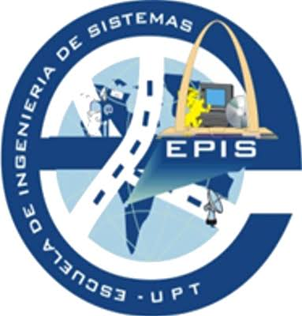
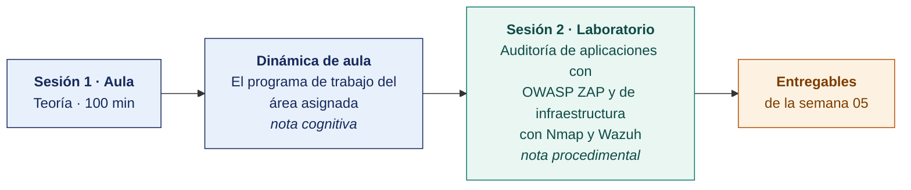

  
  &nbsp;&nbsp;&nbsp;&nbsp;&nbsp;&nbsp;
  

  <strong>Universidad Privada de Tacna</strong> 
  Facultad de Ingeniería · Escuela Profesional de Ingeniería de Sistemas

<h1 align="center">Semana 05 · Áreas Específicas de Auditoría · Programa de Trabajo y Pruebas de Auditoría</h1>

  <strong>SI-084 · Auditoría de Sistemas</strong> 
  4 horas académicas de 50 min · 100 min de teoría con la dinámica incluida en aula · 100 min de taller en laboratorio

---

## Datos de la asignatura

| | |
|---|---|
| **Asignatura** | SI-084 · Auditoría de Sistemas |
| **Escuela** | Escuela Profesional de Ingeniería de Sistemas |
| **Ciclo** | X · 04 horas semanales · 03 créditos · Obligatorio |
| **Prerrequisito** | SI-985 Gestión de la Configuración de Software |
| **Unidad** | I — Seguridad de la Información en Auditoría de Sistemas |
| **Semana** | 05 de 17 |
| **Duración** | 4 horas académicas de 50 min · 100 min de teoría con la dinámica incluida en aula · 100 min de taller en laboratorio |
| **Resultados de aprendizaje** | **RA1** Analiza e interpreta los conceptos y terminología de Auditoría de Sistemas · **RA2** Evalúa la seguridad de la información en Auditoría de Sistemas |
| **Atributos del graduado** | AG-I08 Análisis de Problemas (CD2 y CD3, nivel 4) · AG-I09 Diseño y Desarrollo de Soluciones (CD11, nivel 4) |

### Lo que indica el sílabo

**Contenido conceptual.** Áreas específicas de auditoría, desarrollo de proyectos, aplicaciones, explotación, infraestructura, seguridad, continuidad operativa, ejemplos de programa de trabajo y pruebas de auditoría.

**Contenido procedimental.** Reconoce los controles de auditoría, controles físicos y lógicos, procesamiento de datos, controles de calidad y Ley SOXs.

## Materiales de esta semana

| | Documento | Qué encontrarás | Dónde y cuánto dura |
|---|---|---|---|
| 1 | **[Teoría](1-TEORIA.md)** | Las áreas auditables · El programa de trabajo de auditoría · Ejemplo trabajado de programa de trabajo | Aula · 100 min |
| 2 | **[Dinámica de aula](2-DINAMICA.md)** | El programa de trabajo del área asignada, con su material, su ejemplo resuelto y su rúbrica | Aula · dentro de los 100 min de la sesión de teoría |
| 3 | **[Taller de laboratorio](3-TALLER.md)** | Auditoría de aplicaciones con OWASP ZAP y de infraestructura con Nmap y Wazuh | Laboratorio · 100 min |

## Ruta de la semana

## Entregables

| Entregable | Formato y nombre del archivo | Vence |
|---|---|---|
| **Dinámica de aula** · El programa de trabajo del área asignada | PDF desde la [plantilla de dinámica](../PLANTILLAS/SI084-PLANTILLA-DINAMICA.docx) · `SI084-S05-DINAMICA-Grupo<N>.pdf` | Antes de cerrar la sesión de teoría |
| **Informe del taller de laboratorio N.º 05** | PDF en formato EPIS desde la [plantilla de taller](../PLANTILLAS/SI084-PLANTILLA-TALLER.docx) · `SI084-S05-TALLER-Grupo<N>.pdf` | 48 h después del taller |
| Papeles de trabajo PT05-A, PT05-B y PT05-C en el repositorio | Commit en Git | 48 h después del laboratorio |

> Ambos se entregan en **PDF**, con la carátula de la UPT y los códigos de todos los integrantes. Las plantillas obligatorias están en [`PLANTILLAS/`](../PLANTILLAS/).

## Cómo se evalúa

| Criterio | Instrumento | Peso |
|---|---|---|
| Cognitivo | Rúbrica del programa de trabajo + exposición de 10 min en la Semana 06 | 25 % |
| Procedimental | Lista de cotejo de los 8 resultados del laboratorio | 35 % |
| Actitudinal | Declaración del alcance **antes** de ejecutar y respeto estricto de los límites autorizados | 15 % |

## Medición del Atributo del Graduado

> Esta semana la Escuela recoge evidencia para el **Plan de Assessment**. La rúbrica del atributo se aplica sobre el mismo entregable que ya produces. **No modifica tu calificación** ni añade trabajo adicional.

| | |
|---|---|
| **Atributo** | **AG-I02 · Ética** |
| **Criterio medido** | **CD2** · Aplica los principios éticos, la ética profesional y las normas de la práctica de la ingeniería |
| **Alineación con el sílabo** | **RA1** Reconoce las partes de un plan y ejecución de auditoría · Contenido procedimental del sílabo: áreas auditables y programa de trabajo. El taller exige declarar el alcance **antes** de ejecutar cualquier prueba técnica |
| **Evidencia que se lee** | `SI084-S05-TALLER-Grupo<N>.pdf` · anexo **«Alcance autorizado»**, declarado antes de las pruebas, y el registro de que no se apuntó ninguna herramienta fuera de él |
| **Instrumento** | [Rúbrica AG-I02, escala 1–4](../ASSESSMENT/RUBRICAS-AG.md#ag-i02) |
| **Tipo de medición** | **Captura 1 · formativa** · grupal |
| **Se registra en** | [`ASSESSMENT/REGISTRO-AG-SI084.csv`](../ASSESSMENT/REGISTRO-AG-SI084.csv) |

**Qué mira el evaluador.** Si el equipo delimitó por escrito qué podía tocar y qué no **antes** de ejecutar, y si respetó ese límite cuando la herramienta ofrecía alcanzar más. Es la diferencia entre un auditor y alguien con un escáner.

Mapa completo en [`ASSESSMENT/MAPA-AG.md`](../ASSESSMENT/MAPA-AG.md).

## Preparación para la Semana 06

- **Leer.** ISACA, *ITAF*, sección sobre técnicas de auditoría asistidas por computador (CAAT).
- **Repasar.** `pandas` y consultas SQL de agregación.
- **Instalar.** Ollama (https://ollama.com/) y descargar un modelo abierto pequeño antes de la sesión — la descarga en el laboratorio consume tiempo de clase.
- Preparar el **examen de Unidad I**. Semanas 01 a 06.

---

**Docente** · Dr. Oscar Juan Jimenez Flores
[oscarjimenezflores@upt.pe](mailto:oscarjimenezflores@upt.pe) · [LinkedIn](https://www.linkedin.com/in/oscar-jimenez-flores/) · [CTI Vitae — CONCYTEC](https://ctivitae.concytec.gob.pe/appDirectorioCTI/VerDatosInvestigador.do?id_investigador=33398)

Escuela Profesional de Ingeniería de Sistemas · Universidad Privada de Tacna · Tacna, Perú
